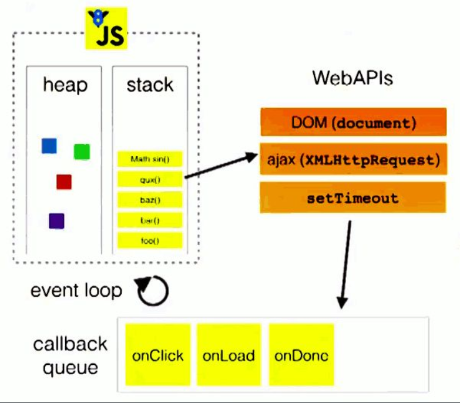

## 浏览器环境JavaScript的事件循环（Event Loop）

​		javascript是一门单线程的非阻塞的脚本语言，这是又其最初的用途来决定的：与浏览器交互。单线程也就意味着JavaScript在执行的时候都只有一个主线程来处理所有的任务。而非阻塞则是当代码需要进行一项异步任务（无法立刻返回结果，需要花一定时间才能返回的任务，如I/O事件）的时候，主线程会挂起（pending）这个任务，然后在异步任务返回结果的时候再根据一定规则去执行相应的回调。

​		虽然现在有web worker技术可以开多线程但是却有着诸多限制，例如：所有新线程都受主线程的完全控制，不能独立执行。这意味着这些“线程” 实际上应属于主线程的子线程。另外，这些子线程并没有执行I/O操作的权限，只能为主线程分担一些诸如计算等任务。所以严格来讲这些线程并没有完整的功能，也因此这项技术并非改变了javascript语言的单线程本质。

​		那么js是如何实现非阻塞的呢？答案就是事件循环，事件循环简单来说是有时执行栈和任务队列组成。我们知道栈I/O就是先入后出，而任务队列中又有宏任务和微任务之分，任务的执行顺序是先执行微任务然后再执行宏任务。那么就可以有如下图的事例图



​		JavaScript中我们调用一个函数或方法的时候是会创建对应的执行环境的，也就是执行上下文，这个执行环境会被放到事件循环的执行栈中，如果这个执行环境中有异步的函数的话，那么就会将这异步函数放到任务队列中，当这个函数执行完成（return了）之后这个执行环境（函数）就会被弹出执行栈，之后继续读后续的代码，当发现再有函数被调用时就会重复上面的操作。具体流程可以参考 [2分钟了解 JavaScript Event Loop | 面试必备](https://www.bilibili.com/video/BV1kf4y1U7Ln) 。

浏览器执行执行JavaScript的流程其实是这样的

```javascript
宏任务 -> 微任务 -> GUI渲染 -> 宏任务 -> ...
```

之前不是所是先执行微任务再执行宏任务吗？为什么这里是先执行宏任务再执行微任务？

因为主代码块也是宏任务，第一次执行的宏任务其实就是主代码块，然后主代码模块执行完成之后就执行微任务了，如果忽略掉浏览器的GUI渲染步骤就是，

```javascript
主代码块 -> 微任务  -> 宏任务 -> 微任务  -> 宏任务 -> ...
```

> **在执行完宏任务后会先查看微任务队列是否还有任务，如果有就会先执行微任务队列，然后调用渲染线程（如果有UI变动的话），再继续执行宏任务队列**
>
> ***渲染线程会在执行栈为空（当前事件循环没有其他代码会别执行）的时候才执行***

### 什么是宏任务

我们可以将每次执行栈执行的代码当做是一个宏任务（包括每次从事件队列中获取一个事件回调并放到执行栈中执行）， 每一个宏任务会从头到尾执行完毕，不会执行其他。同样包括主代码块的代码

比如执行如下代码

```js
document.body.style = 'background:black';
document.body.style = 'background:red';
document.body.style = 'background:blue';
document.body.style = 'background:grey';
```

看到的效果就只会是显示灰色，其他颜色是不会显示出来的，这是因为浏览器的渲染线程会在执行栈为空的时候才执行，并且渲染时`GUI线程`会将所有UI改动优化合并。

再看一个例子

```js
document.body.style = 'background:blue';
setTimeout(function(){
    document.body.style = 'background:black'
},0)
```

看到的效果就会是先显示蓝色，然后立即转化成黑色，这是因为在执行完主代码块之后，

+ `document.body.style = 'background:blue';`被执行
+ 定时任务被定时触发器线程管理，当达到条件之后放进宏任务队列中，发现有一个任务达到了条件，将其放入到宏任务队列中
+ 执行栈为空了，调用渲染进程进行渲染
+ 然后去检查宏任务队列中有没有任务要执行，发现有，执行`document.body.style = 'background:black'`
+ 之后执行栈再次为空，再次调用渲染进程。

继续看一个例子

```js
document.body.style = 'background:blue';
setTimeout(function(){
    document.body.style = 'background:black';
},0)
document.body.style = 'background:red';
setTimeout(function(){
    document.body.style = 'background:yellow';
},0)
setTimeout(function(){
    document.body.style = 'background:green';
},100)
```

会发现会从红色变成黄色再变为绿色，同样的道理执行完主代码块之后，

+ `document.body.style = 'background:blue';document.body.style = 'background:red';`被执行
+ 定时任务被定时触发器线程管理，发现有两个任务达到了条件，将其放入到宏任务队列中
+ 执行栈为空了调用渲染进程进行合并渲染
+ 然后检查宏任务队列，发现有两个任务需要执行
+ 之后执行栈为空，调用渲染进程进行合并渲染
+ 定时触发器线程管理又发现有一个任务满足了条件，将任务放入到宏任务队列中
+ 之后再执行宏任务队列中的任务
+ 之后执行栈为空，调用渲染进程进行渲染


### 什么是微任务

我们已经知道`宏任务`结束后，会执行渲染，然后执行下一个`宏任务`， 而微任务可以理解成在当前`宏任务`执行后立即执行的任务。也就是说，当`宏任务`执行完，会在渲染前，将执行期间所产生的所有`微任务`都执行完。

看一个例子

```js
document.body.style = 'background:blue'
console.log(1);
Promise.resolve().then(()=>{
    console.log(2);
    document.body.style = 'background:black'
});
console.log(3);
```

可以看到直接变成了黑色，这是因为在执行完主代码块后，

+ `document.body.style = 'background:blue'`，输入`1,2`，`.then`回调放入到微任务队列，之后执行栈为空
+ 然后查看微任务队列中是否有任务，有则执行，没有则调用渲染线程

总的来说就是在每次执行栈为空之后先检查是否有微任务，有则执行没有则调用渲染线程

事件循环的总流程，大概就是

```
主代码块 -> 主代码块执行完毕，执行栈为空  -> 检查微任务队列是否有任务要执行 -> 调用渲染线程  -> 检查宏任务队列是否有任务要执行 -> 下一轮事件循环
```

具体参考 [详解JavaScript中的Event Loop（事件循环）机制](https://www.cnblogs.com/cangqinglang/p/8967268.html) [从多线程到Event Loop全面梳理](https://juejin.cn/post/6844903919789801486)


常见的宏任务：

- 主代码块
- setTimeout
- setInterval
- setImmediate ()-Node
- requestAnimationFrame ()-浏览器

常见微任务：

- process.nextTick ()-Node
- Promise.then()
  - Promise在定义的时候是立即执行的，定义时候的代码块部分也是属于宏任务
  - await后面的表达式最终会被处理成promise，且是未完成状态的微任务，会阻塞后面代码的执行
- Promise.catch
- Promise.finally
- Object.observe
- MutationObserver

来个题

```javascript
async function a1(){
  console.log(`a1 start`)
  await a2();
  console.log(`a1 end`)
}

async function a2(){
  console.log('a2')
}

console.log(`script start`)

setTimeout(()=>{
  console.log('settimeout');
},0)

Promise.resolve().then(()=>{
  console.log('promise1')
})

a1();

let promise2=new Promise(resolve=>{
  resolve('promis2.then')
  console.log('promise2')
})

promise2.then(res=>{
  console.log(res)
  Promise.resolve().then(()=>{
    console.log('promise3')
  })
})
console.log('script end')
```

​		首先执行的是主代码块，也就是先执行了11行`console.log('script start')`要入执行栈中输出‘script start’后弹出（下面的console.log都是要压入执行栈中，输出完成后被弹出）；然后读到`setTimeout()`压入执行栈中，setTimeout是宏任务将里面的代码`console.log('settimeout');`放入到宏任务队列中，弹出13行的`setTimeout()`；继续执行到17行`Promise.resolve().then()` 将`Promise.resolve()`压入执行栈中弹出，Promise的then和catch是微任务所以将`Promise.resolve().then()`压入执行栈，将`console.log('promise1')`放入到微任务队列中；继续执行a1函数（使用async标记的函数返回的是一个promise对象，函数里面相当于实例化Promise构造函数），将`a1()`压入执行栈中，执行`console.log('a1 start')`输出’a1 start‘，继续执行`await a2()`,将a2()压入执行栈，执行`console.log('a2')`输出a2，弹出a2()，但是await的结果是一个 `promise.then()` 阻塞后面代码的执行，将这个promise加入到微任务队列中，当这个promise完成后才会继续执行后续代码(`console.log('a1 end')`)；继续执行23行的代码，将`new Promise()`压入执行栈，将`resolve(‘promis2.then’)` 也压入执行栈完成后弹出，继续执行`console.log('promise2')`输出promise2将`new Promise()`弹出；继续执行28行`promise2.then()`将这个微任务放入到微任务队列中；最后执行`console.log('script end')`输出script end。到此主代码块执行完成

目前输出了

```shell
script start
a1 start
a2
promise2
script end
```

微任务队列

```javascript
Promise.resolve().then();//结果为promise1
promise.then()//a1中的await阻塞a1 end
promise2.then()//结果为promis2.then，Promise.resolve().then()//结果为promise3
```

宏任务队列

```javascript
setTimeout();//结果为settimeout
```

先执行微任务队列，当微任务队列中为空了再执行宏任务队列，结果为

```shell
script start
a1 start
a2
promise2
script end
promise1
a1 end
promise2.then
promise3
settimeout
```


参考文章和视频

[「硬核JS」一次搞懂JS运行机制](https://juejin.im/post/5e22b391f265da3e204d8c14)

[详解JavaScript中的Event Loop（事件循环）机制](https://www.cnblogs.com/cangqinglang/p/8967268.html)

[2分钟了解 JavaScript Event Loop | 面试必备](https://www.bilibili.com/video/BV1kf4y1U7Ln)

