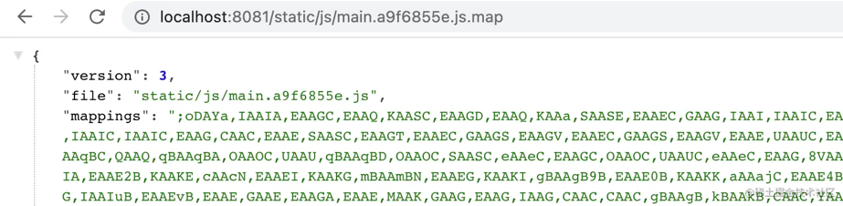

## 在浏览器中调试

一般情况下都可以直接在浏览器中开发者工具的 sources 标签页直接进行断点调试


并且支持对 **请求、事件、DOM节点**进行断点调试，而且可以检测指定的变量


## VS Code 中调试 Vue 项目

首先，通过 Vue 脚手架 `@vue/cli` 创建一个默认项目，并在如图所示 `HelloWorld.vue` 文件中添加代码和断点

在可以从 VS Code 调试你的 Vue 组件之前，你需要更新 webpack 配置以构建 source map。做了这件事之后，我们的调试器就有机会将一个被压缩的文件中的代码对应回其源文件相应的位置。这会确保你可以在一个应用中调试，即便你的资源已经被 webpack 优化过了也没关系。

**配置**

如果你使用的是 `Vue CLI 3` 及以上，请设置并更新 vue.config.js 内的 devtool property：

```js
// vue.config.js
module.exports = {
  configureWebpack: {
    devtool: 'source-map'
  }
}
```

点击在侧边栏里的 `Run and Debug` 图标来到 Debug 视图，然后点击那个齿轮图标来配置一个 launch.json 的文件，选择 Chrome 环境。然后将生成的 launch.json 的内容替换成为相应的配置：

```js
{
  "version": "0.2.0",
  "configurations": [
    {
      "type": "pwa-chrome",
      "request": "launch",
      "name": "vuejs: chrome",
      "url": "http://localhost:8080",//这个是你项目运行起来的地址
      "webRoot": "${workspaceFolder}/src",
      "breakOnLoad": true,
      "sourceMapPathOverrides": {
        "webpack:///src/*": "${webRoot}/*",
        // 2019年及其以后必须新增以下属性，具体参考下文链接
        "webpack:///./*.vue": "${webRoot}/*.vue"
      }
    }
  ]
}
```

**开始调试**

先运行项目

```shell
npm start
```

然后在点击调试按钮，开始调试


之后就可以在 vscode 中打断点了。


## 线上bug调试

开发中可能会出现，开发环境中没有问题，但是到了线上之后就有各种问题，而且难以在开发环境中复现。

线上问题大致可以分两类：`一类是接口数据导致的`，`另一类是数据正常，前端哪里疏忽了导致的`。

- **数据不同**：本地更多的是用的测试环境的数据，而线上用的真实环境的数据。不同数据，页面的渲染以及交互可能不同；
- **代码疏忽**：可能是某些场景的边界情况没有处理好，再或者是未做容错降级处理等；

**数据不同**

如果是数据不同可以使用[Ajax Interceptor](https://link.juejin.cn/?target=https%3A%2F%2Fchrome.google.com%2Fwebstore%2Fdetail%2Fajax-interceptor%2Fnhpjggchkhnlbgdfcbgpdpkifemomkpg)。插件对响应数据进行拦击，并且修改其数据进行测试


修改完之后刷新页面即可

***用完记得关掉拦击！！！！***


**代码疏忽**

如果是代码问题，那么久只能进行代码调试，但是部署到线上的代码都是经过打包压缩的，所以在报错的信息里面是无法看到准确报错位置。但是如果我们提供了`source-map`文件可看到正常的报错信息了。

而谷歌浏览器的`sources`标签上是运行我们上传本地的`source-map`的


首先开启`source-map`的配置，打包出`source-map`文件

```js
devtool:"source-map"
```

> 如果打包出来文件没有 source-map 文件，有可能是一些压缩插件配置了移除 sourceMap ，如
>
> ```js
> new UgilifyPlugin({sourceMap:false})
> ```
>
> 改为 `true` 即可
>
> 还有就是，如果文件并没有修改那么打包出来的文件名是不会变的，但是为了方便便查找文件一般会使用魔法注释配置chunk文件名
>
> ```js
> const pagea = ()=>import(/* webpackChunkName: 'pagea'*/ "./src/pagea.vue");
> ```
>
> 配置
>
> ```js
> module.exports = {
>   output:{
>     filename:"js/[name].[contenthash].[ext]",
>     path:resolve(__dirname,"dist")
>   },
>   optimization:{
>     splitChunks:{
>       chunks:"all",
>       cacheGroups:{//自定打包出来的文件名字需要配置这个
>         vendors:false,
>         default:false,
>       }
>     }
>   }
> }
> ```

因为添加`source-map`需要提供在线`URL`，所以我们可以通过`http-server`搭建一个静态的服务器

```shell
http-server --prot 8081
```



这是添加前的效果


这是添加后的效果


**其他方式**

除了添加 source-map 之外，还可以使用`whilstle`或者谷歌浏览器的`sources-->override`的代理覆盖功能走我们本地的文件


## **参考**

[Whistle，web 抓包与 debug 利器](https://www.cnblogs.com/zhihuilai/p/9992533.html)

[使用Chrome开发者工具overrides实现不同环境本地调试](https://blog.csdn.net/weixin_43834227/article/details/109161756)

[Sources 修改调试代码方法：Local Override](https://blog.csdn.net/weixin_43827779/article/details/125556233?spm=1001.2101.3001.6650.16&utm_medium=distribute.pc_relevant.none-task-blog-2%7Edefault%7EBlogCommendFromBaidu%7ERate-16-125556233-blog-128223171.pc_relevant_3mothn_strategy_recovery&depth_1-utm_source=distribute.pc_relevant.none-task-blog-2%7Edefault%7EBlogCommendFromBaidu%7ERate-16-125556233-blog-128223171.pc_relevant_3mothn_strategy_recovery&utm_relevant_index=17)

[线上崩了？一招教你快速定位问题！](https://juejin.cn/post/7166031357418668040)

