## 资料

+ [2025年广东统考非法预测](公考/2025年广东统考非法预测教师版_QQ浏览器转格式.pdf)
+ [2025年广东统考法律预测学生版](公考/2025年广东统考法律预测学生版.pdf)
+ [习思想冲刺背诵版（极简版）——马克.pdf](公考/习思想冲刺背诵版（极简版）——马克.pdf)
+ [三农知识（三支一扶）——马克(wenchaoedu).pdf](公考/三农知识（三支一扶）——马克(wenchaoedu).pdf)
+ [《公基》《常识》系统课（完整版）——马克Mark](公考/《公基》《常识》系统课（完整版）——马克Mark.pdf)
+ [资料分析系统课——刘文超.pdf](公考/资料分析系统课——刘文超.pdf)
+ [判断推理系统课——刘文超.pdf](公考/判断推理系统课——刘文超.pdf)
+ [言语理解系统课讲义——霍克.pdf](公考/言语理解系统课讲义——霍克.pdf)
+ [数量关系系统课——刘文超.pdf](公考/数量关系系统课——刘文超.pdf)
+ [数字推理基础 题（通用版）——刘文超.pdf](公考/数字推理基础 题（通用版）——刘文超.pdf)

## 资料分析

### 基期量与现期量

作为对比参照的时期称为**基期**，而相对于基期的称为**现期**。

描述具体数值时我们称之为**基期量**和**现期量**。

### 增长量

**增长量**是指基期量与现期量增长（或减少）的绝对量。

增长量是具体值，有单位。

增长量=现期量－基期量；

增长量有正负，负值代表减少量

### 增长率

**增长率**是指增长量与基期量的相对变化，即在基期量的基础上增长了多大的幅度。增长率又称增幅、增速、增长幅度、增长速度等。

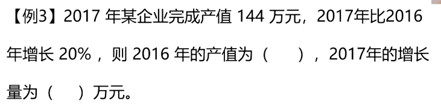

2016年产值：`144/(1 + 20%) = 120`，2017年增长量为`(144/(1 + 20%)) * 20%`

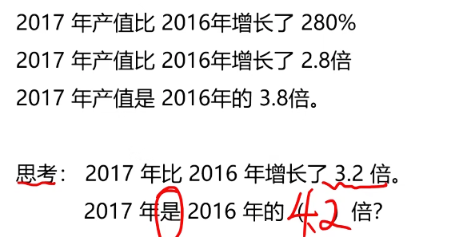

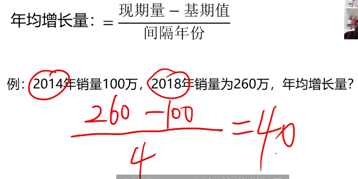

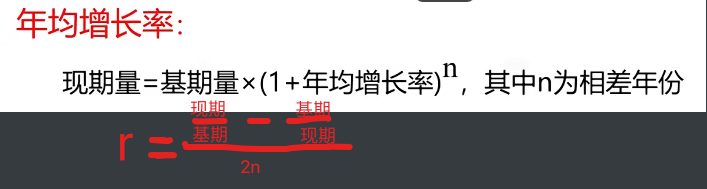

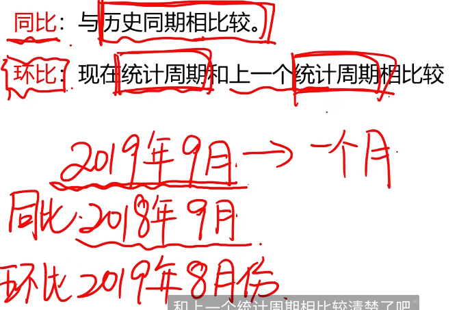

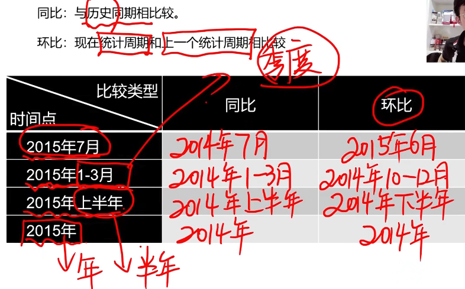

### 比重 

是指某部分在总体中所占的百分比，一般都是百分数形式。比重 = 部分/整体，整体 = 部分 / 比重

### 顺差和逆差

顺差：在一个时期内，一个国家（或地区）的出口商品额大于进口商品额，叫做对外贸易顺差（又称净出口额、出超）。

逆差：在一个时期内，一个国家（或地区）的出口商品额小于进口商品额，叫做对外贸易逆差（又称净进口额、入超）。

### GDP

国内生产总值：GDP 是英文（Gross Domestic Product）的缩写，也即国内生产总值。它是指一个国家（或地区）所有常住单位在一定时期内生产的最终产品和服务价值的总和，常被公认为衡量国家经济状况的最佳指标。国内生产总值由第一产业、第二产业、第三产业**增加值**构成，一个国家的国内生产总值就是**三大产业的增加值之和**。

### 材料阅读

**文字材料——结构、关键词、时间、标点** 

+ **多段落型文字材料：**时间、关键词、结构
+ **孤立段落型文字材料：**时间、关键词、标点

**表格材料——横坐标、纵坐标、标题、单位** 

阅读重点：标题、横标目、纵标目、单位

**图形材料——标题、横轴、纵轴、图例、单位** 

阅读重点：标题、横轴、纵轴、图例、单位

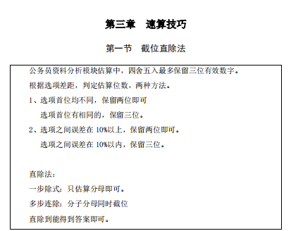

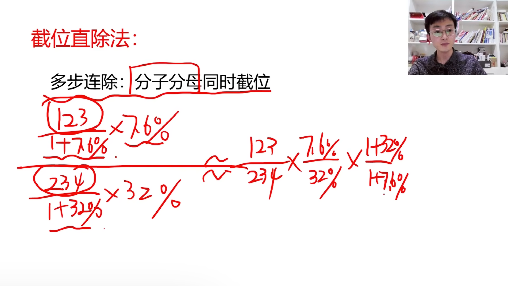

### 估算

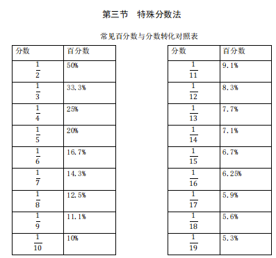

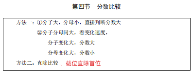

变化速度比如（1） 132 / 3677 和（2） 12 / 335 比较大小，12 x 11 ——> 132，335 x 11 = 3685，所以 335 变到 3677 应该乘一个小于11的数，所以分子变化一样，分母变化小，所以 （1）比 （2）大

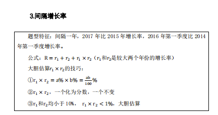

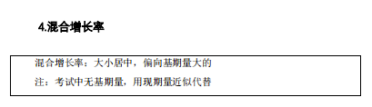

比如上半年增长率10%基期量30万亿，下半年16%基期量60万亿，那么混合增长率是`13% < r < 16%`。

房产基期量为3.2万亿，增长率为12%，地产基期量为1.04万亿，增长率为20%，那么房地产增长率取值范围为`12% < r < 20%`，因为房产基期量大于地产基期量，所以房地产混合增长率取值范围为`12% < r < 14%`

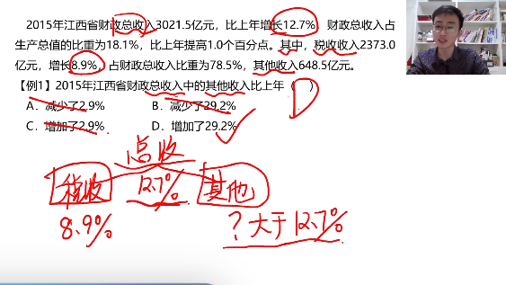

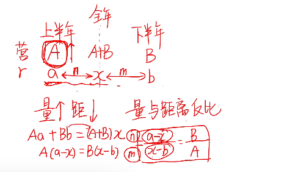

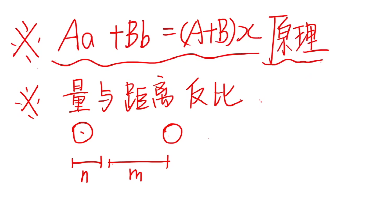

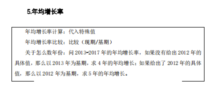

这里的特殊值指的一般是`10% 20%`这些整数，带入后看看是比带入的数大还是小来进行判断 

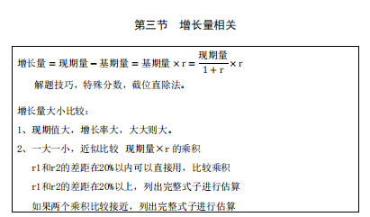

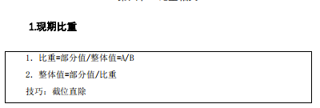

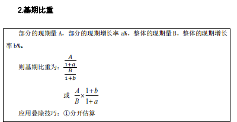

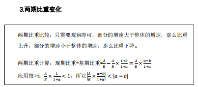

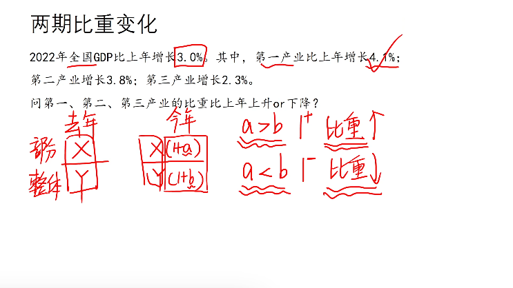

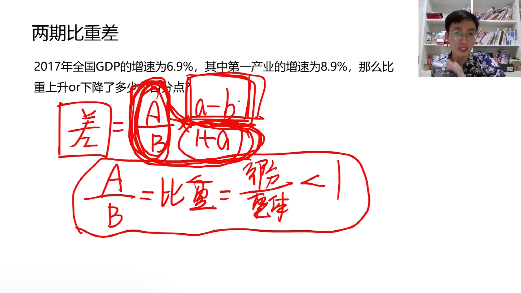

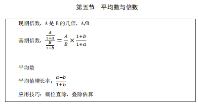

## 判断推理

### 图形推理

#### 1.位置规律

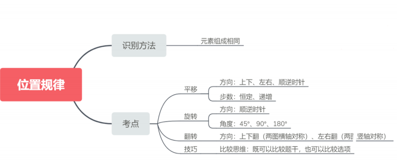

#### 2.样式规律

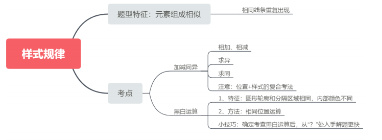

#### 3.属性规律

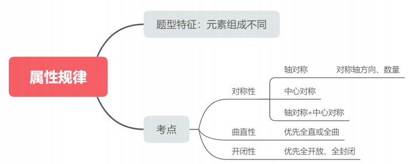

#### 4.数量规律

**题型特征**：元素组成不相同、不相似且观察属性无规律，数量规律明显。

**考点**：点、线、面、素、角

##### 点

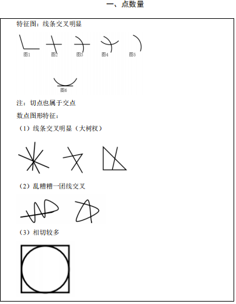

##### 线

一笔画

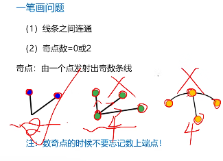

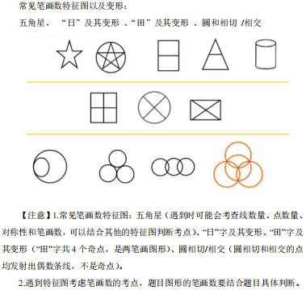

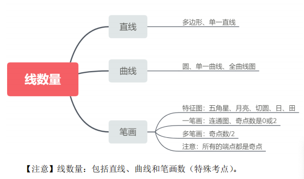

##### 面

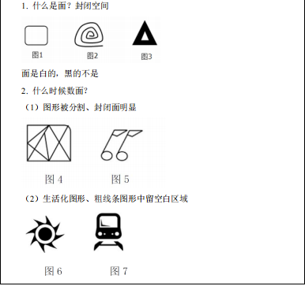

##### 素

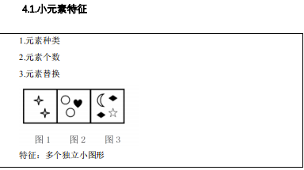

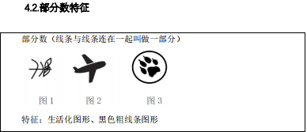

##### 角

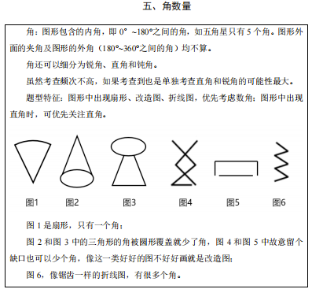

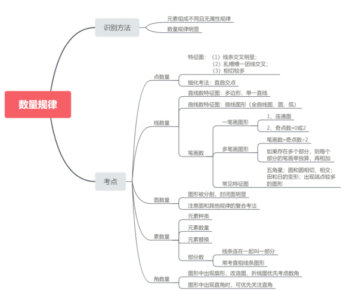

#### 5.特殊规律

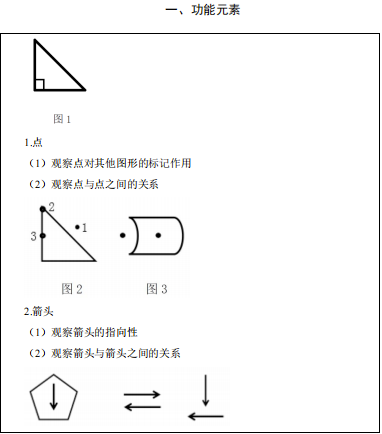

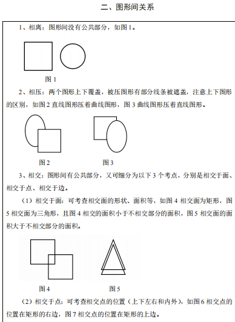

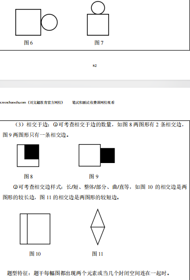

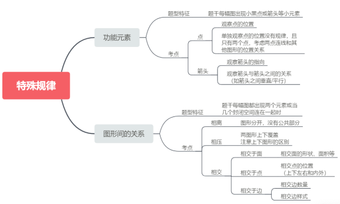

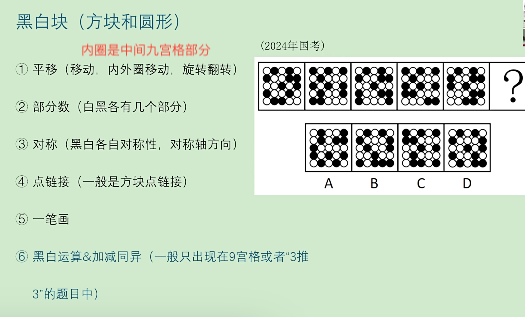

#### 6.空间重构

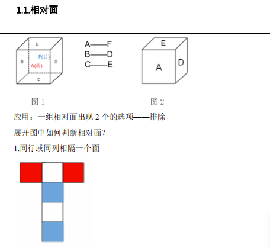

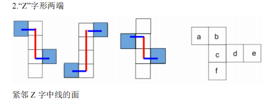

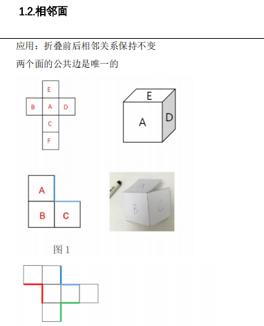

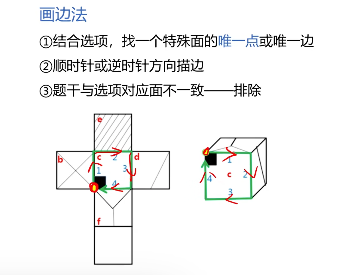

#### 7.立体图形

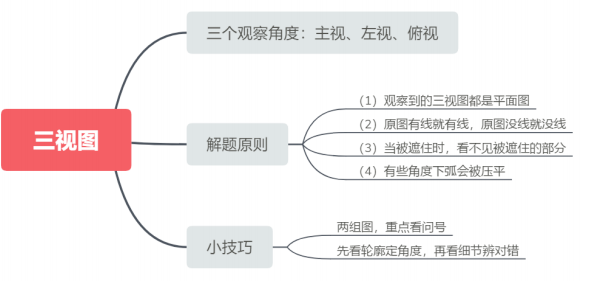

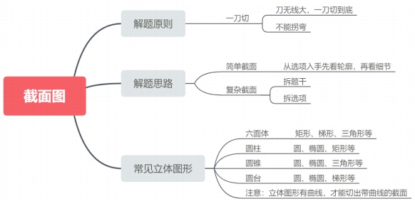

### 类比推理

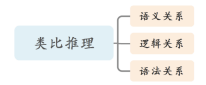

**语义关系**：近义关系、反义关系；比喻义、象征义

**逻辑关系**

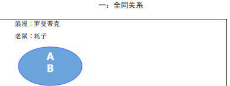

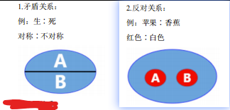

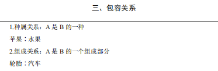

**语法关系**

### 定义判断

### 逻辑推理

#### 翻译推理

#### 排列组合

#### 日常结论

#### 逻辑论证

#### 真假推理

#### 集合推理

#### 技巧

## 言语表达理解

### 片段阅读

## 常识判断

党史、时政、习思想

### 党史

**党的十九大**：2017年10月18日至24日。

主要内容：大会通过的报告《決胜全面建成小康社会，夺取新时代中国特色社会主义伟大胜利》，作出中国特色社会主义进入新时代、我围社会主要矛盾已经转化为人民日益增长的美好生活需要和不平衡不充分的发展之间的矛盾等重大政治论断，确立习近平新时代中国特色社会主义思想的历史地位，提出新时代坚持和发展中国特色社会主义的基本方略，确定决胜全面建成小康社会、开启全面建设社会主义现代化国家新征程的目标。

大会通过《中国共产党章程（修正案）》，把习近平新时代中国特色社会主义思想同马克思列宁主义、毛泽东思想、邓小平理论、“三个代表”重要思想、科学发展观一道确立为究的指导思想井载入兌章。

**党的二十大**：https://news.cyol.com/gb/articles/2022-10/25/content_O9XRBfWya.html

## 数字推理

## 数量关系

### 技巧

## 申论

**今年备考时，要特别关注政府相关的政策文件，例如《广东省提升行政执法质量三年行动实施计划（2023—2025年）》，****政务服务、执法理念、执法体制改革、执法队伍建设****等话题要重点关注。**

**今年备考时，要特别关注政府相关的政策文件，例如《加强新时代公安派出所工作三年行动计划（2023—2025年）》，****政治引领、执法为民、便民服务、警情处理、公安队伍建设****等话题要重点关注。**

公安基础知识

https://gdga.gd.gov.cn/