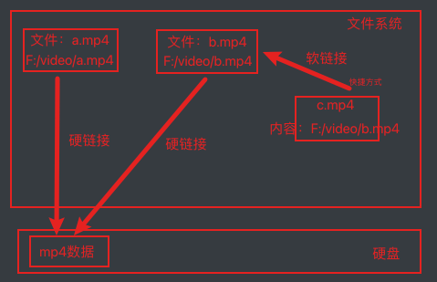

## package.json

`package.json`文件就是项目依赖包的说明文件，描述了项目的名字，版本，开发依赖，生产依赖等信息，之后在安装包的时候就会在这个中查看需要安装那些包。		

在node中可以通过`npm init`初始化一个package.json文件，CommonJS 的包规范允许我们将一组相关的模块组合在一起，形成一组完整的工机具，CommonJS 的包规范由包结构（用于组织包中的各种文件）和包描述文件（描述包的相关信息以供外部读取分析，[package.json](http://nodejs.cn/learn/the-package-json-guide)）两部分组成。

在node环境中如果想访问某个package.json中的字段数据的话可以在`process.env.npm_package_字段名`中访问到(如果值是对象就要在最后加`_`)，比如访问的是`main`字段就可以是`process.env.npm_package_main`，如果是scripts就是`process.env.npm_package_scripts_`，如果是scripts下的dev就可以是`process.env.npm_package_scripts_dev`

如果要在package.json中访问其中的字段的话可以使用`%npm_package_main%`来访问（如果是mac的话使用`$npm_package_main`）


## NPM 

`npm` 是 Node.js 标准的软件包管理器。详情看[这里](http://nodejs.cn/learn/an-introduction-to-the-npm-package-manager)


### **常用命令**

```shell
npm -V #查看版本
npm #查看帮助
npm search 包名  #搜索包
npm remove 包名  #删除包
npm install 包名 #安装下载包
npm uninstall 包名 #卸载包
npm config set registry # 设置镜像源
npm list -g --depth 0 #列出全局安装的包
```

### **修改镜像源**

可以使用 npm 命令安装一个 cnpm 并设置其镜像源为 淘宝的源，之后就可以使用 `cnpm i 包名`进行安装

```shell
npm install -g cnpm --registry=http://registry.npm.taobao.org
```

或者使用 镜像源管理器（nrm） 直接修改

```shell
nrm ls ## 列出可用的镜像源
nrm use taobao ## 使用淘宝镜像
```

需要注意的是，node 搜索包的顺序，在引入模块的时候，如果使用的是 模块名 引入模块时会 首先在当前目录的 node_modules 中寻找是否含有该模块（根据模块中的package.json的main导入，如果没有就没有导入的是index.js），如果有则直接使用，如果没有则会去上一级的 node_modules 中寻找，如果有则直接使用，如果没有则会再去上一级目录中的  node_modules 中寻找，直到找到为止，如果找到磁盘的根目录里还是没有就会报错。

### **npm 安装git 上的包**

```shell
## https 协议安装
npm i git+https://git@github.com:test.git
## ssh 协议安装
npm i git+ssh://git@github.com:test.git
```

### npm 的不足

- 串行安装，要等队列中当前 package 安装成功后才会继续下一个package 的安装
- install 慢，无缓存，删除node_modules 后重新 install 无法利用缓存
- node_modules 依赖冗余过多

npm 下载慢的问题一个重要原因是因为包镜像在国外，所以可以通过修改使用国内镜像源来解决这个问题

```shell
## 查看当前镜像源
npm config get registry

## 临时修改
npm install 软件名 --registry https://registry.npm.taobao.org

## 全局修改
npm config set registry https://registry.npm.taobao.org 
```


## cnpm

cnpm 这个是国内淘宝镜像，是为解决 npm 速度太慢的问题而产生的，控制台log 也清晰许多,但是它最大的问题是会忽视 package-lock.json 文件，也就是说 你无法锁定小版本，可能会导致依赖版本不一致引起的 bug，防止这个隐患则需要在 package.json 中就锁定版本，如下：

- 符号^：表示主版本固定的情况下，可更新最新版。例如：vuex: "^3.1.3"，3.1.3及其以上的3.x.x都是满足的。
- 符号~：表示次版本固定的情况下，可更新最新版。如：vuex: "~3.1.3"，3.1.3及其以上的3.1.x都是满足的。
- 无符号：无符号表示固定版本号，例如：vuex: "3.1.3"，此时一定是安装3.1.3版本。

用法和npm 一样


## yarn

yarn 是 Facebook, Google, Exponent 和Tilde 开发的一款新的JavaScript 包管理工具 ，是为了解决npm的缺点而产生的，Yarn 缓存了每个下载过的包，所以再次使用时无需重复下载，同时利用并行下载以最大化资源利用率，因此安装速度更快

**特点**：

- 速度超快 Yarn 缓存了每个下载过的包，所以再次使用时无需重复下载。 同时利用并行下载以最大化资源利用率，因此安装速度更快。
- 超级安全 在执行代码之前，Yarn 会通过算法校验每个安装包的完整性。
- 超级可靠 使用详细、简洁的锁文件格式和明确的安装算法，Yarn 能够保证在不同系统上无差异的工作。
- 离线模式 如果你以前安装过某个包，再次安装时可以在没有任何互联网连接的情况下进行。
- 确定性 不管安装顺序如何，相同的依赖关系将在每台机器上以相同的方式安装。
- 网络性能 Yarn 有效地对请求进行排队处理，避免发起的请求如瀑布般倾泻，以便最大限度地利用网络资源。
- 相同的软件包 从 npm 安装软件包并保持相同的包管理流程。
- 网络弹性 `重试机制`确保单个请求失败并不会导致整个安装失败。
- 扁平模式 将依赖包的不同版本归结为单个版本，以避免创建多个副本

### 常用指令

```shell
## 全局安装
npm install -g yarn

## 初始化一个项目
yarn init

# 添加依赖包
## 不写参数就是生产依赖
## global 全局安装
## -D 开发依赖
## -P 安装可能与使用者冲突的包
## -O 安装可选的包
yarn add [package] -D｜-P｜-O

## 升级依赖包
yarn upgrade [package]

## 移除依赖包
yarn remove [package]

## 安装全部依赖
yarn install （或者 yarn）
```


## pnpm

使用 `npm/cnpm/yarn` 时，依赖每次被不同的项目使用，都会重复安装一次。  而在使用 pnpm 时，依赖会被存储在内容可寻址的存储中，所以：

1. 如果你用到了某依赖项的不同版本，**只会将不同版本间*有差异的文件*添加到仓库**。 例如，如果某个包有100个文件，而它的新版本只改变了其中1个文件。那么 `pnpm update` 时只会向存储中心额外添加1个新文件，而不会因为仅仅一个文件的改变复制整新版本包的内容。
2. 所有文件都会存储在硬盘上的某一位置。 当软件包被被安装时，包里的文件会**硬链接到这一位置**，而不会占用额外的磁盘空间。 这允许你跨项目地共享同一版本的依赖。

因此，您在磁盘上节省了大量空间，这与项目和依赖项的数量成正比，并且安装速度要快得多

### 硬链接

硬链接 是电脑文件系统中的多个文件平等的共享一个文件存储单元；删除一个文件名字后，还可以用其他名字继续访问

**如何创建硬链接**

文件复制

```shell
## windows 
copy a.txt a_copy.txt
## mac
cp a.txt a_copy.txt
```

注意，我们平常的复制操作并不是创建硬链接，因为复制操作会将数据也复制一份。

创建硬链接

```shell
## windows 
mklink /H a.txt a_hard_link.txt
## mac
ln a.txt a_hard_link.txt
```

需要注意的是windows下**跨磁盘是无法创建硬链接**的


### 软链接（符号链接）

软链接 是一种特殊的文件，其中包含一条以绝对路径或者相对路径的形式指向其他文件或者目录的引用

创建软链接

```shell
## windows 
mklink a.txt a_soft_link.txt
## mac
ln -s a.txt a_soft_link.txt
```



那么在pnpm的内部原理就是，当一个项目通过`pnpm add`安装一个依赖包的时候，会将这个依赖包存储在一个专门统一管理依赖包的位置，然后在当前项目中根据 统一管理目录中的文件 建立硬链接指向这个依赖包，当其他项目也使用到这个依赖包的时候就直接在当前项目中创建硬链接即可，甚至不用下载


### 安装

```shell
yarn global add pnpm 
npm install -g pnpm
pnpm add -g pnpm ## 用来升级版本
```

### 常用命令

```shell
## npm install
pnpm install

## npm i <pkg>
## -g 全局安装
## -D 开发依赖
## -P 安装可能与使用者冲突的包
## -O 安装可选的包
pnpm add <pkg> -D｜-P｜-O｜-g

## npm uninstall <pkg>
pnpm remove <pkg>

## npm run <cmd>
pnpm <cmd>
```


### 非扁平的 node_modules 目录

使用 npm 或 Yarn Classic 安装依赖项时，所有包都被提升到模块目录的根目录。 因此，项目可以访问到未被添加进当前项目的依赖。

但是这样的结果是，源码可以访问本不属于当前项目的所设定的依赖包；这些包是项目依赖的包依赖的第三方包，这种依赖被称为 **幽灵依赖**

**pnpm 创建非扁平的 node_modules 目录，来解决这个问题**


如上图所示，当我们的项目安装一个依赖`axios`的时候会在`node_modules`文件下为这个包创建一个软链接文件夹`node_modules/axios`，这个**软链接**指向`node_modules/.pnpm`目录下的对应的依赖包源码的`axios@0.27.2/node_modules/axios`目录，这个目录下的文件就是axios依赖包的源码，源码文件是一个**硬链接**指向系统统一的依赖包存储目录`.pnpm-store`（这个文件中存储着使用过的所有依赖包）。

因为axios也依赖了一些其他的包，比如`form-data`，那么会在 `node_modules/.pnpm/axios@0.27.2/node_modules`下创建`form-data`的**软链接**，指向`node_modules/.pnpm/form-data@4.0.0/node_modules/form-data`目录，目录下的源码文件又通过**硬链接**指向系统统一的依赖包存储目录`.pnpm-store`。

总结来说就是，当前项目的所依赖的包都会为其在`node_modules`下创建一个软链接，指向`node_modules/.pnpm`下对应版本的源码文件目录，源码文件通过硬链接指向`.pnpm-store`。如果依赖包也依赖了第三方包，就在当前对应版本的源码文件目录下为其创建软链接指向`node_modules/.pnpm`下对应版本的源码文件目录


将当前未被引用的包从store中释放

```shell
pnpm store prune
```


## Monorepo

Monorepo 其实是一种多项目共用同一依赖的项目管理解决方案，之前的代码模式都是一个项目放一个仓库MultiRepo，monorepo 就是将多个项目放在同一个仓库的模式，对应到的代码目录为

```
├── apps (应用,一个大项目中的子项目)
├── packages (本地包)
|   ├── A项目
|   |   ├── package.json 比如这里的 name 是 @my/a
|   ├── B项目
|   |   ├── package.json 比如这里的 name 是 @my/b
├── package.json
```

### 与 Monorepo 相关的 pnpm 命令

**-w，--workspace-root**

在根目录执行命令，比如在根目录安装依赖，那么这个依赖可以在所有的packages中使用

比如每个项目都需要使用vite

```shell
pnpm add -w vite -D
```

**-F <package_name>，--filter <package_name>**

在过滤的指定包运行命令，我们可以通过下面的命令在指定的package安装依赖，这个依赖只可以该package中使用

```shell
pnpm -F @my/a add lodash
```

或者运行某个项目中的脚本

```shell
pnpm -F @my/a run dev
```


**--workspace**

从工作区安装包

```shell
pnpm add @my/a --workspace
```


### 创建 Monorepo 项目

**创建项目目录并进行初始化**

```shell
mkdir monorepo-learn && cd monorepo-learn
pnpm init
```

**然后创建`.npmrc`配置文件**

```ini
shamefully-hoist=true
strict-peer-dependencies=false
ignore-workspace-root-check=true
```

> - **shamefully-hoist** 是否提升依赖，如果某些工具仅在根目录的node_modules时才有效，可以将shamefully-hoist设置为true来提升那些不在根目录的node_modules，就是将你安装的依赖包的依赖包的依赖包的...都放到同一级别（扁平化）。说白了就是不设置为true有些包就有可能会出问题。
> - **strict-peer-dependencies** 当 peerDependencies错误时，命令是否成功

**新建pnpm-workspace.yaml文件**

用这个文件告诉 pnpm 将哪些目录当作包来进行处理

```yaml
packages:
	# 所有的子项目
  - 'apps/*'
	# 负责的所有的前端项目存储的地方
  - 'packages/*'
  # 公共的，给所有项目使用的公开组件目录
  - 'components/**'
  # 公共方法目录
  - 'api/**'
  # 不处理的目录
  - '!**/test/**'
```

在Monorepo下每个包都是一个模块，所以需要在每个包下面运行一下`pnpm init`初始化一下，然后配置`package.json`，比如 `api`模块，在根下创建`api`目录，并进行初始化，设置`package.json`

```json
{
  //模块的名字，为了方便区分是自己的模块还是其他人的模块
  //一般会在前面加个 @my/
  "name": "@my/api",
  "version": "1.0.0",
  "description": "",
  "main": "index.js",
  "private": true,//不需要发布的包
  "buildOptions":{
    //打包出来的模块的名字，之后可以直接使用这个名字
    //如果模块不需要打包出来就不需要配置name
    "name":"MyApi",
    "formats":[//打包出来的格式
      "global",//给浏览器使用
      "cjs",//commonjs
      "esm-bundler"//浏览器 esModules
    ]
  }
}
```

每个模块的默认入口都是`index.js`，所以还要在模块下创建`index.js`，并且我们的api依赖于`axios`，所以使用pnpm安装一下

```shell
pnpm add axios
```

```js
import axios from "axios";
const Axios = axios.create({
  timeout:5000,
  baseURL:"..."
})

function getData(){
  return Axios.get("...");
}

export getData;
```

如果我们在自己的项目中使用到这个库的时候，就可以直接通过`pnpm add @my/api`（`npm、yarn `等使用 `link` 命令来链接本地仓库）进行安装使用

```js
import {getData} from "@my/api";
```


### 创建Vue 和 React 的Monorepo项目

我们创建一个Monorepo架构的项目,在这个项目中有用vue搭建的 manager 后台和用react 搭建的 home 前端项目,还有一个公共工具项目 utils,那么我们先创建好目录结构和配置文件

```
├── apps
|   ├── home
|   |   ├── package.json
|   ├── manager
|   |   ├── package.json
├── packages
|   ├── utils
|   |   ├── package.json
├── package.json
```

初始化项目

```shell
pnpm init
```

并将 `package.json`中的name修改为`@monorepo/root`

`apps/home/package.json` (也可以使用` pnpm init` 来初始化,不过要修改 `name` 和 `private`)

```json
{
  "name": "@monorepo/home",
  "version": "1.0.0",
  "private": true,
  "main":"src/main.jsx",
	"type":"module",
  "scripts": {
    "dev": "vite"
  }
}
```

`apps/manager/package.json`

```json
{
  "name": "@monorepo/manager",
  "version": "1.0.0",
  "private": true,
  "main":"src/main.js",
  "type":"module",
  "scripts": {
    "dev": "vite"
  }
}
```

`packages/utils/package.json`

```json
{
  "name": "@monorepo/utils",
  "version": "1.0.0",
  "private": true
}
```

根目录创建 `pnpm-workspace.yaml`

```yaml
packages:
  - 'apps/*'
  - 'packages/*'
```

因为 vue,react 可以会被多个项目用到所以我们在根目录下安装`vue react react-dom vite @vitejs/plugin-vue @vitejs/plugin-react`

```shell
pnpm add -w vue react react-dom
```

```shell
pnpm add -w vite @vitejs/plugin-vue @vitejs/plugin-react -D
```

在`home`和`manager`中添加 `vite.config.js`

```js
// apps/home/vite.config.js
import {defineConfig} from "vite";
import React from "@vitejs/plugin-react";

export default defineConfig({
  plugins:[React()]
})

// apps/manager/vite.config.js
import {defineConfig} from "vite";
import Vue from "@vitejs/plugin-vue";

export default defineConfig({
  plugins:[Vue()]
})
```

接下来创建页面

```jsx
// apps/home/index.html
<div id="root"></div>
<script type="module" src="./src/main.jsx"></script>

// apps/home/src/main.jsx
import {createRoot} from "react-dom/client";
import App from "./App.jsx"
createRoot(document.getElementById("root")).render(<App />)

// apps/home/src/App.jsx
export default function App(){
  return <h1>hello react home</h1>
}

// apps/manager/index.html
<div id="app"></div>
<script type="module" src="./src/main.js"></script>

// apps/manager/src/main.js
import {createApp} from "react-dom/client";
import App from "./App.jsx"
createApp(App).mount("#app")
```

`apps/manager/src/App.vue`

```vue
<template>
	<h1>hello vue manager</h1>
</template>
```

之后分别运行项目

```shell
pnpm run -F @monorepo/home dev
pnpm run -F @monorepo/manager dev
```


## 参考

[Monorepo 的这些坑，我们帮你踩过了！](https://juejin.cn/post/6972139870231724045)

[使用pnpm做monorepo](https://juejin.cn/post/7055281852789047304)
