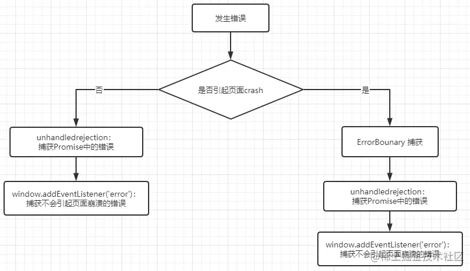

## 前端异常捕获

众所周知，世界上没有完美的人，同样的也不会有完美的程序，无论这个程序是谁写的都避免不了出现bug，一般来说，在开发和测试的阶段我们可以解决大部分的bug，但是由于线上的用户的神器操作，如论我们在本地调试得多么完美，bug总是会出现，最痛苦的还是我们不知道这个bug是怎么出现的，也不知道具体的提示错误是啥。

一般来说这种情况都是需要做一个错误的捕获和上传，这样才能避免线上一些奇怪的bug出现，而我们还不自知的情况。

在前端浏览器中出现错误会逐级上抛错误，类似冒泡事件，在遇到最近的一层 catch 时就会停止上抛，如果中间没有遇到 catch 时，就会直到 window 对象才会结束。


## 错误类型

要想做错误处理就需要先了解有那些错误类型，这样才能使用对应的方法来进行捕获。

### js执行错误

日常执行中主要有同步错误、语法错误、普通异步任务错误、Promise任务错误、async任务错误5种常见的异常错误。

```js
//同步错误/执行错误
console.log(obj.name);

//语法错误
const obj.name

//普通异步任务错误
setTimeout(()=>{
  console.log(obj.name);
},2000)

//Promise任务错误
new Promise((resolve)=>{
  fun();
  resolve('ok')
})

//async/await任务错误
const getData = async ()=>{fun()}
await getData();
```


### 资源加载错误

主要有图片、script、css、font等资源的加载错误问题。

```html

```


### 请求错误

比如请求的地址不存在，或者请求参数填写错误，这种类型的错误可以在响应拦截里面进行处理，也可以在`error`事件中进行处理。


## 错误的捕获

>  语法错误：一般都可以在开发测试阶段中发现，所以没有必要对其进行捕获

### try…catch

一提到错误捕获，相信很多人第一时间想到的就是 `try...catch`，但是要知道的是`try...catch`只能捕获一部分的错误，还不能做到全覆盖，而且相信很多人也不会特意在每段代码中都加个`try...catch`。

1. 能捕获包裹体内的同步执行错误。
2. 能捕获async任务错误，但是需要使用await才能被捕获，其实也是第一条的意思
3. 不能捕获语法错误。
4. 不能捕获异步任务错误。
5. 不能捕获Promise任务错误。
6. 不能捕获资源加载错误。


### window.onerror

浏览器在 window 对象上有个 onerror 的方法，这个样方法也可以捕获页面出现的部分错误。

1. 能捕获所有同步执行错误。
2. 能捕获普通异步任务错误。
3. 不能捕获语法错误。
4. 不能捕获Promise任务错误。
5. 不能捕获async任务错误。
6. 不能捕获资源加载错误。

### window.addEventListener(‘error’)

在Web页面上我们可以监听绝大多数事件，当然也包括错误事件，我们从字面意思上浅理解我们可以认为与onerror差不多，但是实际上它们俩的表现还是有一点区别，就是`window.addEventListener(‘error’)` 能捕获资源加载错误。

不过需要**注意**的是：如果是在js代码中new Image() 后加载出现的错误是无法捕获的


### window.addEventListener(‘unhandledrejection’)

上面三种捕获的方法都不能对 Promise任务错误 、async任务错误 进行捕获。但是我们可以在 promise 的 catch 自己手动捕获错误，不过相信大多数人都不会再每个 promise 中都写上 catch 的吧？至少我除非必要是不会写的。除了手动 catch 捕获还可以使用 `window.addEventListener(‘unhandledrejection’)`进行捕获，它会在Promise 被reject（抛错）且**没有被catch的时候**触发，而且对于没有 catch 的 promise 放在 async 中执行，unhandledrejection事件监听也能捕获到，所以async任务错误unhandledrejection事件监听也是可以支持捕获的。

> `unhandledrejection`事件监听是在Promise 被reject（抛错）且没有被catch的时候触发，那么如果在代码中已经使用 catch 来捕获处理了，但是却没有做上传处理那不就要一个个找以前的 catch 去添加了吗？
>
> 其实还有个事件叫 `handledrejection`，它是在Promise的reject做了处理（catch）后触发。这样就能对以前已经使用 catch 处理的 promise 进行捕获了。


### 响应拦截

专门用来处理请求错误的一种方法，不过`error`事件也是可以捕获到请求错误的


### 总结

结合上面的捕获方法，可以得知捕获的覆盖情况。


那么使用 `window.addEventListener('error')`、`window.addEventListener('unhandledrejection')`、`window.addEventListener('handledrejection')`就可以处理上面提到的全部错误情况了。


## 错误上报

在捕获到错误之后，还需要将错误信息传递到服务中，常用的方法有三种。

### XMLHttpRequest

直接通过 ajax 将数据发送出去，但是有兼容问题，比如 IE 支持 XMLHttpRequest（可以使用axios解决），还有其他的一些问题

1. 有严格的跨域限制、携带cookie问题。
2. 上报请求可能会阻塞业务。
3. 请求容易丢失（被浏览器强制cancel）。

### 图片上报

由于图片加载不受跨域影响，`Image`对象机会所有浏览器都支持，并且做错误上报并不需要接收返回的数据，只需要将数据发给服务器就好，所以可以创建一个 1x1 大小的图片来进行异步加载的方式上报。

```js
var img = new Image();
img.width = 1;
img.height = 2;
img.src = 'https.//www.test.com/api/report.gif?project=111&data=xxx';
```

不过需要注意的是，由于浏览器和服务器对get请求的长度限制（一般2k-8k），所以上传的数据很可能会超出限制，导致上传失败，所以图片上传是不安全的。

如果ajax请求发送过程中跳转了页面，那么该请求会被取消，但用图片不会有这个问题，在记录离开页面打点行为的时候会很有用的

> 不过在用图片上报的时候跳转页面，这个请求也很可能会有比较大的丢失率，如果出现这种情况可以让后端在请求成果的时候返回一个 1x1 的透明像素图片，如果成功会触发`onload`，如果失败就会触发`onerror`存储数据之后再发送，或者直接使用 ajax 上报，失败了就存到缓存中之后上传，又或者等待所有上报请求成功之后再跳转页面。

### sendBeacon

这个方法天生就是为了数据统计而设计的，它解决了XMLHttpRequest和图片上报的绝大部分弊端：没有跨域问题、不阻塞业务，甚至能在页面unload阶段继续发送数据，完美地解决了普通请求在unload阶段被cancel导致丢数据的问题，唯一的问题就是IE并不支持。

不过需要注意的是 sendBeacon并不像XMLHttpRequest一样可以直接指定Content-Type，且不支持application/json等常见格式，仅支持发送 DOMString、FormData、Blob、ArrayBufferView类型的数据

```js
function reportError(err){
  if(navigator.sendBeacon){
    const data = new Blob(
    	[`projectId=123&errorMsg=${err.message}`],
      {type:'application/x-www-form-urlencoded'}
    );
    navigator.sendBeacon('https.//www.test.com/api/report',data);
  }
}
```


## Vue、React 异常处理

在 vue 和 react 中使用，window.onerror 等方法来捕获异常时，可能有些信息会捕获不了，因为有一下错误在其内部就已经被 try...catch 捕获了，不会传递出来被我们的全局捕获事件所捕获。

### Vue 解决方法

使用`Vue.config.errorHandler`这样的`Vue`全局配置，可以在`Vue`指定组件的渲染和观察期间未捕获错误的处理函数。这个处理函数被调用时，可获取错误信息和`Vue` 实例。

```js
Vue.config.errorHandler = function (err, vm, info) {
  // handle error  // `info` 是 Vue 特定的错误信息，比如错误所在的生命周期钩子  // 只在 2.2.0+ 可用
}
```

### React 解决方法

可以使用 react 16.0 提供的 `componentDidCatch` 钩子来进行捕获，不过为了简化和解耦，最好是做成一个组件然后包裹住需要捕获错误的组件

```react
class ErrorBoundary extends React.Component {
  constructor(props) {
    super(props);
    this.state = { hasError: false };
  }

  componentDidCatch(error, info) {
    // Display fallback UI    this.setState({ hasError: true });
    // You can also log the error to an error reporting service
    logErrorToMyService(error, info);
  }

  render() {
    if (this.state.hasError) {
      // You can render any custom fallback UI
      return <h1>Something went wrong.</h1>;
    }
    return this.props.children;
  }
}
```

使用方法

```jsx
<ErrorBoundary>
  <MyWidget />
</ErrorBoundary>
```

如果在使用了`ErrorBounary`的同时，也使用`window.addEventListener("error")`来进行捕获，默认情况下会先被`window.addEventListener("error")`，之后才会被`ErrorBounary`捕获，如果要调整顺序，可以给`error`设置异步处理，并且通过一个缓存标记进行判断

```js
class ErrorBoundary extends React.Component {
  constructor(props) {
    super(props);
    this.state = { hasError: false };
  }

  static getDerivedStateFromError(error) {
    // 更新 state 使下一次渲染能够显示降级后的 UI
    return { hasError: true };
  }

  componentDidCatch(error, errorInfo) {
    // 你同样可以将错误日志上报给服务
    logErrorToMyService(error, errorInfo);
    
    //告诉error事件 ErrorBoundary已处理异常
     localStorage.setItem("ErrorBoundary",true)
  }

  render() {
    if (this.state.hasError) {
      // 你可以自定义降级后的 UI 并渲染
      return <h1>Something went wrong.</h1>;
    }

    return this.props.children; 
  }
}
```

```js
window.addEventListener('error', function (error) {
  setTimeout(() => {
    //进来代表一定有错误 判断ErrorBoundary中是否已处理异常
    const flag = localStorage.getItem('ErrorBounary');
    if (flag) {
      //进入了ErrorBounary 错误已被处理 error事件不用处理该异常
      localStorage.setItem('ErrorBounary', false); //重置状态
    } else {
      //未进入ErrorBounary 代表此错误为异步错误/事件错误
      logErrorToMyService(error, errorInfo);  // 你可以将错误日志上报给服务
      //判断具体错误类型
      if (error.message.indexOf('TypeError')) {
        alert('这是一个TypeError错误，请通知开发人员');
      } else if (error.message.indexOf('SyntaxError')) {
        alert('这是一个SyntaxError错误，请通知开发人员');
      } else {
        //在此次给与友好提示
      }
    }
  });
});
```




## 其他问题

### 跨域脚本错误

跨域脚本加载错误只有一个“Script error”，并不能获取到错误信息。可以通过在`<script>`标签上添加`crossorigin=”anonymous”`，并且服务器添加`Access-Control-Allow-Origin`来解决这个问题

### webpack打包后报错信息不准确

对于使用 webpack 或者其他的一些打包工具来打包工具的话，报错提示的信息（出错的行数、列数等）会不对，因为打包出来的文件都被压缩丑化了，需要配置`devtool:'source-map'`来生成源代码映射文件

```js
var path = require('path');
module.exports = {
  devtool: 'source-map',
  mode: 'development',
  entry: './client/index.js',
  output: {
    filename: 'bundle.js',
    path: path.resolve(__dirname, 'client')
  }
}
```

如果运行打包命令还是没有，可能是压缩插件将`sourceMap`移除了，比如使用了`UglifyJsPlugin`并且设置了`sourceMap:false`（默认是false），所以需要将这个属性设置为`true`

开启`source-map`的缺陷是兼容性，目前只有`Chrome`浏览器和`Firefox`浏览器才对`source-map`支持。不过我们对这一类情况也有解决办法。可以使用引入`npm`库来支持`source-map`，可以参考[mozilla/source-map](https://link.zhihu.com/?target=https%3A//github.com/mozilla/source-map)。这个`npm`库既可以运行在客户端也可以运行在服务端，不过更为推荐的是在服务端使用`Node.js`对接收到的日志信息时使用`source-map`解析，以避免源代码的泄露造成风险，如下代码所示：

```js
const express = require('express');
const fs = require('fs');
const router = express.Router();
const sourceMap = require('source-map');
const path = require('path');
const resolve = file => path.resolve(__dirname, file);// 定义post接口
router.get('/error/', async function(req, res) {
  // 获取前端传过来的报错对象
  let error = JSON.parse(req.query.error);
  let url = error.scriptURI; // 压缩文件路径
  if (url) {
    let fileUrl = url.slice(url.indexOf('client/')) + '.map'; // map文件路径
    // 解析sourceMap
    let consumer = await new sourceMap.SourceMapConsumer(fs.readFileSync(resolve('../' + fileUrl), 'utf8')); // 返回一个promise对象
    // 解析原始报错数据
    let result = consumer.originalPositionFor({
      line: error.lineNo, // 压缩后的行号
      column: error.columnNo // 压缩后的列号
    });
    console.log(result);
  }
});
module.exports = router;
```


### `Uncaught xxx Loading chunk {n} failed`

每次前端更新，重新部署后，用户还停留在更新之前的页面，当请求页面数据时，会导致页面白屏，原因：使用 react.lazy 导致路由缓存，然而版本发布后，js脚本更新导致出现错误

1.对error事件进行监听，检测到错误之后重新刷新

```js
window.addEventListener(
  'error',
  function (event) {
    if (
      event.message &&
      String(event.message).includes('chunk') &&
      String(event.message).includes('failed')
    ) {
      window.location.replace(window.location.href);
    }
  },
  true,
);
```

2.对window.console.error事件监听，效果同上

```js
window.console.error = function () {
  console.log(JSON.stringify(arguments), 'window.console.error'); // 自定义处理
};
```


## 参考

[一文搞定前端错误捕获和上报](https://zhuanlan.zhihu.com/p/434928241)

[前端性能与异常上报](https://zhuanlan.zhihu.com/p/40830370)