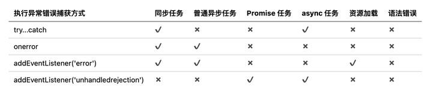

## 前端异常捕获

众所周知，世界上没有完美的人，同样的也不会有完美的程序，无论这个程序是谁写的都避免不了出现bug，一般来说，在开发和测试的阶段我们可以解决大部分的bug，但是由于线上的用户的神器操作，如论我们在本地调试得多么完美，bug总是会出现，最痛苦的还是我们不知道这个bug是怎么出现的，也不知道具体的提示错误是啥。

一般来说这种情况都是需要做一个错误的捕获和上传，这样才能避免线上一些奇怪的bug出现，而我们还不自知的情况。

在前端浏览器中出现错误会逐级上抛错误，类似冒泡事件，在遇到最近的一层 catch 时就会停止上抛，如果中间没有遇到 catch 时，就会直到 window 对象才会结束。


## 错误类型

要想做错误处理就需要先了解有那些错误类型，这样才能使用对应的方法来进行捕获。

### js执行错误

日常执行中主要有同步错误、语法错误、普通异步任务错误、Promise任务错误、async任务错误5种常见的异常错误。

```js
//同步错误/执行错误
console.log(obj.name);

//语法错误
const obj.name

//普通异步任务错误
setTimeout(()=>{
  console.log(obj.name);
},2000)

//Promise任务错误
new Promise((resolve)=>{
  fun();
  resolve('ok')
})

//async/await任务错误
const getData = async ()=>{fun()}
await getData();
```


### 资源加载错误

主要有图片、script、css、font等资源的加载错误问题。

```html

```


## 错误的捕获

>  语法错误：一般都可以在开发测试阶段中发现，所以没有必要对其进行捕获

### try…catch

一提到错误捕获，相信很多人第一时间想到的就是 `try...catch`，但是要知道的是`try...catch`只能捕获一部分的错误，还不能做到全覆盖，而且相信很多人也不会特意在每段代码中都加个`try...catch`。

1. 能捕获包裹体内的同步执行错误。
2. 能捕获async任务错误，但是需要使用await才能被捕获，其实也是第一条的意思
3. 不能捕获语法错误。
4. 不能捕获异步任务错误。
5. 不能捕获Promise任务错误。
6. 不能捕获资源加载错误。


### window.onerror

浏览器在 window 对象上有个 onerror 的方法，这个样方法也可以捕获页面出现的部分错误。

1. 能捕获所有同步执行错误。
2. 能捕获普通异步任务错误。
3. 不能捕获语法错误。
4. 不能捕获Promise任务错误。
5. 不能捕获async任务错误。
6. 不能捕获资源加载错误。

### window.addEventListener(‘error’)

在Web页面上我们可以监听绝大多数事件，当然也包括错误事件，我们从字面意思上浅理解我们可以认为与onerror差不多，但是实际上它们俩的表现还是有一点区别，就是`window.addEventListener(‘error’)` 能捕获资源加载错误。

不过需要注意的是

1. 如果是在js代码中new Image() 后加载出现的错误是无法捕获的
2. 跨域脚本加载错误只有一个“Script error”，并不能获取到错误信息。可以通过在`<script>`标签上添加“crossorigin”属性来解决这个问题

### window.addEventListener(‘unhandledrejection’)

上面三种捕获的方法都不能对 Promise任务错误 、async任务错误 进行捕获。但是我们可以在 promise 的 catch 自己手动捕获错误，不过相信大多数人都不会再每个 promise 中都写上 catch 的吧？至少我除非必要是不会写的。除了手动 catch 捕获还可以使用 `window.addEventListener(‘unhandledrejection’)`进行捕获，它会在Promise 被reject（抛错）且**没有被catch的时候**触发，而且对于没有 catch 的 promise 放在 async 中执行，unhandledrejection事件监听也能捕获到，所以async任务错误unhandledrejection事件监听也是可以支持捕获的。

> `unhandledrejection`事件监听是在Promise 被reject（抛错）且没有被catch的时候触发，那么如果在代码中已经使用 catch 来捕获处理了，但是却没有做上传处理那不就要一个个找以前的 catch 去添加了吗？
>
> 其实还有个事件叫 `handledrejection`，它是在Promise的reject做了处理（catch）后触发。这样就能对以前已经使用 catch 处理的 promise 进行捕获了。

### 总结

结合上面的捕获方法，可以得知捕获的覆盖情况。



那么使用 `window.addEventListener('error')`、`window.addEventListener('unhandledrejection')`、`window.addEventListener('handledrejection')`就可以处理上面提到的全部错误情况了。


## 错误上报

在捕获到错误之后，还需要将错误信息传递到服务中，常用的方法有三种。

### XMLHttpRequest

直接通过 ajax 将数据发送出去，但是有兼容问题，比如 IE 支持 XMLHttpRequest（可以使用axios解决），还有其他的一些问题

1. 有严格的跨域限制、携带cookie问题。
2. 上报请求可能会阻塞业务。
3. 请求容易丢失（被浏览器强制cancel）。

### 图片上报

由于图片加载不受跨域影响，并且做错误上报并不需要接收返回的数据，只需要将数据发给服务器就好，所以可以创建一个 1x1 大小的图片来进行异步加载的方式上报。

```js
var img = new Image();
img.width = 1;
img.height = 2;
img.src = 'https.//www.test.com/api/report.gif?project=111&data=xxx';
```

不过需要注意的是，由于浏览器和服务器对get请求的长度限制（一般2k-8k），所以上传的数据很可能会超出限制，导致上传失败，所以图片上传是不安全的。

### sendBeacon

这个方法天生就是为了数据统计而设计的，它解决了XMLHttpRequest和图片上报的绝大部分弊端：没有跨域问题、不阻塞业务，甚至能在页面unload阶段继续发送数据，完美地解决了普通请求在unload阶段被cancel导致丢数据的问题，唯一的问题就是IE并不支持。

不过需要注意的是 sendBeacon并不像XMLHttpRequest一样可以直接指定Content-Type，且不支持application/json等常见格式，仅支持发送 DOMString、FormData、Blob、ArrayBufferView类型的数据

```js
function reportError(err){
  if(navigator.sendBeacon){
    const data = new Blob(
    	[`projectId=123&errorMsg=${err.message}`],
      {type:'application/x-www-form-urlencoded'}
    );
    navigator.sendBeacon('https.//www.test.com/api/report',data);
  }
}
```


## 参考

[一文搞定前端错误捕获和上报](https://zhuanlan.zhihu.com/p/434928241)