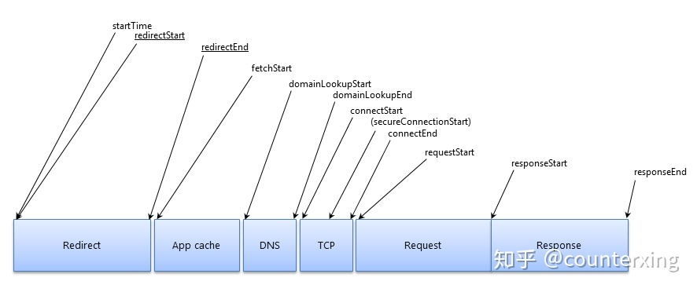

## 性能监控

前端开发中我们经常需要对项目进行优化，这样才能让项目做得更好，让用户的体验更好。如果要做项目的相关优化，我们首先需要做的就是明确哪些地方是需要优化的，哪些地方是可以优化的，这时候就需要获取到相关的数据了，比如优化一下白屏时间，那么我们就需要知道当前白屏时间是多少、还有没有可以优化的空间，还需要知道其他的一下信息，如加载解析dom的时间等，但是对于线上的项目的运行环境还是很复杂的，我们不知道项目是运行在什么浏览器上、网速如何、各种信息都难以明确，所以第一步需要做的就是搜集信息。


### 最简单的性能监控

如果仅仅需要知道白屏的时间的话，可以使用`DOMContentLoaded`事件与`window`的`load`事件来知道统计页面首屏加载时间即所有`DOM`渲染时间：

```html
<!DOCTYPE html>
<html>
<head>
  <title></title>
  <script type="text/javascript">
    // 记录页面加载开始时间
    var timerStart = Date.now();
  </script>
</head>
<body>
  <!-- 加载静态JS资源 -->
  <script type="text/javascript">
    document.addEventListener('DOMContentLoaded', function() {
      console.log("DOM 挂载时间: ", Date.now() - timerStart);
      // 性能日志上报
    });
    window.addEventListener('load', function() {
      console.log("所有资源加载完成时间: ", Date.now()-timerStart);
      // 性能日志上报
    });
  </script>
</body>
</html>
```

这种就是最简单的性能监控方式了，但是这样信息是非常粗糙的，而且这个也只能用来做首屏加载时间的统计，其他的还是很难统计出来的。


### performance

浏览器上的 window 对象上有个对象 performance ，这个对象中包含很多关于网页性能的相关信息，其中`window.performance`包括有`memory`、`navigation`、`timing`以及`timeOrigin`及`onresourcetimingbufferfull`方法。

1.  `memory`是 chrome 浏览器独有的，这个属性提供了一个可以获取到基本内存使用情况的对象
2. `navigation`对象提供了在指定的时间段里发生的操作相关信息，包括页面是加载还是刷新、发生了多少次重定向等等。
3. `timing`对象包含延迟相关的性能信息。这是我们页面加载性能优化需求中主要上报的相关信息。
4. `onresourcetimingbufferfull`方法，它是一个在`resourcetimingbufferfull`事件触发时会被调用的`event handler`。这个事件当浏览器的资源时间性能缓冲区已满时会触发。可以通过监听这一事件触发来预估页面`crash`，统计页面`crash`概率，以便后期的性能优化


#### `navigation`

```js
navigation: {
        redirectCount: 0, // 如果有重定向的话，页面通过几次重定向跳转而来
        type: 0           // 0   即 TYPE_NAVIGATENEXT 正常进入的页面（非刷新、非重定向等）
                          // 1   即 TYPE_RELOAD       通过 window.location.reload() 刷新的页面
                          // 2   即 TYPE_BACK_FORWARD 通过浏览器的前进后退按钮进入的页面（历史记录）
                          // 255 即 TYPE_UNDEFINED    非以上方式进入的页面
    },
```


#### `timing`



```js
timing: {
        // 在同一个浏览器上下文中，前一个网页（与当前页面不一定同域）unload 的时间戳，如果无前一个网页 unload ，则与 fetchStart 值相等
        navigationStart: 1441112691935,
        // 前一个网页（与当前页面同域）unload 的时间戳，如果无前一个网页 unload 或者前一个网页与当前页面不同域，则值为 0
        unloadEventStart: 0,
        // 和 unloadEventStart 相对应，返回前一个网页 unload 事件绑定的回调函数执行完毕的时间戳
        unloadEventEnd: 0,
        // 第一个 HTTP 重定向发生时的时间。有跳转且是同域名内的重定向才算，否则值为 0 
        redirectStart: 0,
        // 最后一个 HTTP 重定向完成时的时间。有跳转且是同域名内部的重定向才算，否则值为 0 
        redirectEnd: 0,
        // 浏览器准备好使用 HTTP 请求抓取文档的时间，这发生在检查本地缓存之前
        fetchStart: 1441112692155,
        // DNS 域名查询开始的时间，如果使用了本地缓存（即无 DNS 查询）或持久连接，则与 fetchStart 值相等
        domainLookupStart: 1441112692155,
        // DNS 域名查询完成的时间，如果使用了本地缓存（即无 DNS 查询）或持久连接，则与 fetchStart 值相等
        domainLookupEnd: 1441112692155,
        // HTTP（TCP） 开始建立连接的时间，如果是持久连接，则与 fetchStart 值相等
        // 注意如果在传输层发生了错误且重新建立连接，则这里显示的是新建立的连接开始的时间
        connectStart: 1441112692155,
        // HTTP（TCP） 完成建立连接的时间（完成握手），如果是持久连接，则与 fetchStart 值相等
        // 注意如果在传输层发生了错误且重新建立连接，则这里显示的是新建立的连接完成的时间
        // 注意这里握手结束，包括安全连接建立完成、SOCKS 授权通过
        connectEnd: 1441112692155,
        // HTTPS 连接开始的时间，如果不是安全连接，则值为 0
        secureConnectionStart: 0,
        // HTTP 请求读取真实文档开始的时间（完成建立连接），包括从本地读取缓存
        // 连接错误重连时，这里显示的也是新建立连接的时间
        requestStart: 1441112692158,
        // HTTP 开始接收响应的时间（获取到第一个字节），包括从本地读取缓存
        responseStart: 1441112692686,
        // HTTP 响应全部接收完成的时间（获取到最后一个字节），包括从本地读取缓存
        responseEnd: 1441112692687,
        // 开始解析渲染 DOM 树的时间，此时 Document.readyState 变为 loading，并将抛出 readystatechange 相关事件
        domLoading: 1441112692690,
        // 完成解析 DOM 树的时间，Document.readyState 变为 interactive，并将抛出 readystatechange 相关事件
        // 注意只是 DOM 树解析完成，这时候并没有开始加载网页内的资源
        domInteractive: 1441112693093,
        // DOM 解析完成后，网页内资源加载开始的时间
        // 在 DOMContentLoaded 事件抛出前发生
        domContentLoadedEventStart: 1441112693093,
        // DOM 解析完成后，网页内资源加载完成的时间（如 JS 脚本加载执行完毕）
        domContentLoadedEventEnd: 1441112693101,
        // DOM 树解析完成，且资源也准备就绪的时间，Document.readyState 变为 complete，并将抛出 readystatechange 相关事件
        domComplete: 1441112693214,
        // load 事件发送给文档，也即 load 回调函数开始执行的时间
        // 注意如果没有绑定 load 事件，值为 0
        loadEventStart: 1441112693214,
        // load 事件的回调函数执行完毕的时间
        loadEventEnd: 1441112693215
    }
```


#### 各时间计算

```js
// 计算加载时间
function getPerformanceTiming() {
    var performance = window.performance;
    if (!performance) {
        // 当前浏览器不支持
        console.log('你的浏览器不支持 performance 接口');
        return;
    }
    var t = performance.timing;
    var times = {};
    //【重要】页面加载完成的时间
    //【原因】这几乎代表了用户等待页面可用的时间
    times.loadPage = t.loadEventEnd - t.navigationStart;
    //【重要】解析 DOM 树结构的时间
    //【原因】反省下你的 DOM 树嵌套是不是太多了！
    times.domReady = t.domComplete - t.responseEnd;
    //【重要】重定向的时间
    //【原因】拒绝重定向！比如，http://example.com/ 就不该写成 http://example.com
    times.redirect = t.redirectEnd - t.redirectStart;
    //【重要】DNS 查询时间
    //【原因】DNS 预加载做了么？页面内是不是使用了太多不同的域名导致域名查询的时间太长？
    // 可使用 HTML5 Prefetch 预查询 DNS ，见：[HTML5 prefetch](http://segmentfault.com/a/1190000000633364)            
    times.lookupDomain = t.domainLookupEnd - t.domainLookupStart;
    //【重要】读取页面第一个字节的时间
    //【原因】这可以理解为用户拿到你的资源占用的时间，加异地机房了么，加CDN 处理了么？加带宽了么？加 CPU 运算速度了么？
    // TTFB 即 Time To First Byte 的意思
    // 维基百科：https://en.wikipedia.org/wiki/Time_To_First_Byte
    times.ttfb = t.responseStart - t.navigationStart;
    //【重要】内容加载完成的时间
    //【原因】页面内容经过 gzip 压缩了么，静态资源 css/js 等压缩了么？
    times.request = t.responseEnd - t.requestStart;
    //【重要】执行 onload 回调函数的时间
    //【原因】是否太多不必要的操作都放到 onload 回调函数里执行了，考虑过延迟加载、按需加载的策略么？
    times.loadEvent = t.loadEventEnd - t.loadEventStart;
    // DNS 缓存时间
    times.appcache = t.domainLookupStart - t.fetchStart;
    // 卸载页面的时间
    times.unloadEvent = t.unloadEventEnd - t.unloadEventStart;
    // TCP 建立连接完成握手的时间
    times.connect = t.connectEnd - t.connectStart;
    return times;
}
```

`performence.getEntries()`可以拿到页面全部资源加载情况


## Vue项目首屏时间的统计

由于 vue 是前端异步渲染页面的，它的 html 也米娜只有一个`<div id="app"></div>`，中中情况下，DOMContentLoad 的时间会很短，但是实际上加载的html元素会很多，从而导致统计到的白屏时间会不准确。

[关于首屏时间采集自动化的解决方案](https://segmentfault.com/a/1190000013016763)


## 数据上报

收集到数据之后就要将数据上传到服务上了，为了避免影响业务逻辑以及浏览器同域名链接数的限制，一般应该在一个新的域名下提供日志记录服务。所以需要在后端服务上设置一下允许跨越的域名`Access-Control-Allow-Origin`。


### 上报的方式

数据上报的方式也有很多种方案

+ `XMLHttpRequest`传统 ajax 请求方式。
+ `fetch` 上传数据，使用简答，不需要其他第三库，但是有兼容性问题，默认不带cookie, 可能有认证问题。
+ `head` 请求，适合数据量少的情况使用，可以减少资源占用及传输量
+ `post`请求，较为通用，适用于数据较多的情况
+ `sendBeacon`上传，可以在浏览器unload阶段上传数据，可以防止因浏览器关闭导致请求被强制取消而导致的数据丢失
+ 图片上传，适用于数据量比较少的情况，没有跨域限制


### 批量打包上传

无论单个埋点的数据量多少，现在假设页面为了做用户行为分析，有多处埋点，频繁上报可能对用户正常功能的访问有一定影响。

解决这个问题最直接思路就是减少上报的请求数。因此我们来实现一个批量上传的方法，一个简单的思路是每收集完10条数据就打包上报.

但是这又会引发另外的问题，如果在没有凑够N条数据的时候用户就关掉页面，或者是超过N倍数但凑不到N的那部分，如果不处理的话这部分数据就丢失了。

> 一种直接的解决方案是监听页面`beforeunload`事件，在页面离开前把剩余不足N条的log全部上传
>
> 还有一种方式是 `sendBeacon` 该方法可以将少量数据异步传输到Web服务器
>
> beforeunload的场景下，最好是使用同步`xhr`和`sendBeacon`的特点：
>
> - 同步xhr: 离开页面时阻塞一会脚本，确保日志发出
> - sendBeacon: 离开页面时发起异步请求，不阻塞并确保日志发出。有浏览器兼容问题


### 无网络延时上报

思考一个问题，假如我们的页面处于断网离线状态（比如就是信号不好），用户在这期间进行了操作，而我们又想收集这部分数据会怎样？

1. 假如断网非常短暂，脚本持续执行并且未触发打包上传。由于log仍保留在内存中，继续执行直到触发可上传数量后，网络已恢复，此时无影响。
2. 断网时间较长，中间触发几次上报，网络错误会导致上报失败。之后恢复网络，后续日志正常上报，此时丢失了断网期间数据。
3. 断网从某一刻开始持续到用户主动关闭页面，期间日志均无法上报。

我们可以尝试增加“失败重传”的功能，比起网络不稳定，更多的情况是某个问题导致的稳定错误，重传不能解决这类问题。设想我们在客户端进行数据收集，我们可以很方便地记录到log文件中，于是同样的考虑，我们也可以把数据暂存到localstorage上面，有网环境下再继续上报，因此解决这个问题的方案我们可以归纳为：

1. 上报数据，`navigator.onLine`判断网络状况
2. 有网正常发送
3. 无网络时记入`localstorage`, 延时上报


基于上面对 **批量打包上传** 、**无网络延时上报**的探讨实现的代码如下

```js
class Analytics{
  constructor(options){
    if(this.instance) return instance;
    this.options = Object.assign({
      url:'http://logs.test.com/api',
      maxLogNum:10,
    },options)
    //记录打包容器容量
    this.maxLogNum = this.options.maxLogNum;
    //记录打包容器
    this.logs = [];
    //记录服务接口地址
    this.logUrl = this.options.url;
    
    this.listenerEvent()
  }
  //监听事件
  listenerEvent(){
    // 监听unload事件，
    window.addEventListener('beforeunload', this.unloadHandler.bind(this), false)
  }
  /**
   * 收集日志，集满 maxLogNum 后上传
   * @param action {string} 埋点行为
   * @param params {object} 埋点附带数据
   */
  collectLogs(action='pageview',params){
    let copyParams = Object.assign({},{
      action,timeStamp:Date.now();
    })
    this.logs.push(copyParams);
    if(this.logs.length >= this.maxLogNum){
      this.sendInPack(this.logs);
      this.logs = [];
    }
  }
  /**
   * unload事件触发时，执行的上报事件
   */
  unloadHandler () {
    if (navigator.sendBeacon) {
      let data = new FormData()
      for (var i = this.logs.length; i--;) {
        data.append('logs', this.logs[i])
      }
      navigator.sendBeacon(this.url, data)
    } else {
      this.sendInPack(this.logs, true)
    }
  }
  /** 批量上传记录到服务器
  * @param logs {Array} 记录
  * @param sync {Boolean} 是否是异步上传
  */
  sendInPack (logs, sync) {
    if (navigator.onLine) {
      //有网络时直接上传记录，还有本地缓存中的记录
      this.sendMultiData(logs, sync)
      this.sendStorageData()
    } else {
      //没有网络的时候将记录存储在本地缓存中
      this.storageData(logs)
    }
  }
  /** 批量上传记录到服务器
  * @param logs {Array} 记录
  * @param sync {Boolean} 是否是异步上传
  */
  sendMultiData (logs, sync) {
    let xhr = new XMLHttpRequest()
    let data = new FormData()
    for (var i = logs.length; i--;) {
      data.append('logs', logs[i])
    }
    xhr.open('POST', this.url, !sync)
    xhr.send(data)
  }
  /** 缓存数据到本地
  * @param logs {Array} 记录
  */
  storageData (logs) {
    let data = JSON.stringify(logs)
    let before = localStorage['analytics_logs']
    if (before) {
      data = before.replace(']', ',') + data.replace('[', '')
    }
    localStorage.setItem('analytics_logs', data)
  }
  /**
  * 将本地缓存中的数据上传到服务器中
  */
  sendStorageData () {
    let data = localStorage['analytics_logs']
    if (!data) return
    data = JSON.parse(data)
    this.sendMultiData(data)
    localStorage['analytics_logs'] = ''
  }
  /**
   * POST上报单个日志
   * @param  {string} 埋点类型事件
   * @param  {object} 埋点附加参数
   */
  sendByPost (action, params) {
    let xhr = new XMLHttpRequest()
    let data = new FormData()
    data.append('action', action)
    for (let obj in params) {
      data.append(obj, params[obj])
    }
    xhr.open('POST', this.logUrl)
    xhr.send(data)
  }
  /**
   * Head上报单个日志
   * @param  {string} 埋点类型事件
   * @param  {object} 埋点附加参数
   */
  sendByHead (action, params) {
    let str = ''
    for (let key in params) {
      str += `&${key}=${params[key]}`
    }
    fetch(`${this.logUrl}?action=${action}&timestamp=${Date.now()}${str}`, {method: 'head'})
  }
}
```


## pv统计

PV（page view 页面访问次数）是日志上报中很重要的一环。

在大多数情况下，我们的pv上报假设每次页面浏览（Page View）对应一次页面加载（Page Load），且每次页面加载完成后都会运行一些统计代码, 然而这情况对于尤其**单页应用**存在一些问题

1. 用户打开页面一次，而在接下来的几天之内使用数百次，但是并没有刷新页面，这种情况应该只算一个 Page View 么
2. 如果两个用户每天访问页面次数完全相同，但是其中一个每次刷新，而另一个保持页面在后台运行，这两种使用模式的 Page View 统计结果应该有很大的不同么

### pv: visibilitychange

为了遵循更好的PV，我们可以在脚本增加下列情况的处理：

1. 页面加载时，如果页面的 visibilityState 是可见的，发送 Page View 统计；
2. 页面加载时, 如果页面的 visibilityState 是隐藏的，就监听 visibilitychange 事件，并在 visibilityState 变为可见时发送 Page View 统计；
3. 如果 visibilityState 由隐藏变为可见，并且自上次用户交互之后已经过了“足够长”的时间，就发送新的 Page View 统计；
4. 如果 URL 发生变化（仅限于 pathname 或 search 部分发送变化, hash 部分则应该忽略，因为它是用来标记页面内跳转的) 发送新的 Page View 统计；在我们的构造函数中增加以下片段：

```js
this.option = Object.assign({
  url: 'http://logs.test.com/api',
  maxLogNum: 10,
  stayTime: 2000, // ms, 页面由隐藏变为可见，并且自上次用户交互之后足够久，可以视为新pv的时间间隔
  timeout: 6000   // 页面切换间隔，小于多少ms不算间隔
}, option)
this.hiddenTime = Date.now()
```

```javascript
listenerEvent(){
  // 监听unload事件，
  window.addEventListener('beforeunload', this.unloadHandler.bind(this), false)
  // 监听页面可见性
  document.addEventListener('visibilitychange', this.viewShow.bind(this))
}
//页面可见性
viewShow(){
  //页面快速切换时不计算pv
  if (document.visibilityState === 'visible' && (Date.now() - this.hiddenTime > this.option.stayTime)) {
    this.collectLogs('re-open')
  } else if (document.visibilityState === 'hidden') {
    this.hiddenTime = Date.now()
  }
}
```

### pv: hash跳转

考虑我们是一个hash模式的单页应用，即路由跳转以 ‘#’加路由结尾标识。如果我们想对每个路由切换进行追踪，一种做法是在每个路由组件的进行监听，也可以在上报文件中直接统一处理：

```tsx
listenerEvent(){
  // 监听unload事件，
  window.addEventListener('beforeunload', this.unloadHandler.bind(this), false)
  // 监听页面可见性
  document.addEventListener('visibilitychange', this.viewShow.bind(this))
  // 监听 hash url 改变
  window.addEventListener('hashchange', () => {
    this.collectLogs('pageview',{pageName:'xxx'})
  })
}
```

但这样子有个问题，如何判别当前hash跳转是个有效跳转。比如页面存在重定向逻辑，用户从A页面进入（弃用页面），我们代码把它跳转到B页面，这样pv发出去了两次，而实际有效的浏览只是B页面一次。又或者用户只是匆匆看了A页面一眼，又跳转到B页面，A页面要不要作为一次有效PV?

 一种更好的方式是设置有效间隔，比如小于5s的浏览不作为一个有效pv，那由此而生的逻辑，我们需要调整我们的 `collectLogs` 方法：

```javascript
listenerEvent(){
  // 监听unload事件，
  window.addEventListener('beforeunload', this.unloadHandler.bind(this), false)
  // 监听页面可见性
  document.addEventListener('visibilitychange', this.viewShow.bind(this))
  // 今天 hash url 改变
 	window.addEventListener('hashchange', () => {
    this.sendPV()
  })
  this.sendPV()
}
// 封装一个sendPV 专门用来发送pv，如果在页面停留的时间不达到一定时间不计算pv
sendPV = this.delay((args) => {
  this.collectLogs({action: 'pageview', ...args})
})
//防抖处理
delay (func, time) {
  let t = 0
  let self = this
  return function (...args) {
    clearTimeout(t)
    t = setTimeout(func.bind(this, args), time || self.option.timeout)
  }
}
```

> 在 vue 的 SPA 下最好是在路由跳转后发送pv统计，因为 hashchange 事件有时在路由切换的时候不会被执行
>
> ```js
> router.afterEach((to)=>{
>     // to为当前已打开的页面，to.name为在router/index.ts中设定的name
>     analytics.sendPV(to.name);
> })
> ```


## 参考

[前端性能与异常上报](https://zhuanlan.zhihu.com/p/40830370)

[从一个前端埋点上报文件说起](https://www.jianshu.com/p/fe1fa97fe9a1?utm_campaign=maleskine...&utm_content=note&utm_medium=seo_notes&utm_source=recommendation)