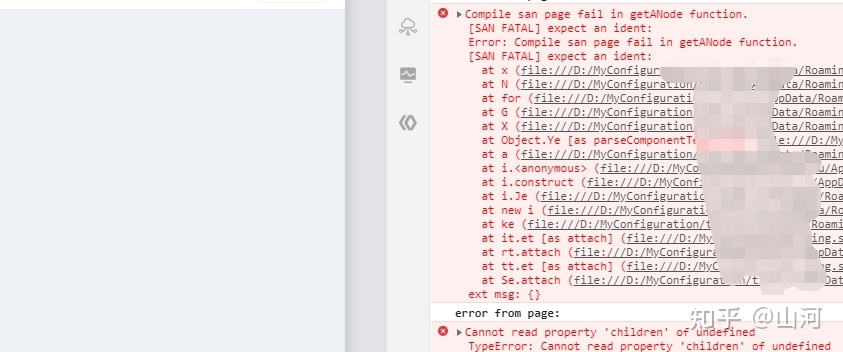
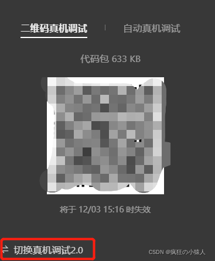

## UNI-APP 打包到百度小程序时显示 ***框架重要节点状态转移超时***

 

这是因为在代码中绑定`key`的时候使用了表达式`:key="'index' + index"`，在非 H5 的情况下是不支持这种写法的，所以将它改成定值就好了`:key="index"`


## 微笑小程序中使用 canvas 的坑

### canvas api 和web一致

微笑小程序中的 canvas 的 api 和 [web 端](https://developer.mozilla.org/zh-CN/docs/Web/API/CanvasRenderingContext2D/drawImage)的是一样的，但是实际上还是会有不一样（不要太相信微信官方的文档，会变得不幸）。比如web端并没有`ctx.draw()`方法，本来`ctx.draw(reserve,cb)`中 cb 是绘制完成之后的回调，我觉得是很方便的，但是现在这个方法在新的基础库中是**不存在**的，但是官方文档并没有更新说明。

### offScreenCanvas 不能创建和绘制图片

虽然官方文档上写着是可以绘制图片的，但是实际上很可能不生效，我在使用的时候使用`canvas.createImage()`创建图片是创建不了的，使用`ctx.drawImage()`绘制图片同样没有作用，后来发现是离屏canvas不支持2d.

### 设置canvas width height

如果canvas 中图像的尺寸不对或者进行了缩放，很有可能是因为没有设置`canvas.width/canvas.height`。

### 真机调试canvas无法显示

微笑开发者工具在真机调试1.0版本不支持调试 cancas，需要切换成2.0版本



也可以使用 真机预览 来进行调试，开启 vConsole 可以在真机预览状态下调试，不过还是相当麻烦的。

### 隐藏canvas

在 离屏canvas 不支持的时候，我们必须要在页面中增加一个 canvas 节点，才能进绘制，如果要隐藏 canvas 节点不能给 canvas 设置 display none/position fixed，可以包裹一层view，然后设置`visibility:hidden`就好

### 生产的canvas图片白屏

`wx.canvasToTempFilePath()`把当前画布指定区域的内容导出生成指定大小的图片。在 `draw()` 回调里调用该方法才能保证图片导出成功，但是这个方法很可能已经不支持了，所以可以使用`setTimeout`方法等待一段时间之后在生成图片

### iOS在vConsole模式下拍照后返回会白屏

如果我们要把拍摄到的照片绘制到canvas之后在生成图片，如果拍摄完成之后立即将canvas导出为图片很可能得到的是一张白屏的图片，这很可能是因为开启了`vConsole`模式；或者拍照后，第一张是白图，第二张开始返回的是前一张图片，这很可能是因为图片还没有渲染完成

### `ctx.measureText`计算文字大小位置

ios和安卓返回的数据可能不一样


## `openSetting:fail can only be invoked by user TAP gesture.`

在调用`wx.openSetting`方法打开设置的时候报错`openSetting:fail can only be invoked by user TAP gesture.`，这个很可能是将`wx.openSetting`放到了异步任务中调用了，比如

```js
setTimeout(()=>{
  wx.openSetting();
},1000)
```

```js
Promise.resolve().then(res=>{
  wx.openSetting();
})
```

```js
async function openSet(){
  await someTask();
  wx.openSetting();
}
```

所以不要将`wx.openSetting`放到异步任务中调用，但是**可以放到回调函数中调用**。


## 打开设置页面显示是空白，没有选项

`wx.openSetting`打开设置页面中的权限项是通过` wx.authorize `申请之后才会有的，所以要在设置页面中看到权限项，首先要用`wx.authorize`申请，可以通过`getSetting`来查看已经申请了那些权限