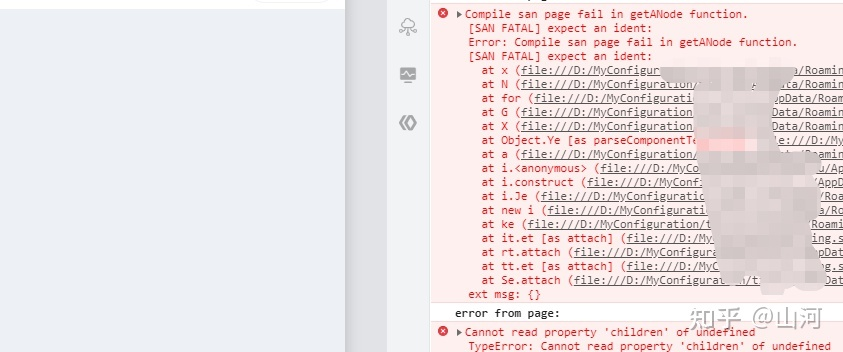
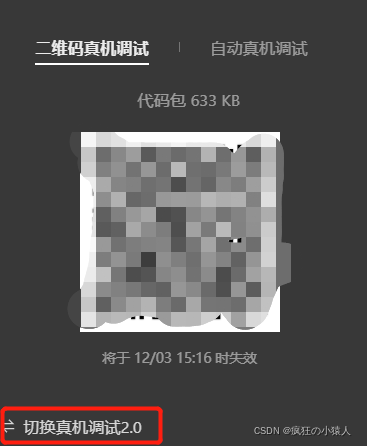

## UNI-APP 打包到百度小程序时显示 ***框架重要节点状态转移超时***

 

这是因为在代码中绑定`key`的时候使用了表达式`:key="'index' + index"`，在非 H5 的情况下是不支持这种写法的，所以将它改成定值就好了`:key="index"`


## 微笑小程序中使用 canvas 的坑

### canvas api 和web一致

微笑小程序中的 canvas 的 api 和 [web 端](https://developer.mozilla.org/zh-CN/docs/Web/API/CanvasRenderingContext2D/drawImage)的是一样的，但是实际上还是会有不一样（不要太相信微信官方的文档，会变得不幸）。比如web端并没有`ctx.draw()`方法，本来`ctx.draw(reserve,cb)`中 cb 是绘制完成之后的回调，我觉得是很方便的，但是现在这个方法在新的基础库中是**不存在**的，但是官方文档并没有更新说明。

### offScreenCanvas 不能创建和绘制图片

虽然官方文档上写着是可以绘制图片的，但是实际上很可能不生效，我在使用的时候使用`canvas.createImage()`创建图片是创建不了的，使用`ctx.drawImage()`绘制图片同样没有作用，后来发现是离屏canvas不支持2d.

### 设置canvas width height

如果canvas 中图像的尺寸不对或者进行了缩放，很有可能是因为没有设置`canvas.width/canvas.height`。

### 真机调试canvas无法显示

微笑开发者工具在真机调试1.0版本不支持调试 cancas，需要切换成2.0版本



也可以使用 真机预览 来进行调试，开启 vConsole 可以在真机预览状态下调试，不过还是相当麻烦的。

### 隐藏canvas

在 离屏canvas 不支持的时候，我们必须要在页面中增加一个 canvas 节点，才能进绘制，如果要隐藏 canvas 节点不能给 canvas 设置 display none/position fixed，可以包裹一层view，然后设置`visibility:hidden`就好

### 生产的canvas图片白屏

`wx.canvasToTempFilePath()`把当前画布指定区域的内容导出生成指定大小的图片。在 `draw()` 回调里调用该方法才能保证图片导出成功，但是这个方法很可能已经不支持了，所以可以使用`setTimeout`方法等待一段时间之后在生成图片

### iOS在vConsole模式下拍照后返回会白屏

如果我们要把拍摄到的照片绘制到canvas之后在生成图片，如果拍摄完成之后立即将canvas导出为图片很可能得到的是一张白屏的图片，这很可能是因为开启了`vConsole`模式；或者拍照后，第一张是白图，第二张开始返回的是前一张图片，这很可能是因为图片还没有渲染完成

### `ctx.measureText`计算文字大小位置

ios和安卓返回的数据可能不一样


## `openSetting:fail can only be invoked by user TAP gesture.`

在调用`wx.openSetting`方法打开设置的时候报错`openSetting:fail can only be invoked by user TAP gesture.`，这个很可能是将`wx.openSetting`放到了异步任务中调用了，比如

```js
setTimeout(()=>{
  wx.openSetting();
},1000)
```

```js
Promise.resolve().then(res=>{
  wx.openSetting();
})
```

```js
async function openSet(){
  await someTask();
  wx.openSetting();
}
```

所以不要将`wx.openSetting`放到异步任务中调用，但是**可以放到回调函数中调用**。


## 打开设置页面显示是空白，没有选项

`wx.openSetting`打开设置页面中的权限项是通过` wx.authorize `申请之后才会有的，所以要在设置页面中看到权限项，首先要用`wx.authorize`申请，可以通过`getSetting`来查看已经申请了那些权限


## 订阅了消息，订阅号接收不到消息推送

订阅了消息只接收到了一次消息，之后就没有消息推送了，可以每次操作都调用一次订阅`wx.requestSubscribeMessage`。

[小程序订阅消息用户拒绝/关闭后，如何引导用户再次开启？并获得用户的操作状态？](https://juejin.cn/post/6844904079269838862)

[微信小程序订阅消息，我踩过的坑都在这里了！](https://www.cnblogs.com/msunh/p/12175555.html)


## App/H5/小程序打开小程序

https://blog.csdn.net/u010059669/article/details/114822996

### 微信小程序跳转微信小程序

通过[`wx.navigateToMiniProgram`](https://developers.weixin.qq.com/miniprogram/dev/api/navigate/wx.navigateToMiniProgram.html)方法跳转到别的小程序,参数如下:

```js
wx.navigateToMiniProgram({
  appId: 'xxxxxx',
  path: 'pages/index/index?scene=xxx',// 这个是跳转到小程序首页
  envVersion: 'develop',// 开发版 develop 要先用手机扫开发版的二维码加载小程序后才能跳转
  success(res) {
    // 打开成功
  }
})
```

### 通过短链接跳转小程序

在**微信或小程序内**可用通过短链接调整到指定的小程序, 自己的小程序的短链接生成方法[Short Link](https://developers.weixin.qq.com/apiExplorer?apiName=generateShortLink&plat=miniprogram)，别人的小程序链接可以通过【小程序菜单】->【复制链接】获取

编程式跳转

```js
wx.navigateToMiniProgram({
  shortLink: "#小程序://DiXiu/SCn62HRFQIZca1b",
  envVersion: 'develop',// 开发版 develop 要先用手机扫开发版的二维码加载小程序后才能跳转
  success(res) {
    // 打开成功
  }
})
```


### 扫小程序码跳转指定小程序页面

生成指定页面的二维码，后台生成小程序二维码接口文档: https://developers.weixin.qq.com/miniprogram/dev/server/API/qrcode-link/qr-code/api_getunlimitedqrcode.html

```js
const result = await cloud.openapi.wxacode.getUnlimited({
    "page": 'pages/index/index',// 要跳转的页面路径
    "scene": 'a=1',// 要跳转的页面参数
    "checkPath": true,// 是否检查page是否存在，如果页面还没上线就需要设置成false
    "envVersion": 'release'// 开发版 develop 要先用手机扫开发版的二维码加载小程序后才能跳转
  })
return result
```


### 获取 URL Scheme 在微信外部打开小程序

在微信外部打开小程序需要获取 `URL Scheme` 或者 `URL Link`，生成普通 `URL Scheme` 或者 `URL Link`方法：[服务端接口调试](https://developers.weixin.qq.com/apiExplorer?apiName=generateScheme&plat=miniprogram)

生成NFC URL Scheme方法[NFC URL Scheme](https://developers.weixin.qq.com/apiExplorer?apiName=generateNFCScheme&plat=miniprogram)

生成 NFC URL Scheme需要参数:

```json
{
	"jump_wxa": {
    // 打开的页面地址
		"path": "/pages/index/scanRepair/scanRepair",
		"query": "scene=xxxx",// 参数
		"env_version": "release"
	},
	"model_id": "aAFEN-Ue6Z0s1W3aL1h_zw", // 这个不可修改，要修改只能在微信后台【行业能力 -> 硬件设备】申请添加一个新的model_id
	"sn":"KFR-35GW/N8KS1-1P" // 这个是任意字符串，但是要注意不要和之前使用的sn重复
}
```

`Short Link / URL Link / URL Scheme`都可以在手机默认浏览器中打开后跳转微信小程序

### 普通 H5 打开小程序

可以通`a`标签或者`location.href`直接打开跳转`URL Link / URL Scheme`打开小程序，但是有些浏览器可能无法打开

### 微信内H5打开小程序

除了`普通 H5 打开小程序`的方法外还可以通过`wx-open-launch-weapp`打开小程序，但是有几个条件

- 需要已认证的微信公众平台账号
- 需要在公众平台后台绑定h5安全域名
- h5需要引入微信js-sdk，配置`wx.config`，使用标签`wx-open-launch-weapp`
- 只能手动点击页面标签按钮跳转
- 可跳转至任意小程序

[文档](https://developers.weixin.qq.com/doc/service/guide/h5/opentag.html#%E8%B7%B3%E8%BD%AC%E5%B0%8F%E7%A8%8B%E5%BA%8F%EF%BC%9Awx-open-launch-weapp)

引入`js-sdk`和配置`wx.config`

```html
<script src="http://res.wx.qq.com/open/js/jweixin-1.6.0.js"></script>
<script>
wx.config({
  debug: true, // 开启调试模式,调用的所有api的返回值会在客户端alert出来，若要查看传入的参数，可以在pc端打开，参数信息会通过log打出，仅在pc端时才会打印
  // 签名生成 https://developers.weixin.qq.com/doc/service/guide/h5/jssdk.html#%E9%99%84%E5%BD%95-JS-SDK%E4%BD%BF%E7%94%A8%E6%9D%83%E9%99%90%E7%AD%BE%E5%90%8D%E7%AE%97%E6%B3%95
  appId: '', // 必填，服务号的唯一标识
  timestamp: , // 必填，生成签名的时间戳
  nonceStr: '', // 必填，生成签名的随机串
  signature: '',// 必填，签名
  jsApiList: [], // 必填，需要使用的JS接口列表
  openTagList: ['wx-open-launch-app'] // 可选，需要使用的开放标签列表
});
  wx.ready(function () {
  // config信息验证后会执行ready方法，所有接口调用都必须在config接口获得结果之后，config是一个客户端的异步操作，所以如果需要在页面加载时就调用相关接口，则须把相关接口放在ready函数中调用来确保正确执行。对于用户触发时才调用的接口，则可以直接调用，不需要放在ready函数中
});
wx.error(function (res) {
  // config信息验证失败会执行error函数，如签名过期导致验证失败，具体错误信息可以打开config的debug模式查看，也可以在返回的res参数中查看，对于SPA可以在这里更新签名
});
</script>
```

使用`wx-open-launch-weapp`

```html
<wx-open-launch-weapp
  id="launch-btn"
  appid="wx111111111" 所需跳转的小程序appid
  username="gh_xxxxxxxx" 所需跳转的小程序原始id
  path="pages/home/index?user=123&action=abc"
>
  <template>
    <style>.btn { padding: 12px }</style>
    <button class="btn">打开小程序</button>
  </template>
</wx-open-launch-weapp>
```


### APP打开微信小程序

#### 通过SDK跳转

需要**在开放平台绑定APP**获取appId（不是小程序appId）和知道小程序的原始id

**跳转规则**

1. 对于*已通过认证的开放平台账号，其移动应用可以跳转至任何合法的小程序*，且不限制跳转的小程序数量。
2. 对于未通过认证的开放平台账号，其移动应用仅可以跳转至同一开放平台账号下小程序。

注意：若移动应用未上架，则最多只能跳转小程序100次/天，用于满足调试需求。

[跳转方法](https://developers.weixin.qq.com/doc/oplatform/Mobile_App/Launching_a_Mini_Program/Android_Development_example.html)

```java
String appId = "wxd930ea5d5a258f4f"; // 填移动应用(App)的 AppId，非小程序的 AppID
IWXAPI api = WXAPIFactory.createWXAPI(context, appId);

WXLaunchMiniProgram.Req req = new WXLaunchMiniProgram.Req();
req.userName = "gh_d43f693ca31f"; // 填小程序原始id
req.path = path;                  ////拉起小程序页面的可带参路径，不填默认拉起小程序首页，对于小游戏，可以只传入 query 部分，来实现传参效果，如：传入 "?foo=bar"。
req.miniprogramType = WXLaunchMiniProgram.Req.MINIPTOGRAM_TYPE_RELEASE;// 可选打开 开发版，体验版和正式版
api.sendReq(req);
```


#### 通过`URL Link / URL Scheme`跳转

安卓端

```java
try {
    // 1. 创建一个Intent来打开这个自定义链接
    Intent intent = new Intent(Intent.ACTION_VIEW, Uri.parse(url));
    // 2. 启动微信App来处理这个链接
    view.getContext().startActivity(intent);
} catch (ActivityNotFoundException e) {
    // 3. 如果手机未安装微信，捕获异常并给用户提示
    Toast.makeText(view.getContext(), "请先安装微信客户端", Toast.LENGTH_SHORT).show();
}
```

IOS端

在`info.plist`中添加协议白名单

```text
<key>LSApplicationQueriesSchemes</key>
<array>
  <string>weixin</string>
  <string>wechat</string>
</array>
```

```objc
#import <UIKit/UIKit.h>

if ([[UIApplication sharedApplication] canOpenURL:URL]) {
    [[UIApplication sharedApplication] openURL:URL
                                       options:@{}
                             completionHandler:^(BOOL success) {
        // 处理跳转结果
    }];
}
```

或者可以通过 webview 打开h5页面，通过路由进行跳转，页面如下

```html
<!doctype html>
<html lang="zh-CN">
  <head>
    <meta charset="UTF-8" />
    <meta name="viewport" content="width=device-width, initial-scale=1.0" />
    <title>微信明文URL Scheme Demo</title>
    <style>
      body {
        font-family: Arial, sans-serif;
        max-width: 780px;
        margin: 24px auto;
        padding: 0 16px;
        line-height: 1.6;
      }
      .card {
        border: 1px solid #e5e7eb;
        border-radius: 10px;
        padding: 16px;
        background: #fafafa;
      }
      .btn {
        display: inline-block;
        margin-top: 12px;
        background: #07c160;
        color: #fff;
        text-decoration: none;
        padding: 10px 14px;
        border-radius: 6px;
      }
      code {
        background: #f3f4f6;
        padding: 2px 4px;
        border-radius: 4px;
        word-break: break-all;
      }
      .tips {
        color: #666;
        font-size: 14px;
      }
    </style>
  </head>
  <body>
    <h2>小程序拉起</h2>
    <div class="card">
      <div><strong>URL Scheme：</strong></div>
      <div><code>weixin://dl/business/?t=B6pHVrURvPk</code></div>
      <a class="btn" href="weixin://dl/business/?t=B6pHVrURvPk">a标签拉起小程序</a>
      <button class="btn" onclick="callMiniProgram()">location拉起小程序</button>
    </div>
    <p class="tips">
      请在微信环境中打开本页面进行测试。若未拉起，可复制上面的 scheme 在微信中尝试。
    </p>
    <script>
      function callMiniProgram(){
        location.href = 'weixin://dl/business/?t=B6pHVrURvPk';
      }
    </script>
  </body>
</html>
```

安卓端需要对协议进行拦截处理

```java
webView.setWebViewClient(new WebViewClient() {
    
    @Override
    public boolean shouldOverrideUrlLoading(WebView view, String url) {
        // 1. 检查点击的链接是否以 "weixin://" 开头
        if (url != null && url.startsWith("weixin://")) {
            try {
                // 2. 创建一个Intent来打开这个自定义链接
                Intent intent = new Intent(Intent.ACTION_VIEW, Uri.parse(url));
                // 3. 启动微信App来处理这个链接
                view.getContext().startActivity(intent);
            } catch (ActivityNotFoundException e) {
                // 4. 如果手机未安装微信，捕获异常并给用户提示
                Toast.makeText(view.getContext(), "请先安装微信客户端", Toast.LENGTH_SHORT).show();
            }
            // 5. 返回true，表示我们已处理该链接，WebView不再尝试加载
            return true;
        }
        // 如果是http或https链接，按WebView默认方式处理
        return false;
    }
});
```

IOS端通常默认就支持，不过如果不支持也可以像安卓端那样进行拦截处理

```objective-c
- (void)webView:(WKWebView *)webView decidePolicyForNavigationAction:(WKNavigationAction *)navigationAction decisionHandler:(void (^)(WKNavigationActionPolicy))decisionHandler {
    NSURL *url = navigationAction.request.URL;
    NSString *urlScheme = url.scheme;
    
    // 关键：拦截 weixin:// 开头的链接
    if ([urlScheme isEqualToString:@"weixin"]) {
        // 取消 WebView 自己的加载
        decisionHandler(WKNavigationActionPolicyCancel);
        
        // 调用新 API 跳转，这是解决 iOS 18 适配的关键
        if ([[UIApplication sharedApplication] canOpenURL:url]) {
            [[UIApplication sharedApplication] openURL:url options:@{} completionHandler:^(BOOL success) {
                if (!success) {
                    NSLog(@"跳转微信失败");
                    // 可以在这里弹窗提醒用户安装微信
                }
            }];
        }
        return;
    }
    
    // 对于 http/https 等常规链接，允许 WebView 正常加载
    decisionHandler(WKNavigationActionPolicyAllow);
}
```

> URL Link 本身就是一个h5页面，webview 直接打开就好

> 对于react-native也通样可以进行拦截处理
>
> ```jsx
> const onShouldStartLoadWithRequest = (request) => {
>   const { url } = request;
>   
>   // 1. 拦截 weixin:// 开头的链接
>   if (url && url.startsWith('weixin://')) {
>     // 2. 尝试使用 Linking 唤起微信
>     Linking.openURL(url).catch((err) => {
>       // 可选：错误时给用户友好提示
>       Alert.alert('提示', '无法打开微信，请确保应用已安装。');
>       console.error('Failed to open WeChat:', err);
>     });
>     // 3. 返回 false 阻止 WebView 继续加载该请求
>     return false;
>   }
> 
>   // 对于其他请求（如http, https），返回 true 允许 WebView 正常加载
>   return true;
> };
> 
> <WebView
>   source={{ uri: 'https://your-web-page.com' }}
>   onShouldStartLoadWithRequest={onShouldStartLoadWithRequest}
>   // ... 其他必要的 WebView 属性，如 style 等
> />
> ```

[明文 URL Scheme 和加密 URL Scheme区别](https://developers.weixin.qq.com/miniprogram/dev/framework/open-ability/url-scheme.html)


## <font color="red">微信小程序打开APP</font>

只有当小程序从 APP 打开的场景打开时（场景值 1069），小程序会获得返回 APP 的能力: https://developers.weixin.qq.com/miniprogram/dev/framework/open-ability/launchApp.html

## <font color="red">微信小程序打开web页面</font>

微信小程序可以通过[`webview`](https://developers.weixin.qq.com/miniprogram/dev/component/web-view.html)方法打开web页面,可打开关联的公众号的文章，但是需要注意**网页需登录小程序管理后台配置业务域名,并且需要网站添加验证文件**

## 微信内h5打开app

微信环境里默认屏蔽了url schema等方式打开app的能力，除非你是白名单app，例如腾讯系的知乎、bilibili等，一般app只能另寻出路。

微信开放标签实现微信内h5打开app

[微信开放平台](https://open.weixin.qq.com/)，[微信公众平台](https://mp.weixin.qq.com/)

+ 需要已认证的微信公众平台账号和微信开放平台账号
+ 需要在公众平台后台绑定h5安全域名
+ 需要在开放平台后台登记h5域名和app的绑定关系
+ h5需要引入微信js-sdk，配置wx.config，使用标签wx-open-launch-app
+ 只能手动点击页面标签按钮跳转
+ 只能跳转h5域名绑定的app
+ 可以实现跳转指定页面和携带参数

```html
<wx-open-launch-app
  id="launch-btn"
  appid="your-appid"
  extinfo="your-extinfo"
>
  <script type="text/wxtag-template">
    <style>.btn { padding: 12px }</style>
    <button class="btn">App内查看</button>
  </script>
</wx-open-launch-app>
<script>
  var btn = document.getElementById('launch-btn');
  btn.addEventListener('launch', function (e) {
    console.log('success');
  });
  btn.addEventListener('error', function (e) {
    console.log('fail', e.detail);
  });
</script>

```

[解析参数](https://developers.weixin.qq.com/doc/service/guide/h5/opentag.html#App%E8%8E%B7%E5%8F%96%E5%BC%80%E6%94%BE%E6%A0%87%E7%AD%BE-wx-open-launch-app-%E4%B8%AD%E7%9A%84extinfo%E6%95%B0%E6%8D%AE)