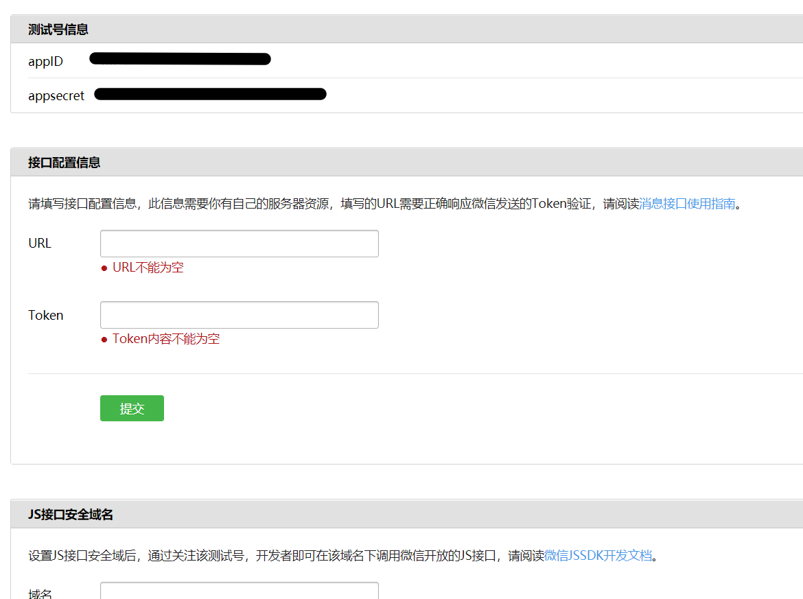

## 微信公众号的分类

微信公众号主要分为订阅号，服务号，微信小程序、企业微信。一般我们常说的微信公众号主要是指订阅号和服务号

### 订阅号和服务号的区别

1.消息推送频率

+ 订阅号：一天内可以群发一条消息
+ 服务号：一月内可发送4条群发消息

2.提供功能

+ 订阅号：包含大部分功能
+ 服务号：认证的服务号包含全部功能

3.适用人群

+ 订阅号：个人、媒体
+ 服务号：企业、政府或其他组织


## 注册账号

一般个人开发者注册订阅号账号就好，因为服务的话需要提供相关的资格证明，并且需要较长时间的审核。在这里[注册](https://mp.weixin.qq.com/cgi-bin/registermidpage?action=index&lang=zh_CN&token=)


## 公众号管理平台的简单使用

在登录公众号管理平台后，可以在上面做一些简单的配置功能，比如关注公众号自动回复，关键字自动回复，发表文章推文等。如果查看`设置与开发 - 接口权限`的话，会发现还是有很多接口是不能使用的，因为那些接口是需要进行微信认证的，也就是需要有资格证明。


## 作为个人开发者进行开发

如果需要做使用或者说需要以个人开发者的身法来学习和使用全部相关的接口的话可以在[这里](https://developers.weixin.qq.com/doc/offiaccount/Basic_Information/Requesting_an_API_Test_Account.html)申请测试账号来进行。登录进去之后就可以设置自己的服务器地址了



在开发中我们自己的服务并不能直接和微信公众号进行交互，而是由微信服务做转接服务。这也就是为啥需要验证Token。

首先需要注意的是 URL 必须是互联网和访问的URL，不能是`http://localhost:3000`这种本地的URL，这里可以使用内网穿透来将本地URL映射到外网上。Token 主要是用来加密生成签名验证服务器的有效性的

### 内网穿透

内网穿透可以使用[**ngrok**](https://ngrok.com/)来实现，这是一个免费的内网穿透库，提供了[软件](https://ngrok.com/download)和[npm包](https://www.npmjs.com/package/ngrok)两种方式。个人比较喜欢用npm包的方式

安装`npm i ngrok -g`，运行`ngrok http 3000`即可。

> 如果你还没有注册 ngrok 账号，一定要先注册账号然后进入到 ngrok 的[管理页面](https://dashboard.ngrok.com/get-started/setup)去获取 authtoken 并运行`ngrok authtoken xxxxxxx`进行签名认证，不然很可能一直显示配置失败

### 验证服务器有效性

1. 微信服务器需要知道开发者服务器是哪个，也就是说我们自己的服务器必须能够接收到微信服务器发来的信息，所以url必须是外网的
2. 微信服务器通过填写的token生成签名发送给开发者服务器进行验证
3. 微信服务器向开发者服务器发送验证信息

```json
{
  signature: '2b2f94c3cb8a32d707861f0e73ee0cc4db4ca1b4',//微信加密签名
  echostr: '202276215371246813',//微信随机字符串
  timestamp: '1639320657',//微信的发送请求时间戳
  nonce: '1194212782'//微信随机数字
}
```

4. 根据收到的消息将`timestamp nonce token`的值按这个顺序组合成一个数组，然后再将这个字符串按字典排序（0-9、a-z）并拼接形成一个字符串，最后做`sha1`加密并与`signature`对比，如果相同返回接收到的`echostr`，不相同返回 error

安装sha1 `npm i sha1 -S`

```js
const sha1 = require('sha1');
const token = 'onlycode'
app.use((req,res,next)=>{
    let {signature,echostr,timestamp,nonce} = req.query;
    let arr = [timestamp,nonce,token];
    let arrSort = arr.sort();
    let str = arr.join("");
    let signStr = sha1(str);
    if(signStr === signature){
        res.send(echostr);
    }else{
        res.end('error');
    }
})
```


