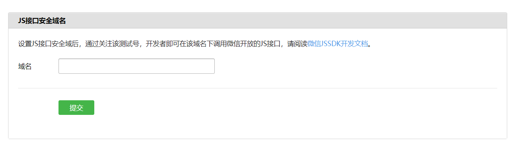

## 微信公众号的分类

微信公众号主要分为订阅号，服务号，微信小程序、企业微信。一般我们常说的微信公众号主要是指订阅号和服务号

### 订阅号和服务号的区别

1.消息推送频率

+ 订阅号：一天内可以群发一条消息
+ 服务号：一月内可发送4条群发消息

2.提供功能

+ 订阅号：包含大部分功能
+ 服务号：认证的服务号包含全部功能

3.适用人群

+ 订阅号：个人、媒体
+ 服务号：企业、政府或其他组织


## 注册账号

一般个人开发者注册订阅号账号就好，因为服务的话需要提供相关的资格证明，并且需要较长时间的审核。在这里[注册](https://mp.weixin.qq.com/cgi-bin/registermidpage?action=index&lang=zh_CN&token=)


## 公众号管理平台的简单使用

在登录公众号管理平台后，可以在上面做一些简单的配置功能，比如关注公众号自动回复，关键字自动回复，发表文章推文等。如果查看`设置与开发 - 接口权限`的话，会发现还是有很多接口是不能使用的，因为那些接口是需要进行微信认证的，也就是需要有资格证明。


## 作为个人开发者进行开发

如果需要做使用或者说需要以个人开发者的身法来学习和使用全部相关的接口的话可以在[这里](https://developers.weixin.qq.com/doc/offiaccount/Basic_Information/Requesting_an_API_Test_Account.html)申请测试账号来进行。登录进去之后就可以设置自己的服务器地址了


在开发中我们自己的服务并不能直接和微信公众号进行交互，而是由微信服务做转接服务。这也就是为啥需要验证Token。

首先需要注意的是 URL 必须是互联网和访问的URL，不能是`http://localhost:3000`这种本地的URL，这里可以使用内网穿透来将本地URL映射到外网上。Token 主要是用来加密生成签名验证服务器的有效性的

### 内网穿透

内网穿透可以使用[**ngrok**](https://ngrok.com/)来实现，这是一个免费的内网穿透库，提供了[软件](https://ngrok.com/download)和[npm包](https://www.npmjs.com/package/ngrok)两种方式。个人比较喜欢用npm包的方式

安装`npm i ngrok -g`，运行`ngrok http 3000`即可。

> 如果你还没有注册 ngrok 账号，一定要先注册账号然后进入到 ngrok 的[管理页面](https://dashboard.ngrok.com/get-started/setup)去获取 authtoken 并运行`ngrok authtoken xxxxxxx`进行签名认证，不然很可能一直显示配置失败

### 验证服务器有效性

1. 微信服务器需要知道开发者服务器是哪个，也就是说我们自己的服务器必须能够接收到微信服务器发来的信息，所以url必须是外网的
2. 微信服务器通过填写的token生成签名发送给开发者服务器进行验证
3. 微信服务器向开发者服务器发送验证信息

```json
{
  signature: '2b2f94c3cb8a32d707861f0e73ee0cc4db4ca1b4',//微信加密签名
  echostr: '202276215371246813',//微信随机字符串
  timestamp: '1639320657',//微信的发送请求时间戳
  nonce: '1194212782'//微信随机数字
}
```

4. 根据收到的消息将`timestamp nonce token`的值按这个顺序组合成一个数组，然后再将这个字符串按字典排序（0-9、a-z）并拼接形成一个字符串，最后做`sha1`加密并与`signature`对比，如果相同返回接收到的`echostr`，不相同返回 error

安装sha1 `npm i sha1 -S`

```js
const sha1 = require('sha1');
const token = 'onlycode'
app.use((req,res,next)=>{
  if(req.method === 'GET'){
    let {signature,echostr,timestamp,nonce} = req.query;
    let arr = [timestamp,nonce,token];
    let arrSort = arr.sort();
    let str = arr.join("");
    let signStr = sha1(str);
    if(signStr === signature){
      res.send(echostr);
    }else{
      res.end('error');
    }
  }else{
    next();
  }
})
```

> 需要注意的是，微信服务器发过来的 GET 请求是专门用来做服务器验证的，所以可以通过`req.method`来做验证请求和普通请求的区分；并且 post 请求的 `req.query`和 get 请求参数是一样的，所以还可以再通过签名来检测请求是不是微信服务器发来的。


### 获取验证接口

在验证服务器有效性之后，还不能马上使用微信公众号提供的接口，因为还需要获取接口请求的凭证`access_token`（请求接口的权限token），一般这个凭证有效期为2小时，也就是所需要在凭证过期之后重新获取，需要注意的是一天内只能请求获取 `access_token`2000 次，最好做一下缓存。

设计思路

> 以文件形式存储 access_token，通过本地是否有文件来判断有没有 access_token ，如果没有就发请求获取 access_token，如果有再判断有没有过期了.
>
> 但是有个问题需要注意一下，access_token 每次请求获取到的都是不一样的，也就是如果本地中保存了一份数据了，且没有过期时使用 access_token 验证工具后，本地的这份数据将会失效，需要将本地的数据清理后再试。

请求方式

```shell
GET https://api.weixin.qq.com/cgi-bin/token?grant_type=client_credential&appid=APPID&secret=APPSECRET
```

> `grant_type`固定为 `client_credential`


### 接收用户发送的消息与回复

**消息接收**

微信用户发送过来的数据会先将数据发送给微信服务器，然后微信服务器再将数据转发到开发者的服务器，并且数据是以 ***xml*** 的格式的***流式数据***的信息，所以在接收数据的时候需要使用文件流的方式接收。在接收到数据之后，为了方便对数据进行处理需要对数据进行格式化处理（node环境中可以使用`xml2js`）。

```js
/**接收用户传递的流式数据 */
exports.getUserStreamData = function(req){
  return new Promise((resolve,reject)=>{
    let xmlData = '';
    req.on('data',data => {
      xmlData += data.toString();
    }).on('end',()=>{
      resolve(xmlData)
    })
  })
}
```

需要注意的是，如果开发者在 5 秒内没有回复或者回复的数据有异常（比如说有多余的空格）的话，微信服务器将会向用户发送`该公众号暂时无法提供服务，请稍后再试`。

用户可以发送的消息包括`文本、语音、视频、小视频、链接、地理位置、图片`等[信息](https://developers.weixin.qq.com/doc/offiaccount/Message_Management/Receiving_standard_messages.html)，也就我们自己的开发者服务器能接收到的信息，在接收到这些信息之后可以通过接收到内容来判断要回复什么。

**消息回复**

作为开发者服务可以回复的数据类型有`文本，信息，图片、音乐、图文`等[信息](https://developers.weixin.qq.com/doc/offiaccount/Message_Management/Passive_user_reply_message.html)

接收到的数据是 xml 格式的数据，那我们回复给用户的信息也需要使用 xml 格式的数据，具体需要传什么样的字段可以查看官网是，比如自动回复的数据是这样的

```xml
<xml>
  <ToUserName><![CDATA[toUser]]></ToUserName>
  <FromUserName><![CDATA[fromUser]]></FromUserName>
  <CreateTime>12345678</CreateTime>
  <MsgType><![CDATA[text]]></MsgType>
  <Content><![CDATA[你好]]></Content>
</xml>
```

然后简单的自动回复可以这样的

```js
if(userData.MsgType === 'text'){
  if(userData.Content === '1'){
    content = 'this value is 1';
  }else if(userData.Content.match('hello')){
    content = 'hello world';
  }
}
let msg = `<xml>
<ToUserName><![CDATA[${userData.FromUserName}]]></ToUserName>
<FromUserName><![CDATA[${userData.ToUserName}]]>
</FromUserName><CreateTime>${Date.now()}</CreateTime>
<MsgType><![CDATA[${userData.MsgType}]]></MsgType>
<Content><![CDATA[${content}]]></Content>
</xml>`
res.send(msg)
```


**事件推送**

当用户进行一些动作时微信服务器也会将动作信息发送到开发者服务器中，比如

1.  关注/取消关注事件
2. 扫描带参数二维码事件
3. 上报地理位置事件
4. 自定义菜单事件
5. 点击菜单拉取消息时的事件推送
6. 点击菜单跳转链接时的事件推送

比较常用的就是点击菜单时候的消息推送了。可以根据用户点击了的菜单继续响应的跳转或消息回复。


### JS-SDK 在网页中使用微信API

通过使用微信JS-SDK，网页开发者可借助微信高效地使用拍照、选图、语音、位置等手机系统的能力，同时可以直接使用微信分享、扫一扫、卡券、支付等微信特有的能力，为微信用户提供更优质的网页体验。

当然要使用这些api都是需要配置并且获取权限的，具体的配置可以查看[官网](https://developers.weixin.qq.com/doc/offiaccount/OA_Web_Apps/JS-SDK.html)

首先获取 jsapi_ticket 

```http
GET https://api.weixin.qq.com/cgi-bin/token?grant_type=client_credential&appid=APPID&secret=APPSECRET
```

这里的 access_token 就是上面获取到的权限凭证，

之后还需要生成签名

签名生成规则如下：参与签名的字段包括noncestr（随机字符串）, 有效的jsapi_ticket, timestamp（时间戳）, url（当前网页的URL，不包含#及其后面部分） 。对所有待签名参数按照字段名的ASCII 码从小到大排序（字典序）后，使用URL键值对的格式（即key1=value1&key2=value2…）拼接成字符串string1。这里需要注意的是所有参数名均为小写字符。对string1作sha1加密，字段名和字段值都采用原始值，不进行URL 转义

```js
 let noncestr = Math.random().split('.')[1];
let jsapi_ticket = 'xxxxx';
let timestamp = Date.now();
let url = 'http://mp.weixin.qq.com?params=value';

let arr = [
  `noncestr=${noncestr}`,
  `jsapi_ticket=${jsapi_ticket}`,
  `timestamp=${timestamp}`,
  `url=${url}`,
]
let sortArr = arr.sort();
let str = sortArr.join('&');
let signature = sha1(str);
```

> 1. 签名用的noncestr和timestamp必须与wx.config中的nonceStr和timestamp相同。
> 2. 签名用的url必须是调用JS接口页面的完整URL。

然后在开发者管理平台上配置授权域名。



> 需要注意的是这里填写的是**域名**，是不包括协议的，也就是说URL是这个的话`http://test.com`，只需要填`test.com`。

之后需要调用JS接口的页面引入`http://res.wx.qq.com/open/js/jweixin-1.6.0.js`文件，并进行配置

```js
wx.config({
  debug: true, // 开启调试模式,调用的所有api的返回值会在客户端alert出来，若要查看传入的参数，可以在pc端打开，参数信息会通过log打出，仅在pc端时才会打印。
  appId: '', // 必填，公众号的唯一标识
  timestamp: , // 必填，生成签名的时间戳
  nonceStr: '', // 必填，生成签名的随机串
  signature: '',// 必填，签名
  jsApiList: [] // 必填，需要使用的JS接口列表
});
```

需要注意的是 wx.config 是异步执行的，在验证通过之后会执行`wx.ready(function(res){})`，所以需要在 `wx.ready`中调用 jsapi 接口。同时验证失败的时候会通过`wx.error(function(err){})`来处理。

可以`wx.checkJsApi`来判断当前客户端版本是否支持指定JS接口

```js
wx.checkJsApi({
  jsApiList: ['chooseImage'], // 需要检测的JS接口列表
  success: function(res){}
});
```