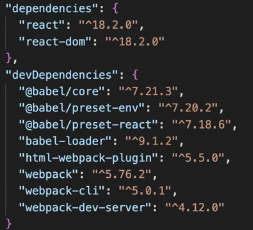
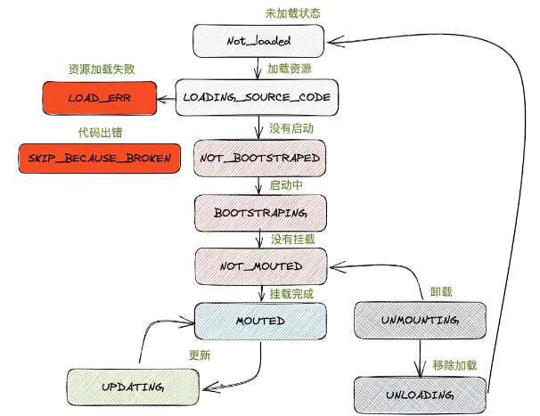
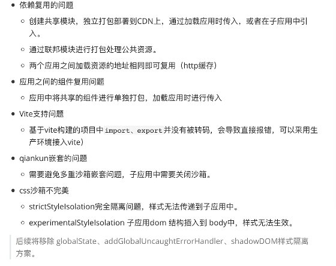

## 微前端是什么？

将 Web 应用由单一的单体应用转变为多个小型前端应用聚合为一的应用。各个前端应用还可以独立运行、独立开发、独立部署。**微前端不是单纯的前端框架或者工具，而是一套架构体系**。

## 为什么需要微前端？

1. **拆分和细化**：当下前端领域，单页面应用（SPA）是非常流行的项目形态之一，而随着时间的推移以及应用功能的丰富，单页应用变得不再单一而是越来越庞大也越来越难以维护，往往是改一处而动全身，由此带来的发版成本也越来越高。微前端的意义就是将这些庞大应用进行拆分，并随之解耦，每个部分可以单独进行维护和部署，提升效率。
2. **整合历史系统**：在不少的业务中，或多或少会存在一些历史项目，这些项目大多以采用老框架类似（Backbone.js，Angular.js 1）的 B 端管理系统为主，介于日常运营，这些系统需要结合到新框架中来使用还不能抛弃，对此我们也没有理由浪费时间和精力重写旧的逻辑。而微前端可以将这些系统进行整合，在基本不修改来逻辑的同时来同时兼容新老两套系统并行运行。
3. 多技术栈同时开发、组合

## 如何实现微前端

可以将一个应用划分成若干个子应用，将子应用打包成一个个的模块，当路径切换时加载不用的子应用，这样每个子应用都是独立的，技术栈也不用做限制。从而解决前端协同开发问题

## 实现微前端的技术方案

### 1）iframe

- 微前端的最简单方案，通过 iframe 加载子应用
- 通信可以通过 postMessage 进行通信
- 完美的沙箱机制，自带应用隔离

> 缺点： 用户体验差（弹框只能在 iframe 中、在内部切换刷新就会丢失状态）
>
> iframe 会触发独立的页面加载流程，包括 HTML 解析、CSS 渲染、JavaScript 执行等，相当于在主页面中嵌套了一个完整的浏览器环境。这意味着：资源重复加载：子应用和父应用可能共用 Vue、React 等基础库，但 iframe 会强制重新下载、解析这些资源，导致带宽浪费和加载时间翻倍
>
> iframe 的隔离性不仅体现在技术层面，更会割裂用户的操作体验：路由同步困难：子应用的路由变化无法自动同步到父页面 URL，当用户刷新页面时，iframe 会重置到初始状态。为解决这个问题，开发者需手动实现postMessage通信来同步路由，增加了系统复杂度。
>
> iframe 与父页面的通信必须通过postMessageAPI，这种基于字符串的序列化通信存在天然局限：数据传输成本高：复杂对象需要经过 JSON 序列化/反序列化，不仅消耗性能，还会丢失函数、正则等特殊类型。实时性差：postMessage属于异步通信，在高频交互场景（如父子应用共享表单数据）中会出现明显延迟。安全性风险：若未严格校验origin参数，可能遭受 XSS 攻击（即使校验origin，仍可能因逻辑漏洞导致安全问题）。恶意子应用可通过postMessage向父页面注入恶意代码。

### 2）Web Components

- 将前端应用程序分解为自定义 HTML 元素
- 基于`CustomEvent`实现通信
- Shadow DOM 天生的作用域隔离

> 缺点：浏览器支持问题、学习成本高、调试困难、修改样式困难等问题

### 3）single-spa

- Single-spa 通过路由劫持实现应用的加载（采用 SystemJS），提供应用间公共组件加载及公共业务逻辑处理，子应用需要暴露固定的钩子`bootstrap、mount、unmount`接入协议
- 基于 props 主子应用间通信
- 无沙箱机制，需要自己实现 JS 沙箱以及 CSS 沙箱

> 缺点：学习成本、无沙箱机制、需要对原有的应用进行改造、子应用间相同资源重复加载问题

### 4）Module federation

- 通过模块联邦将组件进行打包到处使用
- 共享模块的方式进行通信
- 无 CSS 沙箱和 JS 沙箱

> 缺点：需要 webpack5

## SystemJS

创建一个简单 webpack 项目

安装依赖



```js
// webpack.config.js
const HtmlWebpackPlugin = require("html-webpack-plugin");
const path = require("path")
module.exports = env => {
  return {
    mode:"development",
    output:{
      filename:'index.js',
      path:path.resolve(__dirname,'dist'),
      // 使用 systemjs 模块规范
      libraryTarget:env.production ? 'system':''
    },
    module:{
      rules:[{
        test:/\.js$/,
        use:{loader:'babel-loader'},
        exclude:/node_modules/
      }]
    },
    plugins:[
      !env.production && new HtmlWebpackPlugin({
        template:'./public/index.html'
      })
    ]
    externals:env.production ? ['react','react-dom']:[]
  }
}
```

最终打包出来的 `index.js` 就会是 `systemjs`模块规范的代码

```js
System.register(['react-dom','react'],function(__WEBPACL_DYNAMIC_EXPORT__,__system_context__){
	var __WEBPACK_EXTERNAL_MODULE_react_dom__ = {}
  var __WEBPACK_EXTERNAL_MODULE_react__ = {}
  Object.defineProperty(__WEBPACK_EXTERNAL_MODULE_react_dom__,'__esModule',{value:true});
  Object.defineProperty(__WEBPACK_EXTERNAL_MODULE_react__,'__esModule',{value:true});
  return {
    settings:[function(module){
      Object.keys(module).forEach(function(key){
      	// 用 webpack 提供的新对象拷贝并存储模块的属性很方法
        __WEBPACK_EXTERNAL_MODULE_react_dom__[key] = module[key];
      });
    },function(module){
      Object.keys(module).forEach(function(key){
        __WEBPACK_EXTERNAL_MODULE_react__[key] = module[key];
      });
    }],
    execute:function(){
      __WEBPACL_DYNAMIC_EXPORT__((()=>{
        "use strict";
        var __webpack_modules__ = {
          "./src/App.js":()=>{...}
        }
      })())
    }
  }
})
```

```html
<body>
  <div id="root"></div>
  <script type="systemjs-importmap">
    {
      "imports": {
        "react-dom": "https://cdn.bootcdn.net/ajax/libs/react-dom/18.2.0/umd/react-dom.production.min.js",
        "react": "https://cdn.bootcdn.net/ajax/libs/react/18.2.0/cjs/react-jsx-dev-runtime.development.js"
      }
    }
  </script>
  <!-- 添加 systemjs 模块解析器 -->
  <!-- <script src="https://cdn.bootcdn.net/ajax/libs/systemjs/6.14.2/system.min.js"></script> -->
  <script src="./SystemJS.js"></script>
  <script>
    // 直接加载子应用，导入打包后的包来进行加载，采用的规范 system 规范
    System.import("./index.js");
  </script>
</body>
```

### 实现自己的 SystemJS

1. System.register(依赖列表，后调用函数返回值一个 setters、execute)
2. react、react-dom 加载后调用 setters 将对应的结果赋予给 webpack
3. 调用执行逻辑，执行页面渲染

```js
//SystemJS.js
const newMapUrl = {}
function processScripts(resolve){
  Array.from(document.querySelectorAll('script')).forEach(script => {
    if(script.type === "systemjs-importmap"){
     	const imports = JSON.parse(script.innerHTML).imports;
      Object.entries(imports).forEach(([key,value])=>{
        newMapUrl[key] = value;
      })
    }
  })
}

function load(url){
  return new Promise((resolve,reject)=>{
    const script = document.createElement("script");
    script.src = newMapUrl[url] || url;//支持加载cdn
    script.async = true;
    script.addEventListener("load",()=>{
      let _lastRegister = lastRegister;
      lastRegister = undefined;
			resolve(_lastRegister);
    })
    document.head.appendChild(script);
  })
}

// 如何找到window上最后添加的属性？可以在加载前先将 window 存储一下，加载后再 拿当前window和之前保存的 window 做比较
const set = new Set();
function saveGlobalProperty(){
  for(let key in window){
    set.add(key);
  }
}
saveGlobalProperty();
function getLastGlobalProperty(){
  for(let key in window){
    if(set.has(key)) continue;
    set.add(key);
    return window[key];
  }
}

let lastRegister;//代码中注册过来的依赖和函数，
class SystemJs{
  import(id){ // 这个 id 原则上可以是一个第三方路径 cdn
    // 1）去当前路径查找 对应的资源 index.js
    return new Promise().resolve(processScripts()).then(()=>{
      const lastSepIndex = location.href.lastIndexOf("/");
      const baseUrl = location.href.slice(0,lastSepIndex + 1);
      if(id.startsWith('./')){
      	return baseUrl + id.slice(2);
      }
    }).then(url => {
      // 加载 ./index.js 之后会调用 System.register
    	let execute;
      return load(url).then(reg => {
        // setters 是用来保存加载后的资源
        // execute 真正要执行的渲染逻辑
        let {setters,execute:exec} = reg[1](()=>{})
        execute = exec;
        return [reg[0],setters];
      }).then([registeration,setters]=>{
        return Promise.all(registeration.map((dep,i)=>{
          // 拿到的是函数，加载资源，将加载后的模块传递给这个setter
          return load(dep).then(()=>{
            // 加载完毕后，会在 window 上添加属性 window.React window.ReactDOM
            setters[i](getLastGlobalProperty())
          })
        }))
      }).then(()=>{
        execute();
      })
    })
  }
  register(deps,declare){
    lastRegister = [deps,declare];
  }
}

const System = new SystemJs
```

## 使用脚手架创建 Single-SPA 项目

安装 `create-single-spa` 脚手架

```shell
npm install create-single-spa -g
```

然后使用脚手架创建项目

```shell
create-single-spa demo #  首先选择 single-spa root config 生产一个基座项目
```

可以看到创建出来的文件和上面的代码是及其相似的。应用的加载过程

```
父应用的加载过程：访问 localhost:9000 -> index.ejs -> @[组织名]/root-config -> [组织名]-root-config -> 匹配路径加载应用
```

其他应用 single-spa 应用（通过`create-single-spa`创建的项目）如果想要集成到父应用中只需要运行命令`npm run serve`就可以拿到 js 的文件访问路径，然后在`[组织名]-root-config`和`index.ejs`进行配置即可

比如现在创建两个应用

```shell
#创建 react 应用 组织名为 demo
create-single-spa react-project
#创建 vue应用 组织名为 demo
create-single-sap vue-project
```

然后获取包链接地址

```shell
# react-project
npm run start
# vue-project
npm run serve
```

这里需要修改一下应用配置

```js
// react-project/webpack.config.js
module.exports = (webpackConfigEnv, argv) => {
  const defaultConfig = singleSpaDefaults({
    orgName: "demo",
    projectName: "react-project",
    webpackConfigEnv,
    argv,
  });
  //删除这个属性，不排查react react-dom的打包，如果排除了就需要在 index.ejs 把他们两也导入
  /**
  "imports": {
    "react": "https://xxxx/react.min.js",
    "react-dom": "https://xxxx/react-dom.min.js"
  } */
  delete defaultConfig.externals;
  return merge(defaultConfig, {});
};

// vue-project/vue.config.js
module.exports = defineConfig({
  transpileDependencies: true,
  publicPath: "http://localhost:8082",
  chainWebpack: (config) => {
    if (config.plugins.has("SystemJSPublicPathWebpackPlugin")) {
      config.plugins.delete("SystemJSPublicPathWebpackPlugin");
    }
  },
});

// vue-project/router/index.js
const router = createRouter({
  history: createWebHistory("/vue"),
  routes,
});
```

然后配置父应用

```js
// root-config
// 可以通过多次调用 registerApplication 注册多个应用
registerApplication({
  name: "@single-spa/welcome", // 应用名
  app: () =>
    System.import(
      "https://unpkg.com/single-spa-welcome/dist/single-spa-welcome.js"
    ),
  // activeWhen 如果为数组，就会加载每个匹配上的应用，如["/","/react"],访问 /react 时会加载 "/" 和 "/react" 匹配的应用
  activeWhen: (location) => location.pathname === "/",
});

registerApplication({
  name: "@demo/react",
  app: () => System.import("@demo/react"), // index.ejs 中配置的imports 名字
  activeWhen: (location) => location.pathname.startsWith("/react"), // 当访问到 /react 时打开应用
});

registerApplication({
  name: "@demo/vue",
  app: () => System.import("@demo/vue"),
  activeWhen: (location) => location.pathname.startsWith("/vue"),
});
```

同时还需要在`index.ejs`添加配置

```html
<script type="systemjs-importmap">
  {
    "imports": {
      "@demo/root-config": "//localhost:9000/demo-root-config.js",
      "@demo/react": "//localhost:8080/demo-react.js",
      "@demo/vue": "//localhost:8082/js/app.js"
    }
  }
</script>
```

不过需要注意的是应用通过`create-single-spa`创建，无论是`react`还是`vue`都会被包装起来并暴露`bootstrap, mount, unmount`

```js
import React from "react";
import ReactDOM from "react-dom";
import singleSpaReact from "single-spa-react";
import Root from "./root.component";

const lifecycles = singleSpaReact({
  React,
  ReactDOM,
  rootComponent: Root,
  errorBoundary(err, info, props) {
    return null;
  },
});

export const { bootstrap, mount, unmount } = lifecycles;
```

所以如果要想将现有项目添加到微应用框架中就需要通过`create-single-spa`创建项目后迁移过来，或者直接自己手动修改现有项目，使他符合 single-spa 的规范

### Single-spa 的简单使用和原理

`single-sap.js`加载之后会有个`singleSpa`对象，里面有相关的方法

```html
<script src="https://cdn.jsdelivr.net/npm/single-spa@5.9.0/lib/system/single-spa.min.js"></script>

<script>
  const { registerApplication, start } = singleSpa;

  const app1 = {
    // 方法可以是数组也可以是函数，但是必须返回 promise
    bootstrap: [
      // 匹配到路由时调用
      async () => console.log("app1 启动"),
    ],
    mount: [
      // 可以访问到dom时调用
      async (props) => console.log("app1 挂载", props),
    ],
    unmount: [
      // 离开路由时调用
      async () => console.log("app1 卸载"),
    ],
  };

  const app2 = {
    bootstrap: [async () => console.log("app2 启动")],
    mount: [async () => console.log("app2 挂载")],
    unmount: [async () => console.log("app2 卸载")],
  };

  // registerApplication 就是上面使用到的方法
  // registerApplication("应用名",应用对象,匹配路由,传递给应用的数据);
  registerApplication("app1", async () => app1, "#/app1", { name: "jack" });
  registerApplication("app2", async () => app1, "#/app2");

  start();
</script>
```

### Single-spa 的简单源码

[my-single-spa]()

应用加载状态



## qiankun

single-spa 的缺点

- 依赖于 `SystemJS` 来加载模块，接入应用相对麻烦
- 不支持应用的预加载，只有当匹配到路径的时候才会开始加载应用

**qiankun** 框架是在`single-spa`上再次封装的新微前端框架，提供了更加开箱即用的 API。

### 创建 qiankun 项目

首先创建一个基座项目，可以是普通 HTML 项目，也可以是`react vue`项目

```shell
npx create-react-app substrate
```

然后安装依赖

```shell
yarn add react-router-dom qiankun
```

之后分别创建一个 react 应用，和一个 vue 应用

```shell
npx create-react-app m-react
vue create m-vue
```

之后修改基座项目的配置，首先先创建注册应用的文件`registerApps.js`

```js
// registerApps.js
import { registerMicroApps, start } from "qiankun";

registerMicroApps(
  [
    {
      name: "react",
      entry: "//localhost:10000",
      activeRule: "/react",
      container: "#container",
      loader(loading) {
        console.log("react 加载状态", loading);
      },
    },
    {
      name: "vue",
      entry: "//localhost:20000",
      activeRule: "/vue",
      container: "#container",
      loader(loading) {
        console.log("vue 加载状态", loading);
      },
    },
  ],
  {
    beforeLoad() {
      console.log("beforeLoad");
    },
    beforeMount() {
      console.log("beforeMount");
    },
    afterMount() {
      console.log("afterMount");
    },
    beforeUnmount() {
      console.log("beforeUnmount");
    },
    afterUnmount() {
      console.log("afterUnmount");
    },
  }
);

start();
```

在`index.js`中引用它

```js
import "./registerApps";
```

然后修改一下 `App.js`

```js
import "./App.css";
import { BrowserRouter, Link } from "react-router-dom";

function App() {
  return (
    <div className="App">
      <BrowserRouter>
        <Link to={"/react"}>react</Link>
        <Link to={"/vue"}>vue</Link>
        <div id="container"></div>
      </BrowserRouter>
    </div>
  );
}

export default App;
```

现在父应用已经准备好了，可以开始配置子应用了，首先修改`m-react`项目，先安装需要使用到的依赖和配置.

首先创建`.env`文件修改服务开启的端口

```
# .env 配置服务和开发服务器的端口
PORT=10000
WDS_SOCKET_PORT=10000
```

然后在 `qiankun` 要就将 `bootstrap/mount/unmount` 等生命周期方法按 `umd` 的方式来进行导出，所以需要修改一下 webpack 配置

```shell
# 修改 webpack 配置
npm install @rescripts/cli -D --force
```

```js
// .rescriptsrc.js
module.exports = {
  webpack: (config) => {
    config.output.libraryTarget = "umd";
    config.output.library = "m-react-lib";
    return config;
  },
  devServer: (config) => {
    config.headers = {
      // 设置运行跨域资源访问
      "Access-Control-Allow-Origin": "*",
    };
    return config;
  },
};
```

还有就是项目的资源文件加载是相对于当前项目进行加载的，所以在父应用中可能会出现资源无法显示的情况，所以需要配置一下再父应用中加载资源的基础地址

```js
// src/public-path.js
if (window.__POWERED_BY_QIANKUN__) {
  __webpack_public_path__ = window.__INJECTED_PUBLIC_PATH_BY_QIANKUN__;
}
```

最后修改一下 `index.js`文件就可以了

```js
import "./public-path";
import React from "react";
import ReactDOM from "react-dom/client";
import "./index.css";
import App from "./App";

let root = null;
function render(props) {
  // 挂载时， props 中会携带应用应该挂载到的节点，需要挂载到这个制定的节点
  // 否则通过 document.getElementById("root") 获取到的节点可能父应用中的 root 这样会覆盖掉父应用
  const { container } = props;
  const mountNode = container ? container : document.getElementById("root");
  root = ReactDOM.createRoot(mountNode);
  root.render(
    <React.StrictMode>
      <App />
    </React.StrictMode>
  );
}

// 为了避免调用两次，qiankun 提供了一些标识，用于表示当前应用是否在父应用中被引入过
if (!window.__POWERED_BY_QIANKUN__) {
  // 独立运行的时候调用
  render({});
}

// 之后暴露 bootstrap mount unmount 三个方法
// 之后还需要将暴露的方式修改成 umd 格式，因为这是 qiankun 要求的格式
// 可以安装 npm i @rescripts/cli --force 来修改重写 webpack 配置文件
export async function bootstrap(props) {
  console.log(props);
}
export async function mount(props) {
  render(props);
}
export async function unmount(props) {
  console.log(props);
  root.unmount();
}
```

对于 `m-vue`项目也是一样的

```js
// vue.config.js
const { defineConfig } = require("@vue/cli-service");
module.exports = defineConfig({
  transpileDependencies: true,
  devServer: {
    port: 20000,
    headers: {
      "Access-Control-Allow-Origin": "*",
    },
  },
  configureWebpack: {
    output: {
      libraryTarget: "umd",
      library: "m-vue-lib",
    },
  },
});
```

```js
// src/main.js
import { createApp } from "vue";
import App from "./App.vue";
import routes from "./router";
import store from "./store";
import { createRouter } from "vue-router";
import { createWebHashHistory } from "vue-router";

let app;
let history;
let router;
function render(props) {
  const mountNode = props.container ? props.container : "#app";
  app = createApp(App);

  // router/index.js 只导出 路由表即可
  history = createWebHashHistory(window.__POWERED_BY_QIANKUN__ ? "/vue" : "/");
  router = createRouter({
    history,
    routes,
  });

  app.use(router).use(store).mount(mountNode);
}

if (window.__POWERED_BY_QIANKUN__) {
  // eslint-disable-next-line no-undef
  __webpack_public_path__ = window.__INJECTED_PUBLIC_PATH_BY_QIANKUN__;
}

if (!window.__POWERED_BY_QIANKUN__) {
  render({});
}

export async function bootstrap() {}
export async function mount(props) {
  render(props);
}
export async function unmount() {
  app.unmount();
  app = null;

  history.destroy();
  history = null;

  router = null;
}
```

其他的应用接入可以[参考官网](https://qiankun.umijs.org/zh/guide/tutorial#%E4%B8%BB%E5%BA%94%E7%94%A8)

### 应用之间的通信方式

qiankun 中应用之前的通信主要使用`initGlobalState`方法定义全局状态，并返回通信方法，建议在主应用使用，微应用通过 props 获取通信方法。

主应用

```js
import { initGlobalState } from "qiankun";

// 初始化 state
const actions = initGlobalState(state);

actions.onGlobalStateChange((state, prev) => {
  // state: 变更后的状态; prev 变更前的状态
  console.log(state, prev);
});
actions.setGlobalState(state);
actions.offGlobalStateChange();
```

子应用

```js
// 从生命周期 mount 中获取通信方法，使用方式和 master 一致
export function mount(props) {
  props.onGlobalStateChange((state, prev) => {
    // state: 变更后的状态; prev 变更前的状态
    console.log(state, prev);
  });

  props.setGlobalState(state);
}
```

### 沙箱环境

在乾坤有个比较坑的问题就是样式是没有进行隔离的，多个应用之间的样式会被覆盖。

实现样式隔离一般有三种方式

- 使用 css module 或者 scoped 添加一层属性选择器，但是这样无法处理在 body 下的样式
- 使用 Shadow DOM ，但是这样无法访问到内部的节点

```js
// qiankun
start({
  //默认情况下沙箱可以确保单实例场景子应用之间的样式隔离，但是无法确保主应用跟子应用、或者多实例场景的子应用样式隔离
  sandbox: {
    //为每个微应用的容器包裹上一个 shadow dom 节点
    strictStyleIsolation: true,
    //会改写子应用所添加的样式为所有样式规则增加一个特殊的选择器规则来限定其影响范围，因此改写后的代码会表达类似为如下结构
    experimentalStyleIsolation: true,
  },
});
```

> HTML 中的 Shadow DOM
>
> ```html
> <div>abc</div>
> <script>
>   const template = `<div>
>     <div>bcd</div>
>     <style>div{color:red;}</style>
>   </div>`;
>   const container = document.createElement("div");
>   container.innerHTML = template;
>   const appElement = container.firstChild;
>   let oldContent = appElement.innerHTML;
>   appElement.innerHTML = "";
>   let shaow = appElement.attachShadow({ mode: "closed" }); // 这个方法只是在 appElement 下创建了一个 shadow dom 节点，里面还没有内容
>   shadow.innerHTML = oldContent;
>   document.body.appendChild(shadow);
> </script>
> ```

**沙箱的实现方式**
沙箱就是用来防止应用加载的时候对 window 造成污染，比如 两个应用都给 window 上添加属性

1. 使用快照：先保存应用的属性，失活的时候把修改的属性存起来，激活的时候再还原回来，不过这样做会浪费内存

```js
class SnapshotSandbox {
  constructor() {
    this.modifyPropsMap = {}; //存储全局哪些属性被修改
  }
  active() {
    this.widnowSnapshot = {};
    Object.keys(window).forEach((prop) => {
      this.windowSnapshot[prop] = window[prop];
    });

    Object.keys(this.modifyPropsMap).forEach((prop) => {
      window[prop] = this.modifyPropsMap[prop];
    });
  }
  inactive() {
    this.modifyPropsMap = {};
    Object.keys(widnow).forEach((prop) => {
      if (window[prop] !== this.windowSnapshot[porp]) {
        this.modifyPropsMap[prop] = window[prop];
        widnow[prop] = this.windowSnapshot[prop];
      }
    });
  }
}
```

2. 使用 proxy 监听属性变化，存储变化的属性，这种方式可能会有兼容性问题

```js
class LegacySandbox {
  constructor() {
    this.modifyPropsMap = new Map(); //修改前的
    this.addedPropsMap = new Map(); //添加的属性
    this.currentPropsMap = new Map(); // 添加很修改的属性

    const fakeWindow = Object.create(null);
    let proxy = new Proxy(fakeWindow, {
      get: (target, key, reciever) => {
        return window[key];
      },
      set: (target, key, value, reciever) => {
        if (!window.hasOwnProperty(key)) {
          this.addedPropsMap.set(key, value);
        } else if (!this.modifyPropsMap.has(key)) {
          this.modifyPropsMap.set(key, window[key]);
        }
        this.currentPropsMap.set(key, value);
        window[key] = value;
        return true;
      },
    });
    this.proxy = proxy;
  }
  setWindowProp(key, value) {
    if (value === undefined) {
      delete window[key];
    } else {
      window[key] = value;
    }
  }
  active() {
    this.currentPropsMap.forEach((value, key) => {
      this.setWindowProp(key, value);
    });
  }
  inactive() {
    this.modifyPropsMap.forEach((value, key) => {
      this.setWindowProp(key, value);
    });
    this.addedPropsMap.forEach((value, key) => {
      this.setWindowProp(key, undefined);
    });
  }
}
```

上面这两种沙箱方式都只能在单例的情况下使用，同时加载两个应用就回混乱

3. 代理一个虚拟 window 对象，这样就可以在多实例里面使用

```js
class ProxySandbox {
  constructor() {
    this.running = false;
    const fakeWindow = Object.create(null);
    const proxy = new Proxy(fakeWindow, {
      get: (target, key) => {
        return target[key] ? target[key] : window[key];
      },
      set: (target, key, value) => {
        if (this.running) target[key] = value;
        return true;
      },
    });
    this.proxy = proxy;
  }
  active() {
    if (!this.running) this.running = true;
  }
  inactive() {
    this.running = false;
  }
}
```

### qiankun 的一些问题



## micro-app

micro-app 并没有沿袭 single-spa 的思路，而是借鉴了 WebComponent 的思想，通过 CustomElement 结合自定义的 ShadowDom，将微前端封装成一个类 WebComponent 组件，从而实现微前端的组件化渲染。并且由于自定义 ShadowDom 的隔离特性，micro-app 不需要像 single-spa 和 qiankun 一样要求子应用修改渲染逻辑并暴露出方法，也不需要修改 webpack 配置，是目前市面上接入微前端成本最低的方案。


项目的搭建和使用按[官网](https://zeroing.jd.com/micro-app/docs.html#/)上的步骤来即可实现，相比于 qiankun ，micro-app 在接入子应用的时候更加方便几乎不需要改动子应该的东西即可实现，但是因为它是基于 webComponent 实现的，所以在一下不支持 webComponent 的浏览器上就不能使用了。

### WebComponent

> Web Components 旨在解决这些问题 — 它由三项主要技术组成，它们可以一起使用来创建封装功能的定制元素，可以在你喜欢的任何地方重用，不必担心代码冲突。
>
> - **Custom element（自定义元素）**：一组 JavaScript API，允许你定义 custom elements 及其行为，然后可以在你的用户界面中按照需要使用它们。
> - **Shadow DOM（影子 DOM）**：一组 JavaScript API，用于将封装的“影子”DOM 树附加到元素（与主文档 DOM 分开呈现）并控制其关联的功能。通过这种方式，你可以保持元素的功能私有，这样它们就可以被脚本化和样式化，而不用担心与文档的其他部分发生冲突。
> - **HTML template（HTML 模板）：** `<template>`和`<slot>`元素使你可以编写不在呈现页面中显示的标记模板。然后它们可以作为自定义元素结构的基础被多次重用。
>
> https://developer.mozilla.org/zh-CN/docs/Web/API/Web_components

```html
<my-button type="primary"></my-button>
<template id="btn">
  <button class="my-button"><slot></slot></button>
</template>
<script>
  class MyButton extends HTMLElement {
    connectedCallback() {
      // 当节点被挂载的时候执行
      // 元素挂载完成后，需要获取传入的属性，并且使用对应的模版来渲染
      this.shadow = this.attachShadow({ mode: "open" });
      let btn = document.getElementById("btn");
      const btnType = this.getAttribute("type") || "defult";

      this.types = {
        primary: {
          background: "blue",
        },
        default: {
          background: "#a1a1a1",
        },
      };
      let type = this.types;
      let style = document.createElement("style");
      style.innerHTML = `
        .my-button{
          background:${types[btnType].background};
          color:white;
          padding:10px;
        }
      `;
      let tpl = btn.content.cloneNode(true);
      this.shadow.appendChild(style); // 样式隔离
      this.shadow.appendChild(tpl); // dom 隔离

      // 抛出自定义事件
      this.dispatchEvent(new Event("mounted"));
    }
    // 监听属性变化，当监听的属性变化的时候会执行 attributeChangedCallback
    static get observeAttributes() {
      return ["type"];
    }
    attributeChangedCallback(name, oldVal, newVal) {
      if (this.shadow) {
        const btn = this.shadow.querySelector(".my-button");
        btn.style.background = this.types[newVal].background;
      }
    }
    disconnectedCallback() {} // 组件卸载时触发
    adoptedCallback() {} // 移动组件到其他地方时触发
  }
  // 订阅事件，可以监听到组件的自定义事件
  let customBtn = document.querySelector("my-button");
  customBtn.addEventListener("mounted", function () {
    console.log("mounted");
  });

  window.customElements.define("my-button", MyButton);
  setTimeout(() => {
    customBtn.setAttribute("type", "default");
  }, 1000);
</script>
```

micro-app 的基本原理就是自定义一个 WebComponet 组件，然后根据配置在组件上的属性 `url baseroute data`等信息加载子应用页面，在加载完成应用页面之后并不会马上就插入到页面中，而是先格式化 html（修改 head、body 标签）是内容不那么快生效，并且**会对加载过来的页面分成三部分，模版、脚本、样式**（使用`import-html-entry`包是实现），方便之后做样式隔离等操作，在处理完成之后才会子应用内容插入到新创建 shadow DOM 上。

## wujie

在 qiankun 和 micro-app 中，沙箱和 css 隔离都是通过自己框架内 js 实现的。而 wujie 则是用`iframe`来实现`js`沙箱能力和`css`沙箱机制

> https://wujie-micro.github.io/doc/guide/

基本原理如下

```html
<div>基座的代码，不被子应用的样式所污染</div>
<div id="container"></div>
<script>
  // 模拟一下拿到的 html 文件内容和 js 文件内容
  const strTmpWithCss = `
    <body>
      <div id="inner">hello wujie</div>
      <style>
        div{background:red;color:white;}
      </style>
    </body>
  `;
  const strScript = `
    widnow.a = 100;
    console.log(window.a);
    const ele = document.querySelector("#inner")
    console.log(ele)
  `;
  function createIframe() {
    const iframe = document.createElement("iframe");
    iframe.src = "about:blank";
    document.body.appendChild(iframe);
    return iframe;
  }
  function createSandbox() {
    const sandbox = {
      iframe: createIframe(),
      shadowRoot: null,
    };
    return sandbox;
  }
  function injectTemplate(sandbox, template) {
    const wrapper = document.createElement("div");
    wrapper.innerHTML = template;
    sandbox.shadowRoot.appendChild(wrapper);
  }
  function runScriptInSandbox(sandbox, script) {
    const iframeWindow = sandbox.iframe.contentWindow;
    const scriptElement = iframeWindow.document.createElement("script");

    // 获取 head 将 script 插入进去
    // 但是其中获取dom节点的代码将获取不到节点，因为这些节点并不在 iframe 中而在 ShadowDOM 中
    // 所以在插入前需要对一些方法做代理
    // 比如 document.querySelector,document.createElement().appendChild() 这些方法应该使用 shadowRoot 的，还有事件绑定、路由方法/事件、弹窗，还有一些公共方法等。
    const headEl = iframeWindow.document.querSelector("head");

    Object.defineProperty(iframeWindow.Document.prototype, "querySelector", {
      get() {
        return new Proxy(sandbox.shadowRoot["querySelector"], {
          apply(target, thisArgs, args) {
            // 调用 querySelector 方法时执行
            return thisArgs.querySelector.apply(sandbox.shadowRoot, args);
          },
        });
      },
    });

    scriptElement.textContent = script;
    headElement.appendChild(scriptElement);
  }
  // 定义一个组件来使用
  function createCustomElement() {
    class WujieApp extends HTMLElement {
      connectedCallback() {
        // 1.创建沙箱
        const sandbox = createSandbox();
        // 2.创建 shadowDOM
        sandbox.shadowRoot = this.attachShadow({ mode: "open" });
        // 3.将html、css 放入到shadowDOM中
        injectTemplate(sandbox, strTmpWithCss);
        // 4.将js放入到沙箱中执行
        runScriptInSandbox(sandbox, script);
      }
    }
    window.customElements.define("wujie-app", WujieApp);
    container.appendChild(document.createElement("wujie-app"));
  }
</script>
```

wujie 的使用可以参考[官网](https://wujie-micro.github.io/doc/guide/start.html)


## EMP2

emp2 是基于 Webpack5 的模块联邦（Module Federation）开发的微应用构建**脚手架**，使用模块联邦的时候每个应用块低压股图个独立的构建，这些构建都被编译为容器，容器可以被其他应用或者其他容器应用，一个被应用的容器被称为`remote`，引用者被称为`host`，remote 暴露模块给 host，host 则可以使用这些模块，这些模块被称为 remote 模块


可以在 [EMP 官网](https://emp2.netlify.app/)上查看工具的具体使用方式


