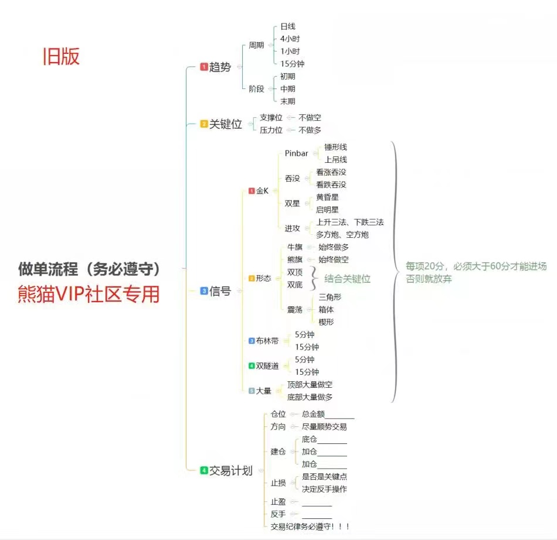

指标,RSI,MACD

压力位、支撑位

是个区域bi

止盈止损：移动止损（三线战法），盈亏比：1.5:1

金k图

趋势线

（红跌绿涨）巨量：下跌趋势巨量红看涨，上涨趋势巨量绿看跌；在顶部发现大量，无关颜色，看跌，在底部发现大量，无关颜色，看涨（风险大不稳）

pribar战法，锤子线、流星线（影线比实体至少大两倍），无关颜色，在支撑位出现锤子线看涨，在压力位出现流星线看跌，注意如果振幅（阴线顶部和底部的差）特别大，甚至比上次的涨幅都大那么这个锤子线或者流星线可能是不正常的。还有就是出现这两种线不要立马进场可以等待局势明朗之后再进

旭日东升战法，前面有一段连续的小阳线时就可以做多，但是通常会先回测一下再上升

必要条件

1. 筑底时间长
2. 7小连阳+
3. 角度平缓，可以参考上一个牛市开始上涨的角度

加分条件

1. 周线小连阳
2. 成交量逐渐放大
3. 配合消息面

如果是在上涨的情况下看到旭日东升形态，那么很可能是即将要下跌了

上面的图和线，在时间周期越大的图中越靠谱

做长线投要看4小时/日的图

找百倍山寨币？

1. 看历史成交量，如果历史成交量是一马平川的不要看
2. 看MACD，长期缠绕在0轴或者即将穿越到0轴上方，不用特别依赖金叉或者死叉，因为很可能是临时调整
3. 看布林带，第一点前期有一个大的开口，然后回调进入缩口横盘震荡，注意这里指的进入缩口必须是在比较低的位置，缩口在较高位也是不建议考虑的，第二点看k线是否长期徘徊在中轨上方不愿下来。
4. 看基本面，如近期涨幅，换手率，价值简介等，可以去非小号，币世界等查看。

前3个位必要条件，找这些比可以去币安，火币上找

注意：

1. 如果这个币种是很符合上面的1，2，3条件的，但是开始时候却下跌了很多，那样很可能是机构在诱空，之后再上涨。反正第一次的趋势反转大概率不会马上出现，总要先继续趋势之后再反转
2. 是否给出货时间，如果涨的时间很短就回跌到低位就是没有出货时间，比如上涨时间只有一两个小时，然后就立即开始下跌到高位的不要看
3. 每周找一次就好，不用太频繁，因为太多，找出来之后可以继续观望
4. 可以用合约购买，设置杠杆，不过杠杆不要设置过高，新手要设置逐仓
5. 记得设置止损，可以会先跌之后再涨，这是后可以补一点仓位，但是如果一直跌到上一次大涨之前的位置就要止损掉了

影响因素：非农。政治

