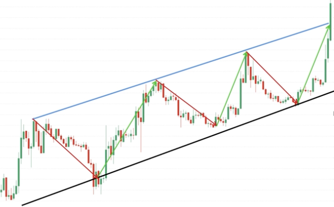
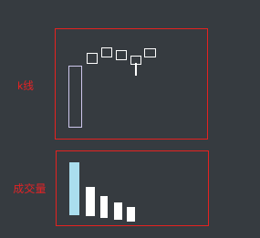
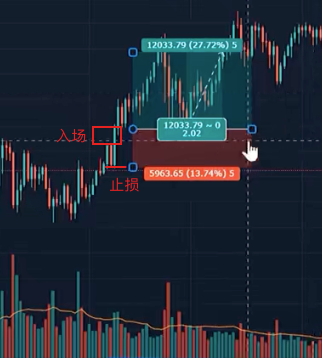
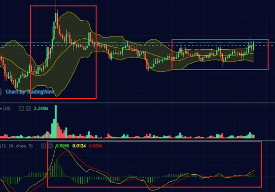
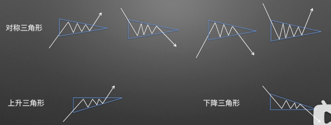
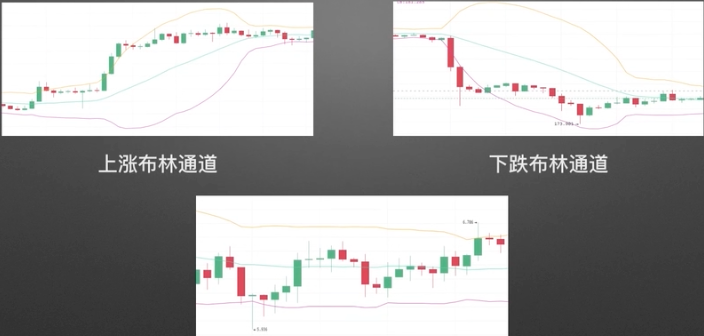

## k线

## 反转信号

**需要注意**：反转信号需要出现在关键位才会有效，比如出现在趋势线附近，或者压力支撑位的时候。

其中的 **射击之星/倒垂形线** 和 **上吊线/锤形线** 常叫做 **Pinbar**，在**支撑位/压力位**或者**趋势线附近**出现Pinbar，都是预示走势的反转，注意如果振幅（阴线顶部和底部的差）特别大，甚至比上次的涨幅都大那么这个锤子线或者流星线可能是不正常的。还有就是出现这两种线不要立马进场可以等待局势明朗之后再进

反转k线特点

## 成交量

成交量与市场的关系，就是努力与结果的关系，努力就是指成交量结果就是这种努力下，价格的上涨或下跌幅度。

+ 有努力有结果=量价确认；表示趋势发展良好
+ 有努力没结果=量价异常：表示趋势可能会发生逆转

1号位：量价确认；2号位：量价异常；3号位：量价异常；4号位：量价异常；5号位：量价异常；6号位：量价异常

**配合趋势使用**

**配合12金K使用**

## 趋势线

连接k线图中的多个低位、高位可以形成趋势线，高位趋势线和低位趋势线形成的区间称为趋势通道。需要连接尽量多的高点或者低点，不论是实体还是影线。

趋势线有价格支撑和价格压力的作用，当k线突破了顶部趋势线的时候大概率会进行改变位上涨趋势，当突破了底部趋势的时候大概率会下跌，不过一般情况下会先被来回趋势线附近之后在继续趋势反转；当k线在趋势线附近出现反转信号时，大概率会出现k线反转，比如在低点的趋势线中出现启明星形态k线组合的时候就预示即将上涨。

通常趋势线还需要配合压力支撑线和交易信号使用

交易中可以先看大时间的趋势然后找小时间的趋势，依据大时间中的趋势来确定未来走向，然后在小时间中寻找入场的机会

## 压力位，支持位（关键位）

**如和找压力位和支撑位？**

首先需要找到纵轴方向上最接近当前位置的最高点或者最低点（找压力位找最高点，找支撑位找最低点），然后在当前点上画一条水平直线，之后继续在这个点的 上下放继续画一条直线从而形成一个区域，这个区域就是支撑位或者压力位

这个区域最好要有几个特点

1. 两个以上的高点或者低点接触，越多越好；
2. 并且要有过强烈的反应；
3. 一眼就能看到；
4. 同时做过支撑位和压力位

在找关键位的时候，首先要做的就是判断当前的走势，如果当前走势为下跌的状态，那么就应该寻找最近的支撑位，在支撑位等待入场机会，如果为上升趋势的话就应该寻找压力位，在压力位寻找入场机会

比如下面找压力位

找支撑位

**如何找关键位？**

关键位其实就是压力位和支撑位，在关键位上比较容易出现趋势反转和交易信号。找关键位和找压力支撑位的方法是一样的，不过不用根据当前的价格来找，而是直接根据大趋势来找到比较合适的交易点位

1. 我们用一条线画出最多K线接触到的地方，而这条线会按照一个原则：**就是实体比引线更加重要**
   + 
2. 在刚才那条线的上方和下方各自画多一条线，这两条线的目标就是接触到K线的次数越多越好，无论是实体也好引线也好
   + 

3. 删除中间那条线，这样你就会得出一个初步的**关键位**区域，如果这个区域范围太大的话就可以按照我刚才讲过的那个秘诀，以连接到最多接触次数的原则去调整一下，记住一个原则，**就是实体比引线重要！**，如果实体和引线有冲突的话我们会选择牺牲引线！
   + 
   + 

其他例子

除此之外还可以结合孤立支点来画出更加准确的关键位

## 怎么数k线

数K线只是一个基础的读图工具，和趋势线等各种指标都一样，具有多解性，属于“器”的层面，不能单独拿来交易，常将它用作入场K线（就是信号k线后面的那个k线）

有一个可靠的信号来判断上升趋势中或交易区间内的回撤走势已经结束，那就是当前K线的高点至少高于前一根K线的高点1个最小报价单位。由此我们发展出一套方法，那就是去数出此类现象发生的次数，我们称之为“数K线”。在上升行情或交易区间的横向或向下调整中，第一根高点高于前一根K线高点的K线被称为高1。高1终结了第一波横向或向下的调整走势，不过这一波调整可能只是一波更大规模调整的一部分。如果市场没有立即转入升势，而是继续盘整或下跌，那么第二次出现的高点高于前一根K线高点的K线就是高2。高2终结了第二波横向或向下的调整

一般情况下需要等到出现信号k线之后才会去数k线，如果数到有两到3根k线之后趋势还没反转可能就是一个更到趋势反转的小回调

总结

1. 在上升行情或交易区间的横向或向下回调中，第一根高点高于1前一根高点的K线被称为高1。如果市场没有立即恢复上涨，第二次出现了第一根高点高于前一根高点的K线被称为高2。高点持续抬升的波段忽略。
2. 在下跌行情或交易区间的横向或向上回调中，第一根低点低于1前一根低点的K线被称为低1。如果市场没有立即恢复下跌，第二次出现了第一根低点低于前一根低点的K线被称为低2。低点持续抬升的波段忽略。

## 如何判断真突破、假突破

在一段趋势的初期一般为真突破，在末期一般为假突破

如何判断是趋势的末端

上面是一段趋势的默契，那么接下来就是一段新趋势的初期

## 交易周期

选择自己的交易周期，如果是选择日内交易，那么就看 1h 的k线图，如果是周内交易就看 4h  的k线图，如果是月内交易就看 日  的k线图。

在大周期内中关键位，在小周期上找入场点

**找交易位置**

在日内交易时，如果在大周期（1h图）当前趋势是一个涨的趋势，但是已经到了趋势的末期即将下跌的时候，就应该减仓或者平仓，看空。那么可以在小周期（15min）图中找相反的趋势，也就是上涨的趋势，然后在压力位处等待交易信号的出现，之后进场

**总结：**

在大周期趋势是涨

+ 趋势在初中期时，在趋势低点看多，去小周期上找下跌趋势的末期找反转点
+ 趋势在末期时，在趋势高点看空，去小周期上找上涨趋势的末期找反转点

在大周期趋势是跌

+ 趋势在初中期时，在趋势高点看空，去小周期上找上涨趋势的末期找反转点
+ 趋势在末期时，在趋势低点看多，去小周期上找下跌趋势的末期找反转点

## 交易系统

## 战法

### 三线战法

通过三根k线设置止损，当进行交易之后可以根据之后的三根k线进行设置止损。

### Pinbar战法

在**支撑位/压力位**或者**趋势线附近**出现Pinbar，都是预示走势的反转，注意如果振幅（阴线顶部和底部的差）特别大，甚至比上次的涨幅都大那么这个锤子线或者流星线可能是不正常的。还有就是出现这两种线不要立马进场可以等待局势明朗之后再进。

在关键位看到Pinbar之后要等下一根K线，也就是入场k线之后在进场

比如上面的 1号、3号k线 就是有效的pinbar ，2号、4号k线就是有效的入场k线，5号k线因为影线没有超过实体的2倍以上所以不是有效的信号k线。而且如果做多入场k线的最高价最好要高于信号k线的最高价，如果做空入场k线的最低价最好要低于信号k线的最低价

1号线处，不要在大趋势下做相反单

### 将军柱、黄金柱战法

什么将军柱？一根大阳线之后紧跟很多的小柱，并且收盘价三日不破底，也不能破第一根阳线的最低点

什么是黄金柱？首先阳柱必须是将军柱，之后跟的k先三日不破顶，对应成交量位缩量

### 惊天逆转战法

**必要条件**

1. 必须是日线级别及以上
2. 必须在一段上升的行情中
3. 阴线之后必须紧跟一根包裹阳线
4. 阳线量能（交易量）不能过大

这里后面一根阳线包裹前面的阴线，并且两根k线的交易量能的差并不大

需要注意的是，这个战法要求的是阴线和阳线的量能不能相差太大，如果相差一倍或以上就认为并不是成功的。

**如何进行交易？**

突破后，在突破后的k线的 50%处等待回调进场，`1:2`盈亏比

### 旭日东升战法

前面有一段连续的小阳线时就可以做多，但是通常会先回测一下再上升

**必要条件**

1. 筑底时间长
2. 7小连阳+
3. 角度平缓，可以参考上一个牛市开始上涨的角度

**加分条件**

1. 周线小连阳
2. 成交量逐渐放大
3. 配合消息面

如果是在上涨的情况下看到旭日东升形态，那么很可能是即将要下跌了

上面的图和线，在时间周期越大的图中越靠谱

### 找百倍山寨币？

1. 看历史成交量，如果历史成交量是一马平川的不要看
2. 看MACD，长期缠绕在0轴或者即将穿越到0轴上方，不用特别依赖金叉或者死叉，因为很可能是临时调整
3. 看布林带，第一点前期有一个大的开口，然后回调进入缩口横盘震荡，注意这里指的进入缩口必须是在比较低的位置，缩口在较高位也是不建议考虑的，第二点看k线是否长期徘徊在中轨上方不愿下来。
4. 看基本面，如近期涨幅，换手率，价值简介等，可以去非小号，币世界等查看。

前3个位必要条件，找这些比可以去币安，火币上找

注意：

1. 如果这个币种是很符合上面的1，2，3条件的，但是开始时候却下跌了很多，那样很可能是机构在诱空，之后再上涨。反正第一次的趋势反转大概率不会马上出现，总要先继续趋势之后再反转
2. 是否给出货时间，如果涨的时间很短就回跌到低位就是没有出货时间，比如上涨时间只有一两个小时，然后就立即开始下跌到高位的不要看
3. 每周找一次就好，不用太频繁，因为太多，找出来之后可以继续观望
4. 可以用合约购买，设置杠杆，不过杠杆不要设置过高，新手要设置逐仓
5. 记得设置止损，可以会先跌之后再涨，这是后可以补一点仓位，但是如果一直跌到上一次大涨之前的位置就要止损掉了

### 道氏2B法则

在B点位可以尝试做单

## k线形态

头肩底（w底也是一样的），相反倒过来就是头肩顶和M顶

圆弧底，相反倒过来就是圆弧顶

庄家操盘形态：箱体、三角形、契形、旗形

## 指标

+ MA：移动平均线，MA10表示，用10根K线来计算平均值，之后将这些值的点连接形成的线，计算是第一个点是1～10，第二个点是2～11，以此类推。
  + 出现金叉（短周期平均线向上穿越长周期平均线）看涨，出现死叉（短周期平均线向下穿越长周期平均线）看跌
  + 
  + 一般设置有 MA5，MA21，MA55，偏离为0，依靠MA线也可以给出啊交易信号
    + 破线：k线跌破/突破短期均线
    + 拐头：短期EMA开始向上/向下拐头
    + 交叉：短期EMA逐步与中期、长期EMA交叉
    + 排列：短期、中期、长期EMA出现多头/空头排列
    + 
+ 成交量：一段时间内的买卖数量，反应市场活跃情况
  + （红跌绿涨）巨量成交量：下跌趋势巨量红看涨，上涨趋势巨量绿看跌；在顶部发现大量，无关颜色，看跌，在底部发现大量，无关颜色，看涨（风险大不稳）
+ 布林带：分为上中下三条线
  + 
  + 
+ MACD：平滑异同移动平均线，
  + 
  + 
  + 
  + 
+ KDJ：随机指标，用来分析多空双方力量
  + 
  + 在80以上位超买区，预示未来可能下跌，在20以下为超卖区，预示未来可能上涨
    + 
  + 同样还有金叉、死叉形态，还有上升、下降趋势
    + 
    + 
+ RSI：相对强弱指标，分析市场景气程度
  + 和KDJ非常相似，一样有超买、超卖区
    + 
+ SAR：抛物线指标，判断趋势转变的辅助指标
  + 

综合使用案例

 
