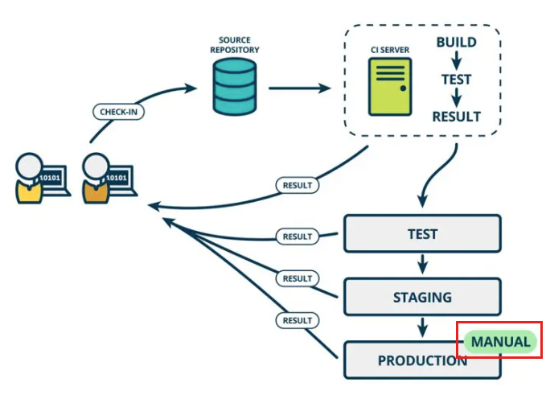

## 开发流程

#### 传统的工作流

参与人员：开发、项目经理、测试

主要流程：

- 项目一开始是先划分好模块，`分配模块`给相应的开发人员；
- 开发人员`开发好`一个模块就进行`单元测试`；
- 等所有的模块都开发完成之后，由项目经理对`所有代码进行集成`；
- 集成后的项目由项目经理`部署到测试服务器`上，被交由测试人员进行集成测试；
- 测试过程中出现 Bug 就提把问题`记录`进行 `Bug` 列表中；
- `项目经理分配 Bug` 给相应的责任人进行修改；
- 修改完成后，项目经理`再次`对项目进行集成，并`部署`到测试服务器上；
- 测试人员在下一次的集成测试中进行`回归测试`；
- 通过通过之后就`部署到生产环境`中；
- 如果测试不通过，则重复上述“分配 Bug -> 修改 Bug -> 集成代码 -> 部署到测试服务器上 -> 集成测试”工作。

**传统的开发过程中的坑：**

- BUG总是在最后才发现
- 越到项目后期，加班越严重
- 交付无法保障
- 变更频繁导致效率低下
- 无效的等待多，用户满足度低


持续集成可以将提交代码后的编译、测试、打包、部署进行自动化处理，这样就能更加关注代码方面的问题，而不需要分心去处理其他问题

**持续集成解决了什么问题？**

- 提高软件质量
- 效率迭代
- 便捷部署
- 快速交付、便于管理

## 持续集成

持续集成（英文：Continuous Integration，简称CI），**集成，就是一些孤立的事物或元素通过某种方式集中在一起，产生联系，从而构成一个有机整体的过程**。在软件工程中，持续集成是指将所有开发者工作副本每天多次合并到主干的做法。

持续集成强调开发人员提交了新代码之后，立刻进行构建、（单元）测试。根据测试结果，我们可以确定新代码和原有代码能否正确地集成在一起。


## 持续交付

持续交付（英文：Continuous Delivery，简称CD），完成 CI 中构建及单元测试和集成测试的自动化流程后，持续交付可自动将已验证的代码发布到存储库。在持续交付中，每个阶段（从代码更改的合并，到生产就绪型构建版本的交付）都涉及测试自动化和代码发布自动化。在流程结束时，运维团队可以快速、轻松地将应用部署到生产环境中。

比如，我们完成单元测试后，可以把代码部署到连接数据库的 Staging 环境中更多的测试。如果代码没有问题，可以继续**`手动`**部署到生产环境中



## 持续部署

持续部署（英文：Continuous Deployment，简称CD），对于一个成熟的 CI/CD 管道来说，最后的阶段是持续部署。作为持续交付——自动将生产就绪型构建版本发布到代码存储库——的延伸，持续部署可以自动将应用发布到生产环境。

实际上，持续部署意味着开发人员对应用的更改在编写后的几分钟内就能生效（假设它通过了自动化测试）。这更加便于持续接收和整合用户反馈。持续部署则是在持续交付的基础上，把部署到生产环境的过程**`自动化`**。


## 持续集成组成要素

**版本管理系统：**项目的源代码需要托管到适合的版本管理系统中，一般我们使用git作为版本控制库，版本管理软件可以使用github、`gitlab`、stash等。

**构建脚本&工具：**每个项目都需要有构建脚本来实现对整个项目的自动化构建。比如Java的项目就可以使用gradle作为构建工具，nodejs的 npm 工具等。通过构建工具实现对编译、静态扫描、运行测试、样式检查、打包、发布等活动串起来，可以通过命令行自动执行。

**CI服务器：**CI服务器可以检测项目中的代码变动，并及时的通过构建机器运行构建脚本，并将集成结果通过某种方式反馈给团队成员。


## CICD的工作流

1. 开发者检入代码到源代码仓库。
2. CI系统会为每一个项目创建了一个单独的工作区。当预设或请求一次新的构建时，它将把源代码仓库的源码存放到对应的工作区。
3. CI系统会在对应的工作区内执行构建过程。
4. 配置如果存在）构建完成后，CI系统会在一个新的构件中执行定义的一套测试。完成后触发通知(Email,RSS等等)给相关的当事人。
5. 配置如果存在）如果构建成功，这个构件会被打包并转移到一个部署目标(如应用服务器)或存储为软件仓库中的一个新版本。软件仓库可以是CI系统的一部分，也可以是一个外部的仓库，诸如一个文件服务器或者像Java.net、SourceForge之类的网站。
6. CI系统通常会根据请求发起相应的操作，诸如即时构建、生成报告，或者检索一些构建好的构件。


## Jenkins

Jenkins是开源CI&CD软件领导者， 提供超过1000个插件来支持构建、部署、自动化， 满足任何项目的需要

### 安装

需要使用到的包

+ `java 8`，因为jenkins是使用java开发的，所以必须安装JDK
+ `Docker`导航到网站顶部的Get Docker链接以访问适合您平台的Docker下载

#### 常规安装

安装JDK，[官方地址](https://links.jianshu.com/go?to=https%3A%2F%2Fwww.oracle.com%2Ftechnetwork%2Fjava%2Fjavase%2Fdownloads%2Fjdk8-downloads-2133151.html)，下载对应的操作系统的JDK，然后解压进行安装。以Linux为例：下载最新版本，上传到Linux服务器，解压并进行配置

```shell
# 上传到 /opt/jdk8目录下

# tar解压JDK安装包
mkdir -p /opt/jdk8
tar zxvf jdk-8u211-linux-x64.tar.gz -C /opt/jdk8 --strip-components 1

# vi /etc/profile
export JAVA_HOME=/opt/jdk8
export JRE_HOME=${JAVA_HOME}/jre
export CLASSPATH=.:${JAVA_HOME}/lib:${JRE_HOME}/lib
export PATH=${JAVA_HOME}/bin:$PATH
```

安装Jenkins，下载Jenkins最新的war包：[Latest](https://links.jianshu.com/go?to=http%3A%2F%2Fmirrors.jenkins.io%2Fwar-stable%2Flatest%2Fjenkins.war)

```shell
mkdir -p /opt/jenkins && cd /opt/jenkins

wget -O /opt/jenkins/jenkins.war http://mirrors.jenkins.io/war-stable/latest/jenkins.war

java -jar jenkins.war --httpPort=8080
```

就可以打开，[http://localhost:8080](https://links.jianshu.com/go?to=http%3A%2F%2Flocalhost%3A8080)了

注意一段这样的话：

```tex
*************************************************************
*************************************************************
*************************************************************

Jenkins initial setup is required. An admin user has been created and a password generated.
Please use the following password to proceed to installation:

63196690ae7d47c49506480ee0e1af4a

This may also be found at: /root/.jenkins/secrets/initialAdminPassword

*************************************************************
*************************************************************
*************************************************************
```

这里的`63196690ae7d47c49506480ee0e1af4a`就是初始的安装的管理员密码。

#### 使用Docker安装

**安装Docker**

```bash
# From https://get.docker.com:
curl -fsSL https://get.docker.com -o get-docker.sh
sh get-docker.sh

#From https://test.docker.com:
curl -fsSL https://test.docker.com -o test-docker.sh
sh test-docker.sh

# From the source repo (This will install latest from the test channel):
sh install.sh
```

配置Docker镜像加速，使用阿里云[容器加速服务](https://links.jianshu.com/go?to=https%3A%2F%2Fcr.console.aliyun.com%2F%3Fspm%3Da2c4e.11153940.blogcont29941.9.52027e29w2jv9P)，左侧的加速器帮助页面就会显示为你独立分配的加速地址

```bash
例如：
公网Mirror：[系统分配前缀].mirror.aliyuncs.com
```

使用配置文件 `/etc/docker/daemon.json`（没有时新建该文件）

```bash
{
    "registry-mirrors": ["<your accelerate address>"]
}
```

重启Docker Daemon就可以了

```bash
systemctl daemon-reload
systemctl restart docker
```


**安装gitlab**

内网环境一般使用gitlab进行代码版本管理，可以使用docker进行安装

（可以按照文档上的方式进行安装）首先在github上搜索`docker-gitlab`项目，然后将里面的`docker-compose.yml`文件下载或者复制出来，并修改一下配置

```yaml
GITLAB_HOST=localhost

GITLAB_ROOT_PASSWORD=12345678
GITLAB_ROOT_EMAIL=1234@email.com
```


然后上传到 linux 服务上，运行`docker compose up `启动服务，在浏览器访问`localhost:10080`就可以访问到gitlab服务

> 如果运行报错，可以先安装`docker-compose`再运行`docker-compose up`
>
> 安装`docker-compose`
>
> ```shell
> #下载
> sudo curl -L https://github.com/docker/compose/releases/download/1.20.0/docker-compose-`uname -s`-`uname -m` -o /usr/local/bin/docker-compose
> #安装
> chmod +x /usr/local/bin/docker-compose
> #查看版本
> docker-compose --version
> ```
>
> Compose分为V1和V2版本，安装方式分为两种，一种是独立安装(`docker-compose`)，一种是插件安装(`docker compose`)


**安装 jenkins**

```bash
# Jenkins
docker run \
  -itd \
  -u root \
  -p 8080:8080 \
  -v jenkins-data:/var/jenkins_home \
  -v /var/run/docker.sock:/var/run/docker.sock \
  -v /usr/bin/docker:/usr/bin/docker \
  --name jenkins-master \
  jenkins/jenkins
  
# Jenkins blueocean
docker run \
  -itd \
  -u root \
  -p 8080:8080 \
  -v jenkins-data:/var/jenkins_home \
  -v /var/run/docker.sock:/var/run/docker.sock \
  -v /usr/bin/docker:/usr/bin/docker \
  --name jenkins-master \
  jenkinsci/blueocean
```

> Jenkins with Blue Ocean: [https://hub.docker.com/r/jenkinsci/blueocean](https://links.jianshu.com/go?to=https%3A%2F%2Fhub.docker.com%2Fr%2Fjenkinsci%2Fblueocean)，可视化编辑 pipeline 及流程观察的插件

`docker ps` 查看容器运行状态

`docker logs 容器ID/容器名称` 查看管理员初始密码

配置Jenkins插件加速，进入jenkins系统管理->插件管理中->高级选项卡->升级站点，使用清华源：

```shell
https://mirrors.tuna.tsinghua.edu.cn/jenkins/updates/current/update-center.json
```


### 常规配置

在jenkins的首页里面可以需要进行初始化配置，比如环境变量，github webhook，邮件通知等。在`manage jenkins -> configure system -> 全局属性`里面配置环境变量，比如 JDK的环境变量，maven 的路径等（这里指的是在宿主机中配置了的环境变量，也可以在jenkins的全局工具配置中安装），如果这些东西是使用`docker`进行安装就不能这样进行配置了。

这里必须要注意的是`manage jenkins -> configure system -> Jenkins Location`的URL要设置对（当前jenkins服务的地址）


### 全局工具配置

`manage jenkins -> global tool configuration`这里可以安装其他工具，如jdk，git ，docker 等


### 权限配置

记得添加**添加管理员用户所有的权限**，添加[Authorize Project](https://links.jianshu.com/go?to=https%3A%2F%2Fwiki.jenkins-ci.org%2Fdisplay%2FJENKINS%2FAuthorize%2BProject%2Bplugin)插件，并且在系统管理中进行配置。配置逻辑，就给用户当前项目的矩阵权限！


### 与gitlab进行联接

#### 设置自由风格的任务

先在`manage jenkins -> plugins -> available plugins`安装需要使用到插件，记得安装完插件之后要重启jenkins

+ `github integration`
+ `gitlab`
+ `ssh、Publish Over SSH、SSH Agent、SSH Pipeline Steps`

> 其他插件推荐：
>
> + Nodejs，主要用于处理不同版本的node打包
> + Publish over SSH 这个是一个远程Shell工具，可以远程去执行一些shell命令
> + HTTP Request Plugin，跨平台调用，在构建前后可以通过该插件以http形式调用各种api接口实现和内部系统的联动
> + Publish Over FTP，用于远程使用FTP发布，比较合适于静态资源的发布。
> + Performance Plugin，该插件可以读取和解析测试框架输出的报告，并且在 Jenkins 上绘制性能和稳定性相关的图表。Performance Plugin 支持的测试框架有 JUnit、JMeter, Twitter 的 Lago 和 Taurus。
>
> - Gitlab Merge Request Builder Plugin，可以方便的自动发起代码审查，它在创建 pull request 的时候，会自动带上关联任务的运行结果，以方便代码审查着确认改动的正确性。同时，这款插件还支持自动合并，既在代码审查通过后自动合并该 pull request 内容。
>
> - JIRA Plugin，JIRA Plugin 可以让 Jenkins 任务和 JIRA 集成起来，这样项目管理者可以通过 JIRA 了解项目进度，开发者也可以通过该插件直接更改 JIRA 上的 issue 状态。
>
> - Kubernetes Plugin，和最近大热的容器编排框架 Kubernetes 集成当然不能落下了。另外，Jenkins 对执行机的管理一直比较弱，无法做到快速的扩容和缩容。Kubernetes Plugin 通过引入 Kubernetes 的容器编排能力，让 Jenkins 执行机运行在 Kubernetes 环境中。
>
> - Build Pipeline plugin，对一个系统的持续集成会包含很多个方面，如果将它们都杂糅在一个 Jenkins 任务中，会提高排查成本，也不利于整个持续集成的运作。Build Pipeline plugin 可以让项目管理员针对系统持续集成步骤设置一系列关联的任务，任务之间可以设置不同的触发条件，以确认何时需要人工介入。

配置链接 gitlab，首先需要在 gitlab 上创建一个项目（仓库），然后将在jenkins上创建一个自由风格的任务


然后在安装了`gitlab`插件之后，在任务的设置里面就会有一个就会有触发器选项，可以得到触发构建的 webHook url，并且在高级选项里可以生成 Secret Token


然后将得到的  webHook url 和 Secret Token 填写到 gitlab 创建的项目的 设置 -> 集成信息中（记得把**底下的 安全 SSL 去掉**）


如果保存的时候报错


就需要去 `管理中心 -> 设置 -> 网络 -> 外发请求`勾选运行即可


现在就可以去 jenkins 里面设置在接收到gitlab的构建请求的时候应该怎么做了


之后当我们在 gitlab 里面进行提交就会触发设置的构建任务。

#### 设置流水线方式任务

相关概念：

- 流水线：**Jenkins Pipeline**（或简称为 "Pipeline"）是一套插件，将持续交付的实现和实施集成到 Jenkins 中。

  Jenkins Pipeline 提供了一套可扩展的工具，用于将“简单到复杂”的交付流程实现为“持续交付即代码”。Jenkins Pipeline 的定义通常被写入到一个文本文件（称为 `Jenkinsfile` ）中，该文件可以被放入项目的源代码控制库中。其实就是一个项目构建和部署流程的设置文件

- 节点：节点是一个机器，主要用于执行jenkins任务

- 阶段：定义不同的执行任务，比如：构建、测试、发布(部署)

- 步骤：相当于告诉Jenkins现在要做些什么，比如shell命令。

流水线说白了就是在配置在接受到构建请求的时候应该怎么进行构建，在jenkins中通过`jenkinsfile`来定义流水线。有两种方式可以定义，声明式和脚本化，其中`pipeline`用来定义声明式的流水线，节点`node`用来定义脚本化的流水线

```jenkinsfile
// 定义声明式流水线块
pipeline {
		// 在任何可用的代理上，执行流水线或它的任何阶段。
		// 也就是下面的阶段任务应该运行在什么环境下。
    agent any 
    stages { // 每次任务都会从上到下执行下面的阶段
    		// 定义 "Build" 阶段。"Build" 作为阶段名字可以是任意的
        stage('Build') { 
            steps {
                // 执行与 "Build" 阶段相关的步骤。
            }
        }
        // 定义"Test" 阶段。
        stage('Test') { 
            steps {
                // 执行与"Test" 阶段相关的步骤
            }
        }
        // 定义 "Deploy" 阶段
        stage('Deploy') { 
            steps {
                // 执行与 "Deploy" 阶段相关的步骤。
            }
        }
    }
}
```

```jenkinsfile
//定义脚本化的流水线
node {  
    stage('Build') { 
        // 
    }
    stage('Test') { 
        // 
    }
    stage('Deploy') { 
        // 
    }
}
```


[jenkinsfile pipeline语法](https://www.jenkins.io/zh/doc/book/pipeline/syntax/)

然后配置一个简单 jenkinsfile，首先需要在 gitlab 上创建一个项目，并在这个项目下创建一个`jenkinsfile`文件，并推送到仓库

```jenkinsfile
pipeline { 
    agent {
    	docker {
    		image 'node:10'
    		args '-p 20000:8080'
    	}
    } 
    stages {
        stage('Build') { 
            steps { 
                sh 'node -v' 
                // 如果提示没有权限可以用 chmod +x 命令来给文件权限
                // sh 'chmod +x ./script/*.sh'
                sh 'echo "hello world!!"'
            }
        }
    }
}
```

> set指令能设置所使用shell的执行方式，可依照不同的需求来做设置
>
>  `-a` 　标示已修改的变量，以供输出至环境变量。
>  `-b` 　使被中止的后台程序立刻回报执行状态。
>  `-C` 　转向所产生的文件无法覆盖已存在的文件。
>  `-d` 　Shell预设会用杂凑表记忆使用过的指令，以加速指令的执行。使用-d参数可取消。
>  `-e` 　若指令传回值不等于0，则立即退出shell。　　
>  `-f`　 　取消使用通配符。
>  `-h` 　自动记录函数的所在位置。
>  `-H` Shell 　可利用"!"加<指令编号>的方式来执行history中记录的指令。
>  `-k` 　指令所给的参数都会被视为此指令的环境变量。
>  `-l` 　记录for循环的变量名称。
>  `-m` 　使用监视模式。
>  `-n` 　只读取指令，而不实际执行。
>  `-p` 　启动优先顺序模式。
>  `-P` 　启动-P参数后，执行指令时，会以实际的文件或目录来取代符号连接。
>  `-t` 　执行完随后的指令，即退出shell。
>  `-u` 　当执行时使用到未定义过的变量，则显示错误信息。
>  `-v` 　显示shell所读取的输入值。
>  `-x` 　执行指令后，会先显示该指令及所下的参数。
>
> `+<参数>` 取消某个set曾启动的参数。

然后在jenkins 打开 blue ocean 插件，并创建一个流水线


之后就可以看到运行结果了


在 blue ocean 中可以查看创建的流水线，并且可以可视化的编辑`jenkinsfile`文件动态添加步骤

