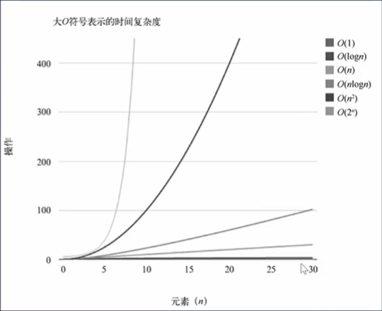
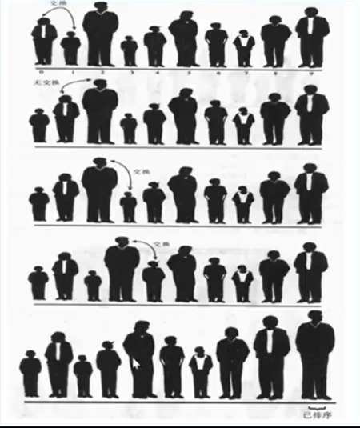
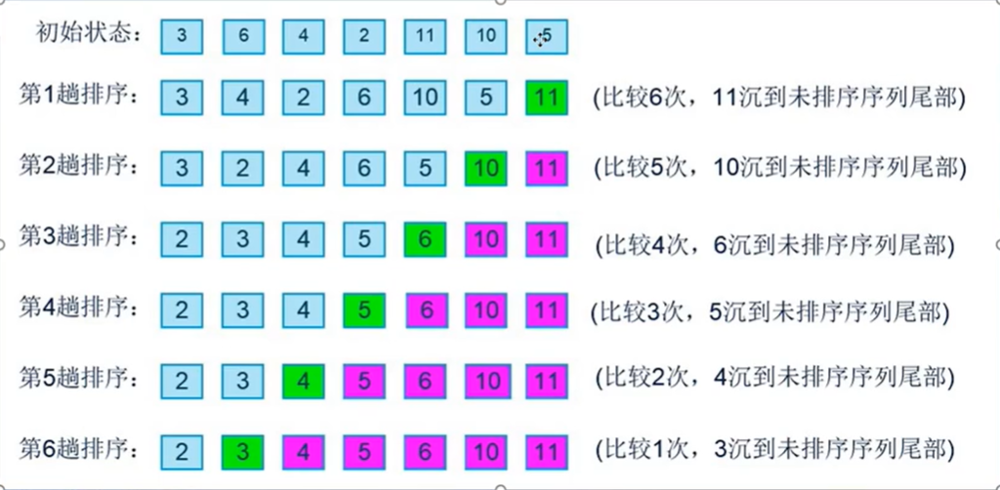
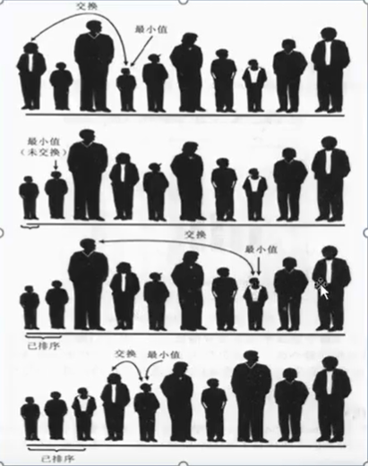
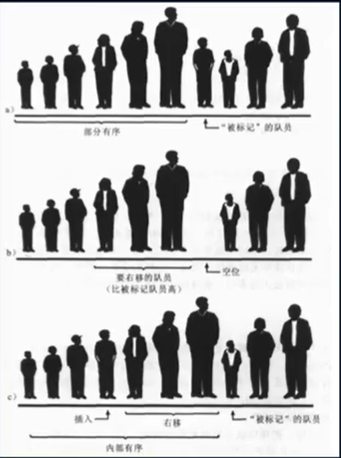
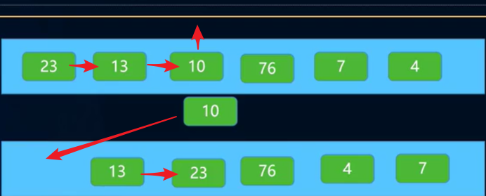
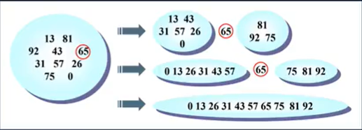

**来源于王红元老师的：[coderwhy的JavaScript数据结构与算法](https://www.bilibili.com/video/BV1x7411L7Q7?p=4&spm_id_from=pageDriver)**

**总结来源于网友的：[XPoet](https://github.com/XPoet/JS-Data-Structures-and-Algorithms)**  总结和记录得非常好，非常推荐直接去github上观看。


## 数据结构

因为我这边的网络经常访问不了github，所以我备份了一些 [XPoet](https://github.com/XPoet/JS-Data-Structures-and-Algorithms) 的笔记

- [JavaScript 数据结构与算法（一）前言](https://github.com/XPoet/js-data-structures-and-algorithms/blob/master/assets/doc/01_JavaScript数据结构与算法（一）前言.md)
- [JavaScript 数据结构与算法（二）数组](https://github.com/XPoet/js-data-structures-and-algorithms/blob/master/assets/doc/02_JavaScript数据结构与算法（二）数组.md)
- [JavaScript 数据结构与算法（三）栈](https://github.com/XPoet/js-data-structures-and-algorithms/blob/master/assets/doc/03_JavaScript数据结构与算法（三）栈.md)
- [JavaScript 数据结构与算法（四）队列](https://github.com/XPoet/js-data-structures-and-algorithms/blob/master/assets/doc/04_JavaScript数据结构与算法（四）队列.md)
- [JavaScript 数据结构与算法（五）优先队列](https://github.com/XPoet/js-data-structures-and-algorithms/blob/master/assets/doc/05_JavaScript数据结构与算法（五）优先队列.md)
- [JavaScript 数据结构与算法（六）单向链表](https://github.com/XPoet/js-data-structures-and-algorithms/blob/master/assets/doc/06_JavaScript数据结构与算法（六）单向链表.md)
- [JavaScript 数据结构与算法（七）双向链表](https://github.com/XPoet/js-data-structures-and-algorithms/blob/master/assets/doc/07_JavaScript数据结构与算法（七）双向链表.md)
- [JavaScript 数据结构与算法（八）集合](https://github.com/XPoet/js-data-structures-and-algorithms/blob/master/assets/doc/08_JavaScript数据结构与算法（八）集合.md)
- [JavaScript 数据结构与算法（九）字典](https://github.com/XPoet/js-data-structures-and-algorithms/blob/master/assets/doc/09_JavaScript数据结构与算法（九）字典.md)
- [JavaScript 数据结构与算法（十）哈希表](https://github.com/XPoet/js-data-structures-and-algorithms/blob/master/assets/doc/10_JavaScript数据结构与算法（十）哈希表.md)
- [JavaScript 数据结构与算法（十一）树](https://github.com/XPoet/js-data-structures-and-algorithms/blob/master/assets/doc/11_JavaScript数据结构与算法（十一）树.md)
- [JavaScript 数据结构与算法（十二）二叉树](https://github.com/XPoet/js-data-structures-and-algorithms/blob/master/assets/doc/12_JavaScript数据结构与算法（十二）二叉树.md)
- [JavaScript 数据结构与算法（十三）二叉搜索树](https://github.com/XPoet/js-data-structures-and-algorithms/blob/master/assets/doc/13_JavaScript数据结构与算法（十三）二叉搜索树.md)
- [JavaScript 数据结构与算法（十四）图](https://github.com/XPoet/js-data-structures-and-algorithms/blob/master/assets/doc/14_JavaScript数据结构与算法（十四）图.md)


## 时间复杂度（大O表示法）

在算法中比较的过程中，我们可能喜欢说：算法A比算法B快两倍，但是这样的比较是没有意义的，在**数据项个数**发生变化的时候，**算法的效率**会跟着发生变化。所以我们通常使用一种**算法的速度**会如何跟随**数据量**的变化的。

### 常见的大O表示形式

|    符号    |      名称      |
| :--------: | :------------: |
|    O(1)    |      常数      |
| O(log(n))  |      对数      |
|    O(n)    |      线性      |
| O(nlog(n)) | 线性和对数乘积 |
|   O(n^2)   |      平方      |
|   O(2^n)   |      指数      |



一般算法的 事件复杂度都不会是完全是 符合上面给出的是形式的，需要我们自己进行推导转化

### 推导大O表示法的方式

+ 用常量1取代运行时间中的所有的加法常量
+ 在修改后的运行次数函数中，只保留最高阶项
+ 如果最高存在且不为1，则去除与这个项相乘的常数


## 排序算法

**排序算法有很多**：冒泡排序，选择排序，插入排序，归并排序，基数排序，计数排序，希尔排序，堆排序，桶排序

**简单排序**有：冒泡排序，选择排序，插入排序

**高级排序**有：希尔排序，快速排序

**对数据进行排序的原因是为了方便查找和突出数据。**


## 冒泡排序

冒泡排序算法相对其他排序运行效率较低，但是在概念上他是排序算法中最简单的。

### 冒泡排序的思路

以按身高从小到大排序为例

+ 对未排序的各元素从头到尾依次比较相邻的两个元素的大小关系
+ 如果左边的队员高，则两队员交换位置
+ 当走到最右端时，最高的队员一定被放在了最右边
+ 按照这个思路，从最左端重新开始，这次做到倒数第二位置的队员即可
+ 依次类推，就可以将数据排序完成



### 代码实现

```js
function bubbleSort(arr){
    let len = arr.length;
    for(let i = 0; i < len - 1; i++){
        for(let j = 0; j < len - 1 - i; j++){
            if(arr[j] > arr[j + 1]){
                [arr[j],arr[j + 1]] = [arr[j + 1],arr[j]]
            }
        }
    }
  	return arr;
}
```

测试

```js
let arr = [3,6,4,2,11,10,5];
bubbleSort(arr);
```

### 代码分析



### 冒泡排序的效率

如果按照上面的例子来说的话，7个数据需要6次循环，第一次循环6次比较，第二次循环5次比较，第三次循环4吃比较，依次类退n数据就需要 `(n-1)+(n-2)+...+1 = n*(n-1)/2` 次比较

**比较次数的大O表示法**，通过大O表示法的转化方法:

+ `n*(n-1)/2 = n**2/2-n/2`,保留最高项`n**2/2`
+ 去除掉常量系数为`n**2`
+ 所以大O表示法为O(n^2)

**交换次数的大O表示法**，通过大O表示法的转化方法:

不一定每次都需要交换，这里取没两次比较，交换一次 `n*(n-1)/2/2 = n*(n-1)/4`，依照转化方法得出 交换次数的大O表示法为O(n^2)


## 选择排序

选择排序相比于冒泡排序将**交换次数**由O(n^2)减少到了O(n)，但是**比较次数**还是O(n^2);

### 选择排序的思路

+ 选定第一个索引的位置，然后和后面的元素依次比较
+ 如果后面的队员，小于第一个索引位置的队员，则交换位置
+ 经过一轮比较后，可以确定第一位置时最小的
+ 然后使用同样的方法把剩下的元素逐一比较即可
+ 可以看出选择排序，第一轮会选出最小值，第二轮会选出第二小的值



### 代码实现

```js
function selectionSort(arr){
    let len = arr.length;
    //最后一个不用比较
    for(let i = 0; i < len - 1; i++){
        let minValIndex = i;//最小值的索引
        //找到数组中的最小值的索引
        for(let j = minValIndex; j < len; j++){
            if(arr[minValIndex] > arr[j]){
                minValIndex = j;
            }
        }
        //交换位置
        [arr[minValIndex],arr[i]] = [arr[i],arr[minValIndex]];
    }
    return arr;
}
```

测试

```js
var arr = [3,6,4,2,11,10,5];
selectionSort(arr);
```

### 选择排序的效率

由上面的代码可以看出，选择排序的比较次数和冒泡排序的是一样的，7个数据需要6次循环，第一次循环6次比较，依次类退n数据就需要 `(n-1)+(n-2)+...+1 = n*(n-1)/2` 次比较

**选择排序的是比较次数的大O表示法**是O(n^2);

**选择排序的交换次数的大O表示法**

+ 选择排序每次选择的时候，最多需要交换一次，一共最多交换了 `n-1` 次
+ 选择排序的交换次数 `n-1`，依据转换方法，大O表示法为O(n)
+ 所以选择排序通常认为执行效率上是高于冒泡排序的


## 插入排序

插入排序是简单排序中效率最好的一种，是学习高级排序的基础

### 插入排序的思路

**局部有序**

+ 插入排序的思想核心是局部有序
+ 比如在一个队列中的人，我们选择其中一个作为标记的队员
+ 这个被标记的队员左边的所有队员都是局部有序的
+ 这意味着，有一部分有是按顺序排序好的，有一部分还没有顺序

**思路**：

+ 从第一个元素开始，该元素可以认为已经排序好了
+ 取出下一个元素，在已经排序的元素序列中从后向前扫描
+ 如果该元素（已排序）大于新元素，将该元素移动到下一个位置
+ 重复上一个步骤，直到找到已排序的元素小于或者等于新元素的位置
+ 将新元素插入到该位置后，重复上面的步骤。



### 代码实现

```js
function insertionSort(arr){
    let len = arr.length;
    //外层循环，从第1位置开始获取数据，向前面局部有序的进行插入
    for(let i = 1;i < len; i++){
        //将数据与局部有序部分从右向左比较，将数据插入到比局部有序部分数据的大的位置
        let temp = arr[i];
        let j = i;
        while(arr[j - 1] > temp && j > 0){
            arr[j] = arr[j - 1];
            j--;
        }
        //将j位置的数据放置temp即可
        arr[j] = temp;
    }
    return arr;
}
```

测试

```js
var arr = [23,13,10,76,7,4];
insertionSort(arr);
```

在处理 10 的时候



### 插入排序的效率

**插入排序的比较次数**：

+ 第一趟时，需要比较的最多次数是1，第二趟的最多次数是2，依次类推，最后一趟是 `n-1`
+ 因此总比较次数是`1+2+3+...+n-1 = n*(n-1)/2`
+ 然而每趟发现插入点之前，平均只有全体数据项的一般需要比较
+ 我们可以除以2得到`n*(n-1)/4`，所以相对于选择排序，其他比较次数少了一半

**插入排序的复制次数**：

+ 第一趟时，需要的复制最多次数是1，第二趟的最多次数是2，依次类推，最后一趟是 `n-1`
+ 因此总复制次数是`1+2+3+...+n-1 = n*(n-1)/2`

## 快速排序

快速排序几乎可以说是目前所有排序算法中，最快的一种排序算法。

希尔排序相当于是插入排序得升级版，快速排序其实是冒泡排序的升级版。

冒泡排序需要经过多次交换才能将最大值放在正确的位置，而**快速排序**可以在一次循环中(其实是递归调用)，找出某个元素的正确位置，并且该元素之后不在需要移动。

### 快速排序的思路：分而治之

比如有数组：`13,87,92,,43,65,31,57,26,75,0`

+ 第一步：从其中选出 65 （可以是任意数字——枢纽）
+ 第二步：我们通过算法将所有小于 65 的数字放在65 的左边，将所有大于65的数字放在65的右边
+ 第三步：递归的处理左边的数据，比如选择的是 31 来处理左侧，递归处理右边数据，比如选择 75 来处理右侧。



### 选择合适的枢纽(合适的数字)

一个好的枢纽可以提高算法的执行效率，在快速排序中枢纽的选择一般使用的方法是先选出三个位置的数字，分别是最左边的`left = 0`，最右边的`right = length - 1`，中间的`center = (left + right) / 2`，然后选择其中大小为中间的那个数字作为枢纽，并先将这是三个数字排序并交换位置。然后再将中位数和数组的倒数第二个位置交换,因为最后一个位置比枢纽的值大。

比如上面的`13,87,92,43,65,31,57,26,75,0`中选出`13,0,31`，选择`31`作为枢纽，并排序为`0,87,92,43,65,13,57,26,75,31`，将中位数和数组的倒数第二个位置交换`0,87,92,43,65,75,57,26,13,31`.

### 枢纽代码实现

```js
function findPivot(arr,left,right){
    //取出中间的位置
    let center = Math.floor((left + right) / 2);
    //判断大小，冒泡交换位置
    if(arr[left] > arr[center]){
        [arr[left],arr[center]] = [arr[center],arr[left]]
    }
    if(arr[center] > arr[right]){
        [arr[center],arr[right]] = [arr[right],arr[center]]
    }
    if(arr[left] > arr[center]){
        [arr[left],arr[center]] = [arr[center],arr[left]]
    }
    //将center换到 right - 1 的位置
    [arr[center],arr[right - 1]] = [arr[right - 1],arr[center]]
    
    return right - 1;
}
```

### 快速排序代码实现

思路：有数组`3,2,5,8,7,5,6,9,4`；

+ 先进行枢纽化处理得到，`3,2,5,8,9,5,6,4,7`，得到枢纽索引`right - 1`为`7`，值为 4
+ 然后定义两个指针`left`和`right`分别指向`0`和`right-1`（枢纽的位置）的位置
+ 然后判断两个指针的值，如果`left`的值比枢纽的值大就停止向右移动，如果小于等于枢纽值就继续向右移动；同样的如果`right`的值比枢纽的值小就停止向左移动，如果大于等于枢纽值就继续向左移动
+ 当`left`找到比枢纽值大，`right`找到比枢纽值小的值时，他们两值交换位置，然后继续找
+ 当`left == right`的时候，表示寻找结束，将当前`left`指向的值和枢纽值进行交互
+ 依次类推，继续去找left 左边的和left 右边的数组。

```js
//入口函数
function quikSort(arr){
    //获取长度
    let len = arr.length;
    //递归排序
    recursion(arr,0,len - 1);
    
    return arr;
}
//递归排序
function recursion(arr,left,right){
    //找到了最后
    if(left >= right) return arr;
    //枢纽位置
    let pivot = findPivot(arr,left,right);
    //定义两个指针,分别指向左右要进行判断的位置
    let leftIndex = left;
    let rightIndex = pivot;
    //开始一直寻找
    while(leftIndex < rightIndex){
        // 如果左边的迭代器小于枢纽位置的值则一直向右寻找
        while(leftIndex < rightIndex && arr[leftIndex] <= arr[pivot]) leftIndex++;
        // 如果右边的迭代器大于枢纽位置的值则一直向左寻找
        while(leftIndex < rightIndex && arr[rightIndex] >= arr[pivot]) rightIndex--;
        // 如果两个都找到了对应的值，则让他们进行交换位置
        if(leftIndex < rightIndex){
        	[arr[leftIndex],arr[rightIndex]] = [arr[rightIndex],arr[leftIndex]]
        }
    }
    [arr[leftIndex],arr[right - 1]] = [arr[right - 1],arr[leftIndex]]
    // 在枢纽找到合适的位置后，将枢纽左边和右边的数也按照同样的方法交换
    this.recursion(arr,left, leftIndex - 1);
    this.recursion(arr,leftIndex + 1, right);
}
```

测试

```js
var arr = [13,87,92,43,65,31,57,26,75,0];
quikSort(arr);
```


### 快速选择的效率

- 快速排序最坏情况下的效率：每次选择的枢纽都是最左边或最右边的数据，此时效率等同于冒泡排序，时间复杂度为**O（n2）**。可根据不同的枢纽选择避免这一情况；
- 快速排序的平均效率：为**O（N\*logN）**，虽然其他算法效率也可达到O（N*logN），但是其中快速排序是**最好的**。


## 其他算法的参考

### 一维数组转树结构

递归转化

```js
function array2Tree(arr,rootId = 0){
  let result = [];
  getChildren(arr,result,rootId);
  return result;
}

function getChildren(data,children,pid){
  for(let item of data){
    if(item.pid == pid){
      if(!item.children) item.children = [];
      children.push(item);
      getChildren(data,item.children,item.id);
    }
  }
}
```

Map快速查找方法

```js
function array2Tree(arr){
  const result = [];
  const itemMap = {};
  
  for(const item of arr){
    const id = item.id;
    const pid = item.pid;
    
     if (!itemMap[id]) {
      itemMap[id] = {
        children: [],
      }
    }

    itemMap[id] = {
      ...item,
      children: itemMap[id]['children']
    }
    
    const treeItem = itemMap[id];
    if(pid == 0){
      result.push(item);
    }else{
      if(!itemMap[pid]){
        itemMap[pid] = {children:[]};
      }
      itemMap[pid].children.push(treeItem);
    }
  }
  return result;
}
```

### 深度遍历

```js
//递归的方法
const deepTree = (data, arr = []) => {
  for (let i = 0; i < data.length; i++) {
    let item = data[i]
    arr.push(item.id)
    if (item.children && item.children.length) {
      deepTree(item.children, arr)
    }
  }
  return arr
}
//while循环 栈
const deepTree2 = (data) => {
  let stack = data
  let arr = []
  while (stack.length) {
    let item = stack.shift()
    let children = item.children
    arr.push(item.id)
    if (children) {
      for (let i = children.length - 1; i >= 0; i--) {
        stack.unshift(children[i])
      }
    }
  }
  return arr
}
```

### 广度遍历

```js
//递归方式
let tempArr = []
const walk = (data,arr = []) => {
  tempArr = [];
  for(let item of data){
    arr.push(data);
    if(item.children && item.children.length){
      tempArr = tempArr.concat(item.children);
    }
  }
  if(tempArr.length){
    walk(tempArr,arr)
  }
}

//while循环 栈
const widthTree = (data) => {
  let stack = []
  let arr = []
  stack = data
  while (stack.length) {
    let item = stack.shift()
    let children = item.children
    arr.push(item.id)
    if (children) {
      for (let i = 0; i < children.length; i++) {
        stack.push(children[i])
      }
    }
  }
  return arr
}
```


[JS-7种查找算法之顺序查找、二分查找、插值查找、斐波那契查找](https://www.cnblogs.com/orxx/p/10279444.html)

[JS-10种排序算法整理](https://www.cnblogs.com/orxx/p/10279425.html)


