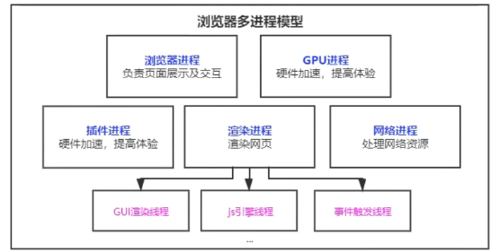
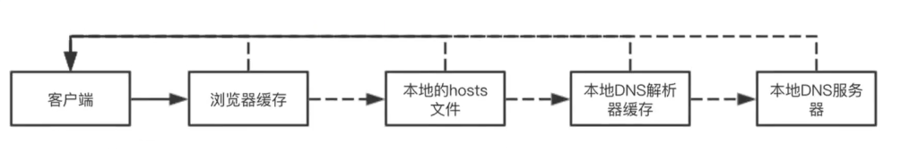
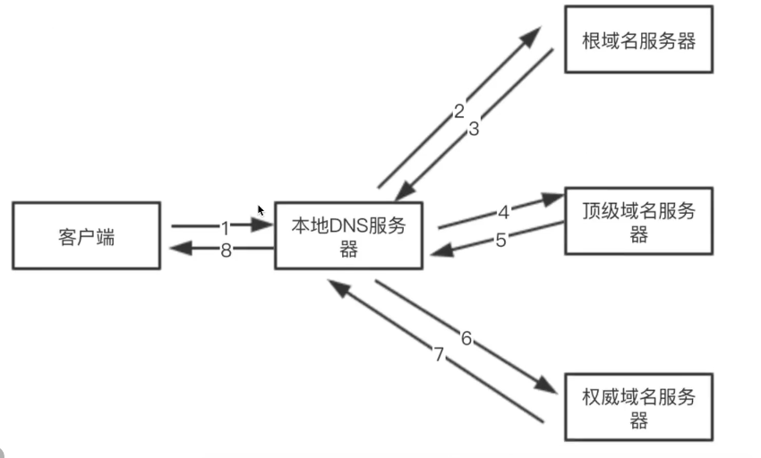
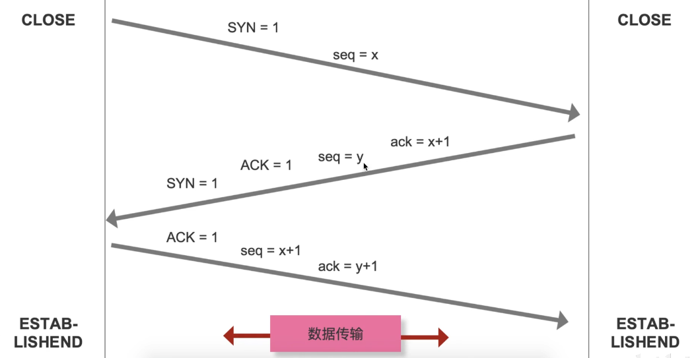
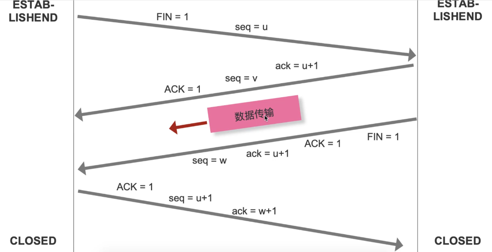
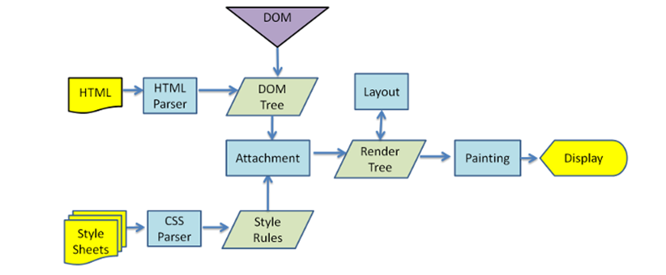
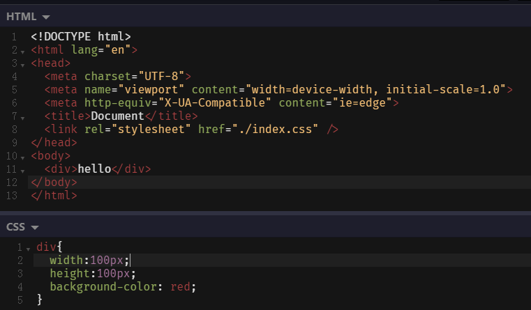
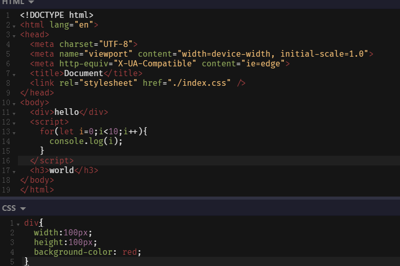
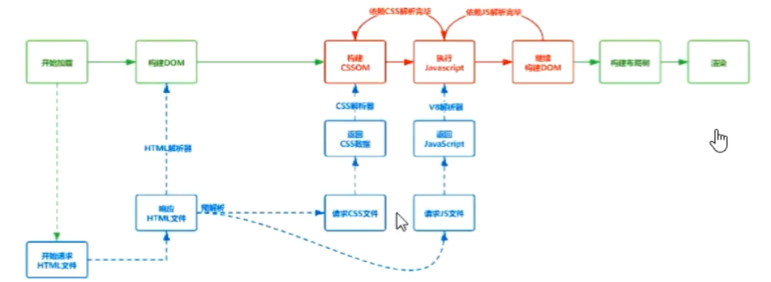
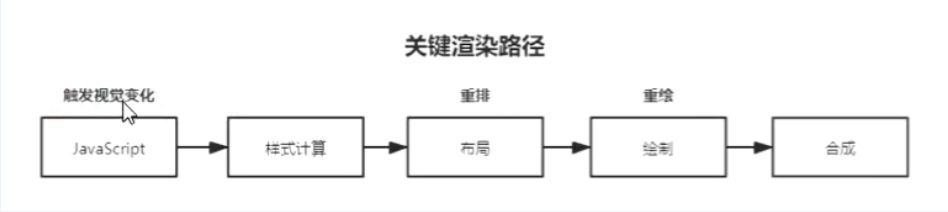

# 浏览器渲染原理

计算机的几个基本概念：进程（process）—— 软件应用，线程（thread）—— 进程中的事件处理，执行栈（stack）—— 代码的执行环境；

在浏览器中的进程和线程




## 浏览器从输入网址到页面出现做了什么

在浏览器中输入url必定会经过网络七层协议（物理层、数据层）、（网络层）ip、传输层(tcp-安全可靠，分段传输，upd 可能丢包)、（会话层、表现层、应用层）http

用户在地址栏输入了url后（），浏览器器会先检测本地中是否有缓存，若果有，再检查缓存是否过期，如果没有过期则直接使用缓存的数据，如果已经过期或者没有缓存将发送请求

发送请求前会先在浏览器缓存中查看 域名 是否有已经有被解析过的了，如果没有就再去本地主机中查找是否用缓存，如果有就直接使用缓存中被解析出来的 ip 、端口和协议发送请求，如果没有将使用 DNS协议 将域名解析成 ip 地址（DNS 基于 UDP）协议 + ip + 端口

如果请求是https，则进行 SSL 协商

使用 ip地址进行寻址，排队等待，最多能发送6个http请求

找到地址后 创建 tcp连接 用于传输（三次握手）

利用 tcp 传输数据（拆分数据包，有序）可靠、有序服务器会按照顺序来接收

http 请求（请求行 请求头 请求体）

默认不会断开 keep-alive 为了下次传输数据时可以复用上次创建的链接

服务器收到数据后（响应行 响应头 响应体）

服务返回 301 302 会进行重定向操作

服务器 304 去查询浏览器缓存进行返回

浏览器接受资源后解析资源

### **总结**

1. 在浏览器地址栏输⼊URL 

2. 浏览器查看缓存，如果请求资源在缓存中并且新鲜，跳转到转码步骤 
	- 如果资源未缓存，发起新请求 

	- 如果已缓存，检验是否⾜够新鲜，⾜够新鲜直接提供给客户端，否则与服务器进⾏验证。 

	- 检验新鲜通常有两个HTTP头进⾏控制 Expires 和 Cache-Control ： 

		- HTTP1.0提供Expires，值为⼀个绝对时间表示缓存新鲜⽇期 

		- HTTP1.1增加了Cache-Control: max-age=,值为以秒为单位的最⼤新鲜时间

3. 浏览器解析URL获取协议，主机，端⼝，path 

4. 浏览器组装⼀个HTTP（GET）请求报⽂ 

5. 浏览器获取主机ip地址，过程如下： 
	1. 浏览器缓存 
	2. 本机缓存 
	3. hosts⽂件 
	4. 路由器缓存 
	5. ISP DNS缓存 
	6. DNS递归查询（可能存在负载均衡导致每次IP不⼀样） 

6. 打开⼀个socket与⽬标IP地址，端⼝建⽴TCP链接，三次握⼿如下： 
	1. 客户端发送⼀个TCP的SYN=1，Seq=X的包到服务器端⼝ 
	2. 服务器发回SYN=1， ACK=X+1， Seq=Y的响应包 
	3. 客户端发送ACK=Y+1， Seq=Z 

7. TCP链接建⽴后发送HTTP请求 

8. 服务器接受请求并解析，将请求转发到服务程序，如虚拟主机使⽤HTTP Host头部判断请求的服务程序 

9. 服务器检查HTTP请求头是否包含缓存验证信息如果验证缓存新鲜，返回304等对应状态码 

10. 处理程序读取完整请求并准备HTTP响应，可能需要查询数据库等操作 

11. 服务器将响应报⽂通过TCP连接发送回浏览器 

12. 浏览器接收HTTP响应，然后根据情况选择关闭TCP连接或者保留重⽤，关闭TCP连接的四次握⼿如下： 
	1. 主动⽅发送Fin=1， Ack=Z， Seq= X报⽂ 
	2. 被动⽅发送ACK=X+1， Seq=Z报⽂ 
	3. 被动⽅发送Fin=1， ACK=X， Seq=Y报⽂ 
	4. 主动⽅发送ACK=Y， Seq=X报⽂ 

13. 浏览器检查响应状态吗：是否为1XX，3XX， 4XX， 5XX，这些情况处理与2XX不同 

14. 如果资源可缓存，进⾏缓存 

15. 对响应进⾏解码（例如gzip压缩） 

16. 根据资源类型决定如何处理（假设资源为HTML⽂档） 

17. 解析HTML⽂档，构件DOM树，下载资源，构造CSSOM树，执⾏js脚本，这些操作没有严格的先后顺序，以下分别解释 

18. 构建DOM树： 
	1. Tokenizing：根据HTML规范将字符流解析为标记 
	2. Lexing：词法分析将标记转换为对象并定义属性和规则 
	3. DOM construction：根据HTML标记关系将对象组成DOM树 

19. 解析过程中遇到图⽚、样式表、js⽂件，启动下载 

20. 构建CSSOM树： 
	1. Tokenizing：字符流转换为标记流
	2. Node：根据标记创建节点 
	3. CSSOM：节点创建CSSOM树 

21. 根据DOM树和CSSOM树构建渲染树 : 
	1. 从DOM树的根节点遍历所有可⻅节点，不可⻅节点包括：
		- 1）script , meta 这样本身 不可⻅的标签。
		- 2）被css隐藏的节点，如 display: none 
	2. 对每⼀个可⻅节点，找到恰当的CSSOM规则并应⽤ 
	3. 发布可视节点的内容和计算样式 

22. js解析如下： 
	1. 浏览器创建Document对象并解析HTML，将解析到的元素和⽂本节点添加到⽂档中，此时document.readystate为loading 
	2. HTML解析器遇到没有async和defer的script时，将他们添加到⽂档中，然后执⾏⾏内或外部脚本。这些脚本会同步执⾏，并且在脚本下载和执⾏时解析器会暂停。这样就可以⽤document.write()把⽂本插⼊到输⼊流中。同步脚本经常简单定义函数和注册事件处理程序，他们可以遍历和操作script和他们之前的⽂档内容 
	3. 当解析器遇到设置了async属性的script时，开始下载脚本并继续解析⽂档。脚本会在它下载完成后尽快执⾏，但是解析器不会停下来等它下载。异步脚本禁⽌使⽤document.write()，它们可以访问⾃⼰script和之前的⽂档元素 
	4. 当⽂档完成解析，document.readState变成interactive 
	5. 所有defer脚本会按照在⽂档出现的顺序执⾏，延迟脚本能访问完整⽂档树，禁⽌使⽤document.write() 
	6. 浏览器在Document对象上触发DOMContentLoaded事件 
	7. 此时⽂档完全解析完成，浏览器可能还在等待如图⽚等内容加载，等这些内容完成载⼊并且所有异步脚本完成载⼊和执⾏，document.readState变为complete，window触发load事件 

23. 显示⻚⾯（HTML解析过程中会逐步显示⻚⾯）






### TCP 三次握手

+ seq 序号，用来标识从TCP 源端向目的端发送的字节流，发送数据时对此进行标记
+ ack 确认序号，只有 ACK标志位为1时，确认序号字段才有效，ack=seq+1
+ 标志位
	+ ACK：确认序号有效
	+ RST：重置连接
	+ SYN：发起一个新连接
	+ FIN：释放一个链接
	+ …..




### TCP四次挥手

客户端和服务器建立连接通道后，客户端把数据传递给服务器，然后开始发送释放 TCP 的操作；服务器返回给客户端信息，会先将回馈返回（避免应答不及时导致客户端多次发送数据），然后才会准备数据，在给客户端发送数据。




### http版本区别：

- http 0.9 负责传输 html 最早的时候没有请求头和响应头
- http 1.0 提供了http 的 header 可以改根据 header 的不同来处理不同的资源（TCP 连接通道用完就会被关闭）
- http 1.1 默认开启 keep-alive 链接复用；管线化——服务器处理多个请求（队头阻塞问题）
	- **队头阻塞问题**：若干个请求排队串行化单线程处理，后面的请求等待前面请求的返回才会获得执行机会，一旦有某个请求超时，后续请求只能被阻塞，这就是队头阻塞
- http 2.0 用同一个 tcp 链接来发送数据 一个域名一个tcp（多路复用）头部压缩 服务器可以推送数据给客户端

```
//通过在应用生成 HTTP 响应头信息中设置Link 命令
Link:</styles.css>; rel=preload; as=style, </example.png>; rel=preload; as=image
```

- http 3.0 解决了tcp的队头阻塞问题 QUIC 协议 采用了 udp

[服务端向客户端主动发送消息](https://blog.csdn.net/liujiandu101/article/details/81064707)


## 浏览器接受到资源之后是如何解析的？





如果浏览接受到的资源是如上面的代码的话，浏览器将先逐行解析html，形成 DOM Tree，当遇到 **link 标签的请求 css 样式文件**的时候将开辟一个子任务队列去下载css文件，**不会阻断DOM Tree 的解析**，当解析完 DOM Tree 时，就会等待子任务队列中的css下载完成，然后开始解析 css 文件 生成 CSS Rules ，然后将DOM Tree 和 CSS Rules 合成一个渲染树（Render Tree），然后经过布局、分层、组合、隐藏一系列操作之后就形成了页面。

**需要注意**：**样式放到底部可能会导致重绘**，因为当 html 解析时，会先扫描 js 和 css 渲染从上而下，边解析边渲染（div之前的那些），渲染 DOM （这里是div）时要先等待样式加载完成。如果将样式放到底部，浏览器在解析到 div 是并没有遇到样式 所以此时的下载css的任务队列是空的，CSS Rules也是个空的，那么浏览器将直接将 组合 DOM Tree 和 CSS Rules 并直接渲染，然后到最后的时候又读到了 link 下载css此时就将前面的解析 DOM Tree 和 CSS Rules 等再走一遍，形成回流和重绘。



如果解析 html 是**遇到了 script 标签，无论是嵌入还是引用 js 文件只要没有加 async 或者 defer 都会中断DOM Tree 的解析，**并且在**等待 css 下载完成后**，且 js 文件下载完成或者解析完后 js会被立即执行。上面的代码中，当解析到 script 的时候中断DOM Tree解析，然后渲染DOM，渲染完成之后开始执行 js 代码，后面会继续执行DOM Tree 解析。**所以 js 会阻塞 html 继续，阻塞渲染，js 要等上面的css加载完毕，保证页面js可以操作到样式**。

### 利用回流实现不定高度展开动画

在`css`中，`transition`的属性如果不是明确的数值变化的话是不会应用过渡动画的。所以下面对`item`元素设置`height:auto`是不会触发过渡动画的。

```html
<style>
  .item {
    width: 200px;
    height: 50px;
    overflow: hidden;
    background-color: black;
    color: white;
    transition: height 0.3s;
  }
</style>
<div class="item">
  Lorem ipsum dolor sit amet consectetur adipisicing elit. Tenetur voluptas sint deleniti veniam expedita temporibus nam accusantium, mollitia soluta quos nisi non ab vero esse velit qui suscipit magnam nesciunt?
</div>
<script>
  const itemEl = document.querySelector('.item');
  itemEl.onmouseover = function() {
    itemEl.style.height = 'auto';
    const h = itemEl.offsetHeight;// 触发回流,layout阶段计算最新高度,获取实时高度,因为还没有到 painting 阶段，所以还不会显示到页面上也就不会闪烁
    itemEl.style.height = '50px';// 还原初始高度
    itemEl.offsetWidth;// 触发回流,应用初始高度
    itemEl.style.height = h + 'px';// 设置为目标高度,触发过渡动画
  }
  itemEl.onmouseout = function() {
    itemEl.style.height = '50px';
  }
</script>
```

> 在新版的浏览器中可以通过设置`calc-size`，或者`interpolate-size: allow-keywords;`来实现，但是这两个属性是有兼容性问题的，可以需要使用`polyfill`
>
> ```css
> .item:hover{
>   height:calc-size(auto,size);
> }
> ```
>
> ```css
> .item{
>   interpolate-size: allow-keywords;
> }
> .item:hover{
>   height:auto;
> }
> ```
>
> 


### async 和 defer 的区别：

+ async ：不阻塞DOM Tree 解析，异步加载，加载 后之后立即执行。
+ defer ：不会停止（阻塞）dom 树构建，立即异步加载。加载好后，如果 dom 树还没构建好，则先等 dom 树解析好再执行；如果 dom 树已经准备好，则立即执行。执行要在所有元素解析完成之后，`DOMContentLoaded` 事件触发之前完成。




# 优化策略

## 网络优化策略

- 减少 HTTP 请求数，合并 js 、css、合理内嵌 css、js (内嵌会导致无法做缓存优化)
- 合理设置服务端缓存，提高服务器处理速度（强制缓存、对比缓存）

```
Expires/Catch-Control 强制缓存；Etag/if-none-match，/last-modified/if-modified-since 对比缓存
```


[HTTP强缓存和协商缓存](https://segmentfault.com/a/1190000008956069)

- 避免重定向，重定向会降低响应速度 301 302
- 使用 dns-prefetch 进行 dns 预解析 [DNS预解析dns-prefetch是什么及怎么使用](https://blog.csdn.net/qq_35432904/article/details/83988726)
- 采用域名分片技术，将资源放到不同的域名下。解决同一域名最多处理6个TCP链接问题
- 采用 CDN 加速加快访问速度。（指派最近、高度可用）
- gzip 压缩优化对传输资源进行体积压缩（html，js，css）

```
Content-Encoding:gzip
```

- 加载数据优先级：preload（预先请求当前页面需要的资源） prefetch（将来页面中使用的资源）将数据缓存到 HTTP 缓存中，一般首页用 preload ，子页使用 prefetch。在webpack可以使用插件进行配置 [Webpack之prefetch和preload](https://blog.csdn.net/hjc256/article/details/100135886)

```
<link rel="preload" herf="style.css" as="style">
```


## 关键渲染路径



### 减少回流和重绘

**强制同步布局问题**：javascript强制将计算样式和布局操作提前到当前的任务中

```html
<div id="app"></div>
<script>
	function reflow(){
        let el = document.getElementById("app");
        let node = document.createElement("h1");
        node.innerHTML = "hello";
        el.appendChild(node);
        //强制同步布局
        console.log(app.offsetHtight);//访问位置大小属性的时候，因为要确定当前的位置和大小，所以会重新计算导致回流
    }
    requestAnimationFrame(reflow);
</script>
```

可以将`console.log(app.offsetHtight);`移动出函数外面，不要等布局完成之后再进行访问。

**布局抖动问题**：反复执行布局操作


### DOM 的重绘和回流 

**重绘（Repait）：**元素的样式改变，但是宽高、大小、位置不变。比如`outline visibility color background-color`等

**回流（Reflow） ：**元素的大小或者位置发生改变的时候（页面布局和几何信息发生变化的时候），触发了重新布局，导致渲染树重新渲染和计算布局。比如窗口大小改变，添加和删除DOM元素，修改DOM元素的大小位置。

触发回流一定会触发重绘，而重绘不一定会触发回流。


### 避免DOM回流的方法

1. 放弃传统操作dom的时代，基于 vue / react 开始数据影响视图模式。使用`mvvm / mvc /virtual dom / dom diff`
2. 分离读写操作（现代浏览器都有渲染队列的机制），`offsetTop、offsetLeft、offsetWidth、offsetHeight、clientTop、clientLeft、clientWidth、clientHeight、scrollTop、scrollLeft、scrolWidth，scrollHeigh，getComputedStyle、currentStyle`会刷新渲染队列

所谓的分离读写就是将 获取的代码都汇总到一起，设置的代码都汇总到一起，比如

```js
box.style.width = "200px";
console.log(box.clientWidth);
box.style.height = "200px";
```

这样写将会发生两次回流

```js
box.style.width = "200px";
box.style.height = "200px";
console.log(box.clientWidth);
```

这样写只会发生一次回流，这是因为浏览器在设置 box 的 width 时并不会立即渲染到页面上，而是先看紧接的下一句代码是不是也是 设置box 的样式的，如果是则加入到渲染队列中准备渲染，如果不是就会立即执行渲染。

3. 样式集中改变	

```js
div.style.cssText = "width:20px;height:30px";
div.className = "box";
```

4. 缓存读写

```js
box.style.width = box.clientWidth + 10 + "px";
box.style.height = box.clientHeight + 10 + "px";
```

这个将会执行两次回流，因为在读到`box.clientHeight`时已经中断连续设置步骤了；

```js
let a = box.clientWidth;
let b = box.clientHeight;
box.style.width = a + 10 + "px";
box.style.height = b + 10 + "px";
```

这样子就会执行一次回流。

5. 元素批量修改

```js
let ul = document.getElementById("ulId");
for(let i = 0; i < 5;i++){
  let li = document.createElement("li");
  li.innerText = i;
  ul.appendChild(li);
}
```

这个将执行5次回流，因为每次插入新元素都会触发回流。

```js
let fragment = document.createDocumentFragment();
let ul = document.getElementById("ulId");
for(let i = 0; i < 5;i++){
  let li = document.createElement("li");
  li.innerText = i;
  fragment.appendChild(li);
}
ul.appendChild(fragment);
fragment = null;
```

这个将触发一次回流，`document.createFragment()`可以创建一个 文档碎片元素，和普通的DOM元素一样，但是又不是一个真正的元素，插入到页面上是不会有任何元素，一般用于批量插入元素。也可以使用字符串拼接，总而言之就是将多次插入操作合并为一次。

6. 动画效果应用到 position 属性为 absolute 或者 fixed 的元素上（脱离文档流）
7. css3硬件加速（GPU加速），使用 transform/opacity/filter 属性不会引起回流和重绘，因为这些属性会开启浏览器的硬件加速，但是比较消耗内存和性能
8. 避免使用table布局和css的JavaScript表达式。


## 静态文件优化

**图片格式**：

- jpg：适合色彩丰富的照片、banner图；不适合图形文字、图标（纹理边缘有锯齿），不支持透明度
- png：适合纯色、透明、图标、支持半透明；不适合色彩丰富图片，因为无损存储会导致存储体积大
- gif：适合动画，可以动的图标；不支持半透明，不适合存储彩色图片
- webp：适合半透明图片，可以保存图片质量和较小的体积
- svg：格式图片相比于 jpg 和 png 体积小，但是渲染成本过高，且适合小且色彩单一的图标

**图片优化**：

- 避免空 src 的图片（也是会发送请求，消耗网络资源）
- 减少图片尺寸，节约用户流量
- img 标签设置 alt 属性，提升图片加载失败时的用户体验
- 图片设置宽高（浏览器不知道图片宽高，会先计算图片大小，然后图片加载之后又会去计算一次）
- 原生 `loading="lazy"`图片懒加载

```html

```

+ 不同环境下，加载不同尺寸和像素的图片

```html

```

当屏幕宽度小于等于500px的时候显示宽度为100px的图片 min_img.png ，当屏幕宽度小于等于600px 的时候显示 宽度为 200px 的图片 max_img.png

+ 对较大的图片可以考虑采用**渐进式图片**（由UI提供）
+ 采用 base64URL 处理小图片， 减少图片请求
+ 采用雪碧图合并图标图片


## HTML优化

+ 语义化  html ：代码简洁清晰，利于搜索引擎，便于团队开发
+ 提前声明字符编码，让浏览器快速确定如何渲染页面内容
+ 减少 html 嵌套关系，减少DOM节点数量
+ 删除多余空格、空行、注释以及无用的属性等。
+ html 减少 iframes 使用（iframes 会阻塞 onload 事件可以动态加载 iframe）
+ 避免使用 table 布局


## css 优化

+ 减少伪类选择器，减少样式层数、减少使用通配符
+ 避免使用 css 表达式，css 表达式会频繁求值，当页面滚动或者移动鼠标时都会重新计算 (ie 6,7)

```css
background-color:expression((new Date()).getHours()%2 ? "red" : "yellow");
```

+ 删除多余空格、空行、注释以及无用的单位等，css压缩
+ 使用外链 css ，可以对 css 进行缓存
+ 添加媒体字段，只加载有效的css文件

```html
<link href="index.css" rel="stylesheet" media="screen and (min-width:1024px)" />
```

当屏幕宽度大于 1024px 时才加载 index.css;

+ css contain 属性将元素进行隔离
+ 减少使用 @import，因为@import 采用的是串行加载


## js优化

+ 通过 async、defer 异步加载文件
+ 减少 DOM 操作，缓存访问过的元素
+ 操作不直接应用到 DOM 上，而是应用到虚拟 DOM 上，最后一次性应用到 DOM 上。
+ 使用 webworker 解决程序阻塞问题
+ IntersectionObserver 滚动检测

```html


<script>
	const observer = new IntersectionObserver(changes=>{
    changes.forEach((el,index)=>{
      if(el.intersectionRatio > 0){//进入可视区域
        oberver.unobserve(el.target);//解除监视
        el.target.src = el.target.dataset.src;//从新设置图片
      }
    })
  })
  function initOberver(){
    const listItems = document.querySelectorAll("img");
    liseItems.forEach(item=>{
      observer.observe(item);//监视全部img
    })
  }
</script>
```

+ 虚拟滚动 vertual-scroll-list [聊聊前端开发中的长列表](https://zhuanlan.zhihu.com/p/26022258)
+ requestAnimationFrame、requestIdCallback
	+ requestAnimationFrame：每帧开始前都会执行（一般浏览器是 60FPS 每秒刷新60次），也就是每16.6毫秒执行一次
	+ requestIdCallback：在每帧的空闲时间执行。有时候每帧执行的 js 代码，可能在小于16.6ms 前就执行完毕了，完后剩余下来的时候就是空闲时间，这些时间内可用通过 requestIdCallback 来执行其他的代码。
+ 尽量避免使用 eval 消耗事件久
+ 使用事件委托，减少事件绑定个数
+ 尽量使用 canvas 动画、css动画


## 浏览器初始阶段优化


### 网页首页加载慢的优化

对于首页加载慢的问题，一般是由于首页加载的资源过多，并且资源过大导致的，所以相应的策略就是减少资源的数量和大小来解决

1. 对于图片可以懒加载，减少首屏图片的加载量，以及对于小图标和小图片分别使用 iconfont 和 雪碧图 来解决，最大程度减少首屏图片数量，从而提升首页渲染性能
2. 对于其他资源可以通过打包（nginx 或者 webpack 打包）来合并资源，并可以通过懒加载路由的方式来减小首页js的数量，对于需要引入一些大型第三方库的时候，可以通过特定的babel插件来进行按需加载
3. 减小资源的方式可以通过压缩和混淆加密来减小文件体积，图片则可以使用工具来压缩或者使用 webp 格式
4. 同时可以在服务端开启gzip压缩来最多化减少所有文件


### 优化图片的做法

从两方面进行优化，太多，太大

+ 可以通过懒加载减少图片的请求，或者通过雪碧图来合并图片，以及小图片转化成 base64 的格式（可以使用url-loader），来解决多的问题
+ 图片太大的问题，可以通过自动化压缩工具来压缩图片（比如tinypng），或者使用webp 格式图片


### webpack 打包优化

+ 可以通过设置 mode=production 来默认实现 webpack 对代码的混淆和压缩，从而最大程度的减少代码的体积
+ 使用 webpack + dynamic  import 并结合路由的入口文件做拆包处理
+ 并且可以设定一些打包策略，并配合网络缓存做最终的加载性能优化


### CDN 加速优化

CDN 服务器就是在你家门口放一台服务器，把所有的静态资源都同步到你家门口这台服务器上，以后只要你访问这个网站，都直接从这台服务器上下载静态资源

同时 在 http 1.1 请求上：**对于同一个协议、域名、端口，浏览器允许同时打开最多6个tcp连接（最多同时发送6个请求）**

可以使用 [JSDELIVR](https://www.jsdelivr.com/?docs=gh) 来实现。这个一个免费的 CDN 加速网站

+ CDN 服务器主要是来放静态资源的服务器，可以用来加速静态资源的下载
+ CDN 之所以能够，是因为会在很多地方都部署 CDN 服务器，，如果用户需要下载静态资源，会自动选择最近的节点下载
+ 同时由于 CND 服务器的地址一般都是跟主服务器的地址不同，所以可以破除浏览器对一个同一个域名发送请求的限制


## 浏览器运行阶段优化

渲染十万条数据如何不卡顿

+ 可以使用 `document.createDocumentFragment` 创建虚拟节点，从而引起没有必要的渲染
+ 当所有的 li 都创建完毕后，一次性吧虚拟节点里的 li 标签全部渲染出来
+ 可以采取分段渲染的方式，比如一次只渲染一屏的数据
+ 最后使用 `window.requestAnimationFrame` 来渲染

# 浏览器的存储策略

+ cookie：cookie 过期时间内一直有效，存储大小 4k 左右，同时存储限制字段个数，不适合大量的数据存储，每次请求会携带 cookie ，主要可以利用做身份检查。
	+ 设置cookie有效期，可以使cookie自动被回收
	+ 根据不同子域划分 cookie 较少传输
	+ 静态资源域名和 cookie 域名采用不同域名，避免静态资源访问时携带 cookie
+ localStorage：Chrome 下最大存储 5M ，除非手动清除，否则一直存在。利用 localStorage 存储静态资源
+ sessionStorage：会话级别存储，用于页面间传值
+ indexDB：浏览器本地数据库（基本无上限）


# 增加体验 PWA（Progress Web App）

webapp 用户体验差（不能离线访问），用户粘性低（无法保存入口），pwa 就是为了解决这一系列问题让 weapp 具有快速、可靠、安全等特点

+ web app Manifest： 将网站添加到桌面、更类似于 native 体验
+ Service Worker：离线存储内容，配合 cache api
+ push api & notification api：消息推送与提醒
+ app shell & app skeleton：app壳、骨架屏


# lighthouse 性能检测

使用 浏览器的 performance 可以看到网页的各项性能，但是不能检测整站的，可以使用 lighthouse 库对指定网站做性能检测和分析，并且能给出优化建议。谷歌浏览器中默认就带有这个库，但是需要翻墙才能看。

安装：`npm i lighthouse -g`

使用：比如检测 node 的官网

```shell
lighthouse --view https://nodejs.org
```


[浏览器渲染原理和优化](https://www.bilibili.com/video/BV12z4y1r7uB?p=2&spm_id_from=pageDriver)