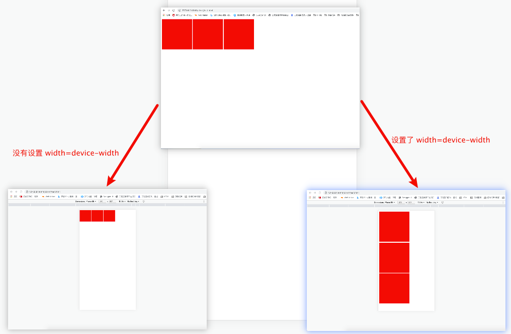
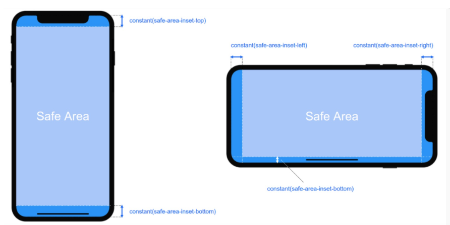

## 移动端开发适配问题

在进行移动端开发的时候经常回遇到适配不同手机屏幕尺寸的问题，同一css尺寸在不同手机上看到的大小是不一样的，这样我们就不能使用一个固定的尺寸来做开发，必须要使用一个相对的尺寸或者使用一些手段将页面按照比例整体缩放来适配屏幕的大小。

### 基础概念

+ **设备像素/物理像素**：设备实际物理像素点，是显示设备中一个最微小的物理部件，每个像素可以根据操作系统设置自己的颜色和亮度。任何设备的物理像素的数量都是固定的。例如（iphone6 750 * 1337） （iphone6plus 1960 * 1080）。注意：设备像素不等于CSS像素
+ **像素密度**：屏幕上每英寸可以显示的像素点的数量，单位是PPI
+ **屏幕分辨率**：设备屏幕横纵向上的物理像素点数的乘积。
+ **CSS像素**：CSS像素是一个抽象的单位，主要使用在浏览器上，用来精确的度量（确定）Web页面上的内容。CSS像素被称为与设备无关的像素（device-independent像素），简称为“DIPs”，单位px
+ **设备独立像素（PD/PID）**：密度无关像素，表示用几个实际物理像素表示的一个虚拟像素，这个虚拟像素就叫设备独立像素，如（iphone6 375 * 667） （iphone6P 414 * 736） （iphoneX 375 * 812）。实际开发中常可以认为“ 设备独立像素=CSS像素 ”
+ ***设备像素比（dpr）***：设备物理像素与设备独立像素的比例，可以在JS中获取`window.devicePixelRatio`。现在的智能手机dpr一般都大于1，例如iphone6/7/8的dpr=2
+ ***物理像素***：设备屏幕实际拥有的像素点。比如iPhone 6的屏幕在宽度方向有750个像素点，高度方向有1334个像素点，所以iPhone 6 总共有750*1334个物理像素。
+ **布局视口（layout viewport）**：网页布局的基准窗口，PC浏览器上，布局视口就等于当前浏览器的窗口大小（不包括 borders 、 margins、滚动条）；移动端，布局视口被赋予一个默认值，大部分为 980px。`document.documentElement.clientWidth/clientHeight`获取布局视口的宽高。通过在页面中添加meta的viewport width值设置布局视口的尺寸，一般为device-width
+ **视觉视口（visual viewport）**：用户通过屏幕真实看到的区域，默认等于当前浏览器的窗口大小。通过`window.innerWidth/innerHeight`来获取视觉视口大小
+ **理想视口（ideal viewport）**：网站页面在移动端展示的理想大小，上面说到的375 * 667指的就是理想视口尺寸。当页面不进行缩放时，视觉视口=理想视口。

上面比较重要的两个概念是***设备像素比***，***物理像素***；我们开发的时候常用的尺寸单位是px，这个px其实是***逻辑像素***。一般情况下，在设备像素比为1的屏幕上，1px在屏幕上占据1个物理像素点，在设备像素比为2的屏幕上，1px在屏幕上占据2个物理像素点，这就导致在设备像素比越高的屏幕上画面会更加细腻。除此之外还需要了解一下html的`<meta>`标签

### `<meta type='viewport'>`说明

HTML标签的viewport说明：`<meta type='viewport' content='width=device-width;init-scale=1' />`

+ width决定布局视口的宽度，device-width是理想视口的宽度，设置 width=device-width就相当于让布局视口等于理想视口；
+ initial-scale=理想视口宽度/视觉视口宽度，设置 initial-scale=1 就相当于让视觉视口等于理想视口。此时，1个 CSS像素=1个设备独立像素；如果initial-scale=0.5，且屏幕dpr=2，此时1个CSS像素=1个物理像素
+ width取理想视口和视觉视口中较大的值，如果initial-scale<1（即页面进行缩小），视觉视口大于理想视口，则width的值是取决于视觉视口

当我们的一个web端页面没有设置` width=device-width`时，在移动端打开网页会发现网页会被缩小后在移动端完全显示，也就是说如果页面上有一个宽高 200px的方块在移动端看到的就是远小于200的方块，当设置了` width=device-width`时，就就会又在将页面的元素大小按比例放大以此来回复元素原本的大小。




### 解决方案一：flexible + rem

flexible会根据当前设备动态计算meta的initial-scale，已经设置html的font-size，之后使用rem代替px即可

1.安装lib-flexible

```shell
cnpm i lib-flexible -S
```

2.将css的px使用postcss的px2rem动态编译px到rem

```shell
cnpm install px2rem-loader -S
```

配置一下基准及loader

```js
{
    loader: 'px2rem-loader',
    options: {
      remUnit: 75
    }
}
```


### 解决方案二：viewport

vh、vw方案即将视觉视口宽度 window.innerWidth和视觉视口高度 window.innerHeight 等分为 100 份。如果视觉视口为 375px，那么 1vw=3.75px，这时 UI给定一个元素的宽为 75px（设备独立像素），我们只需要将它设置为 75/3.75=20vw

1.设置标签

```html
<meta name="viewport" content="width=device-width, initial-scale=1.0, maximum-scale=1.0, user-scalable=0">
```

2.安装`postcss-px-to-viewport`将px编译为vw/vh

```shell
cnpm install postcss-px-to-viewport postcss-write-svg postcss-cssnext postcss-aspect-ratio-mini --save-dev
```

3.配置PostCSS配置文件

```js
module.exports = {
    "plugins": {
        "postcss-px-to-viewport": {
            unitToConvert: "px", // 默认值`px`，需要转换的单位
            viewportWidth: 375, // 视窗的宽度,对应设计稿宽度（按照设备独立像素的设计稿，如果设计稿是750，此处也应该是750）
            viewportHeight: 667, // 视窗的高度, 根据375设备的宽度来指定，一般是667，也可不配置
            unitPrecision: 3, // 指定`px`转换为视窗单位值的小数位数，默认值是5
            propList: ["*"], // 转化为vw的属性列表
            viewportUnit: "vw", // 指定需要转换成视窗单位
            fontViewportUnit: "vw", // 字体使用的视窗单位
            selectorBlaskList: [".ignore-"], // 指定不需要转换为视窗单位的类
            mediaQuery: false, // 允许在媒体查询中转换`px`
            minPixelValue: 1, // 小于或等于`1px`时不转换为视窗单位
            replace: true, // 是否直接更换属性值而不添加备用属性
            exclude: [], // 忽略某些文件夹下的文件或特定文件，如node_modules
            landscape: false, // 是否添加根据landscapeWidth生成的媒体查询条件 @media (orientation: landscape)
            landscapeUnit: "vw", // 横屏时使用的单位
            landscapeWidth: 1134 // 横屏时使用的视窗宽度
        },
        "postcss-write-svg": {   //用来处理1pxborder的问题
            uft8: false
        },
        "postcss-cssnext": {},   //自动添加样式前缀
        "postcss-aspect-ratio-mini": {}, //用来处理元素容器宽高比
    }
}
```


### 解决方案三：rem + 缩放比

因为rem的是相对于html的font-size的，所以当html的font-size发生变化的时候其他使用到rem单位的元素也会跟着发生变化，那么在不同屏幕，只要我们求出缩放比例然后再乘以原来设置font-size的基础值即可得到正确的大小。

假设UI给了一个375*667的效果图，那么我现在制定了一个基础值为16px，并以此设置其他元素的大小单位为rem。当屏幕大小发生变化时（移动端禁用缩放后不可能出现这种情况，可以在初始化的时候设置）设置html的font-size。

```js
let baseSize = 16;
let UIWidth = 375;
let curWidth = window.innerWidth;
let scale = curWindth / UIWindow;
let target = scale * baseSize;
let el = document.documentElement || document.body;
el.style.fontSize = target + 'px';
```

同时因为`设计稿的宽度/设计稿元素的宽度 = 手机屏宽/手机中元素的宽度`我们可以自己设置一个函数将设计稿中的尺寸直接转化成现在的尺寸，直接一步到位

`手机中元素的宽度 = 手机屏宽 * 设计稿元素的宽度 / 设计稿的宽度 `

```js
function px2rem(UIElWidth){
    return phoneWidth * UIElWidth / UIWidth;
}
```


### [iOS、Android 开发单位换算及 UI 切图要求](https://www.jianshu.com/p/ee3b2b75b180)


### 测量元素尺寸

在平时的开发中一般我测量元素尺寸都是使用 [pxcook](https://www.fancynode.com.cn/pxcook) 的（支持使用rem，rpx，px，vw/vh等单位），如果是移动端开发的话，通常UI图是按照 iphone6 的屏幕尺寸来进行设置，也就是所最终UI给到我们的尺寸大小会是`750x1334`的，但是我们开发的时候的视口大小却是`375x667`的，那么我们应该怎么准确的将UI的尺寸对到开发视口的尺寸呢？

1. 如果选用的是 rpx 的话，那么可以直接测量，因为 rpx 是微信小程序解决自适应屏幕尺寸的尺寸单位。微信小程序规定屏幕的宽度为750rpx。无论是在iPhone6上面还是其他机型上面都是 750rpx 的屏幕宽度，拿iPhone6来讲，屏幕宽度为375px，把它分为750rpx后， 1rpx = 0.5px。所以`375x667px`就是对应着`750x1334rpx`。但是如果你的UI尺寸不是`750x1334`时最好将UI图用ps按宽度等比例转换的 750 的尺寸再测量。如果你的开发视口尺寸不是 375 ，那么需要将你的UI图按宽度等比例转化成 2倍的开发视口尺寸 。
2. 如果选用的是 rem，px，vw/vh这些单位的话最好就是将UI图用ps按宽度等比例转换的 375 的尺寸再测量。
3. 如果你的页面需要在不同分辨率的窗口下正常显示就不要使用 px 作为主要尺寸。


### 其他的注意事项



- safe-area-inset-left：安全区域距离左边边界的距离
- safe-area-inset-right：安全区域距离右边边界的距离
- safe-area-inset-top：安全区域距离顶部边界的距离
- safe-area-inset-bottom ：安全距离底部边界的距离

而env()和constant()函数有个必要的使用前提，H5网页设置viewport-fit=cover的时候才生效，小程序里的viewport-fit默认是cover。


### 参考

[前端移动端适配总结](https://blog.csdn.net/xiaxiaoxian/article/details/79395694)

[css属性——env()和constant()设置安全区域](https://www.cnblogs.com/djjlovedjj/p/13983852.html)

[safe-area-inset-bottom iphone](https://blog.csdn.net/sd19871122/article/details/80989704)

[H5移动端适配方案](https://blog.csdn.net/ttx_laughing/article/details/105657341?utm_medium=distribute.pc_aggpage_search_result.none-task-blog-2~aggregatepage~first_rank_ecpm_v1~rank_aggregation-1-105657341.pc_agg_rank_aggregation&utm_term=h5+%E5%A4%A7%E5%B0%8F%E9%80%82%E9%85%8D%E6%96%B9%E6%A1%88&spm=1000.2123.3001.4430)

[rem适配布局---4. rem适配方案](https://www.cnblogs.com/deer-cen/p/12143290.html)

[移动开发之设计稿转换页面单位尺寸](https://www.cnblogs.com/lovesong/p/5439756.html)