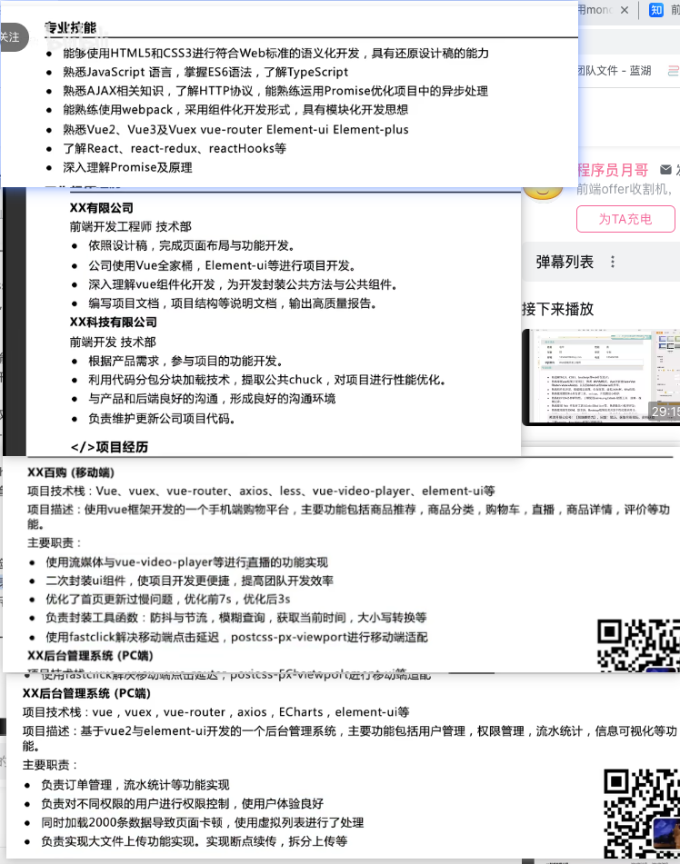

+ 熟练掌握vue2，vue3及其全家桶
+ 熟悉react开发

广东工程宝科技有限公司

前端开发工程师	技术部

+ 依照设计稿与需求，完成页面布局与功能开发
+ 深入理解vue组件化开发，为开发封装公共方法与公共组件
+ 优化项目结构
+ 负责 的修App 的IOS端、小程序端、管理后台等项目的开发工作

react-native 的原理是什么？ jsBridge 是什么

项目难点：背景 + 解决方法 + 取得成

重点、难点解决、小山与bug，编码规范

权限管理优化

图片合成优化

首屏优化，打包优化，怎么优化的，优化了什么

小程序定位问题，封装获取定位方法。各种地理坐标的转换

怎么做？遇到的问题是什么？产出了什么？有什么成果

主要职责/项目业绩

