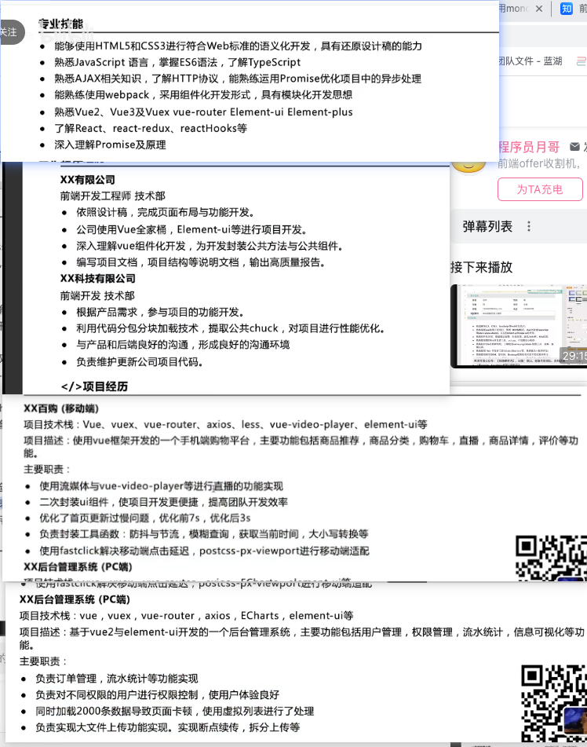

## 自我介绍

面试官好，我叫练建发，此次是来应聘的是贵司前端开发的岗位，目前在工程宝公司中担任前端开发组组长职位，现在工作中主要负责的项目是公司APP IOS端、H5、小程序、后台、鸿蒙APP端的开发工作，在此项目担任核心开发的角色，这个项目是使用 react-native 搭建的，在这个项目中也顺利完成了产品提出的各个功能需求，如配件管理、维修上报、数据分析等。除此之外还协助的修后台管理系统、小程序端、H5端的开发工作，如大文件上传、二维码图片合成等比较难的功能。

## 离职原因

对于所负责的开发工作，我已经没有什么新知识可以学的了，我希望职业生涯是一个持续的学习和提升的过程，并且在自己具备了相关业务技能经验后，也想迎接一些新的挑战，前公司管理比较扁平，虽然一直被领导重用，也负责过多个核心业务，但是职级几年来来一直没有变化。领导也争取过，但由于工作年限等原因，没能通过。我不想安于现状，想找一个更能发挥自己才能的平台

1. 缺乏发展空间：在现公司，我感到自己的职业发展受到了限制，没有更多的机会去学习和成长。
2. 无法提升：在现公司，我没有得到提升的机会，无法提高自己的职业水平和地位。
3. 缺乏挑战：我发现现公司的工作内容越来越单一，缺乏新的挑战和刺激，无法激发我的工作热情和创造力。
4. 薪资福利待遇不好：我在现公司的薪资和福利待遇相对较低，无法满足我的生活和经济需求

介绍项目，项目有哪些难点（大文件上传，合成二维码图，配件仓库的悬浮配件选择弹窗，错误监控，优化权限管理系统，级联选择优化）,自动化部署

鸿蒙端开发，基础功能开发（文件上传，视频播放，文件重传功能），类似vue响应式状态数据管理

做过哪些性能优化的工作，怎么知道那里需要进行优化？知道那里需要优化之后应该怎么进行优化？

前端监控怎么做？监控些啥（性能监控fp/fcp/fmp/ttfb，错误监控，用户行为监控）？怎么做监控埋点

jsBridge 是什么

优化项目权限系统，提供更便捷的权限判断，优化路由管理与菜单管理。

+ 背景：后台管理系统的按钮级别权限原来是按页面通过权限类型使用v-if进行判断的，当一个页面中有相同类型的权限时就无法很好的控制按钮的显示与隐藏
+ 解决方式：通过vue的自定义指令功能，定义`v-permission`指令根据权限的 strCode 进行权限判断
+ 成就：权限定义更加明确，可以清晰的分辨按钮权限，区分按钮是否需要显示

封装异步请求级联选择组件，异步获取数据，减少单次请求数据量，减少页面卡顿，降低服务端处理压力。

+ 背景：工单管理根据条件搜索时

优化微信小程序二维码图片合成功能，使合成时间缩短50%。

l 实现大文件上传、断点续传、拆分上传功能，解决大文件上传慢，中断后整个文件需要重新上传的问题。

大文件上传（断点续传），错误监控，图片合成，配件管理。升级后台项目，vite，vue3

+ 熟练掌握vue2，vue3及其全家桶
+ 熟悉react开发

广东工程宝科技有限公司

前端开发工程师	技术部

+ 依照设计稿与需求，完成页面布局与功能开发
+ 深入理解vue组件化开发，为开发封装公共方法与公共组件
+ 优化项目结构
+ 负责 的修App 的IOS端、小程序端、管理后台等项目的开发工作

react-native 的原理是什么？ jsBridge 是什么

项目难点：背景 + 解决方法 + 取得成

重点、难点解决、小山与bug，编码规范

权限管理优化

图片合成优化

首屏优化，打包优化，怎么优化的，优化了什么

小程序定位问题，封装获取定位方法。各种地理坐标的转换

怎么做？遇到的问题是什么？产出了什么？有什么成果

主要职责/项目业绩

