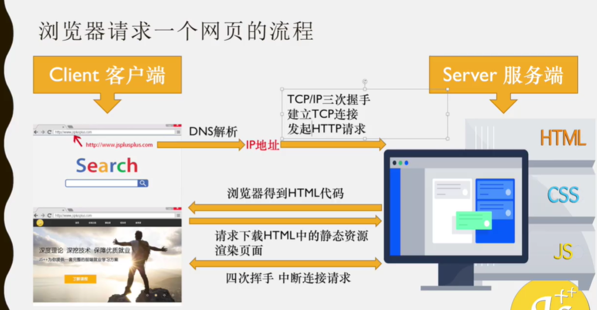
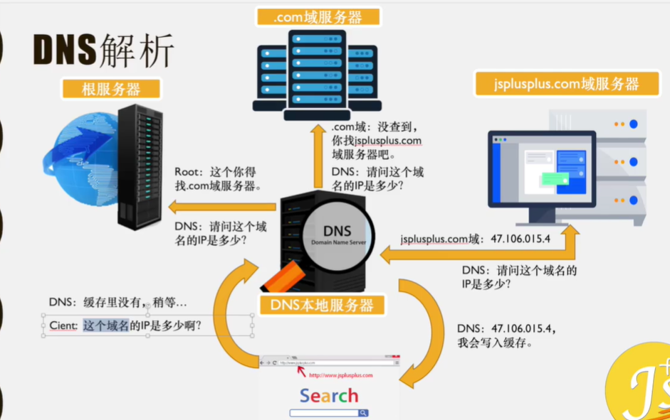
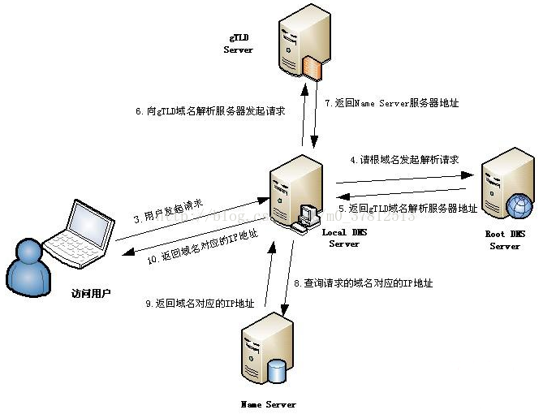
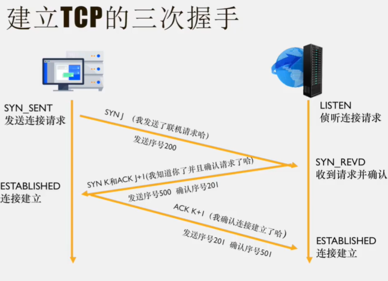

# 网络协议

网络协议，其实就是数据传输和解析的一种规则，这种规则规定发送和接收数据的双方如何对数据进行处理。常见的协议有 www（网页服务），FTP（文件传输），E-mail（电子邮件），Telnet（远程登录）等等。www是用浏览器访问页面的服务，所以网站的主页的域名前需要加 www。但是随着网站服务类型的增加，不同的二级域名或者三级域名对应不同的业务，而业务的处理任务会分配到多个服务器，所以，不在需要使用 www 来标注页面，很多网站都还是会做 DNS 解析 www，因为用户习惯如此。

## DNS 解析

+ DNS ：Domain Name Server（域名服务器）
+ 作用：域名与对应的IP转换的服务器
+ 特征：DNS 中保存了一张域名与对应IP地址的表，一个域名对应一个IP地址，一个IP地址可以对应多个域名
+ gTLD：generic Top-Level DNS Server 顶级域名服务器为所有的.com、.net….后缀做域名解析的服务器

如访问`www.taobao.com`时，其解析过程如下

1. 浏览器先检查自身缓存中是否有被解析过的这个域名的IP地址，如果有就是直接使用
2. 如果浏览值缓存中没有，就在操作系统的 hosts 文件中检查看看有没有该域名被解析过的IP地址，有则直接使用
3. 如果操作系统的缓存中（hosts）中还是没有，就发送请求到LDNS（本地域名服务器）中去获取，还是同样的如果缓存中有没有，如果有就直接使用，如果还是没有就向根域名服务器请求解析。`www.taobao.com.`其中末尾的`.`代表的是根域。
4. 根域名服务器返回给LDNS一个gTLD（顶级域名服务器）地址，如`.com`的。
5. LDNS 接收到顶级域名服务器地址后，会再向 gTLD 发送请求，获取下一级域名服务器地址（一级域名服务器）
6. gTLD 接收都请求后会将域名对应的 Name Server 服务器地址返回给LDNS，这个地址就是网站注册的域名服务器（如腾讯的域名服务器）
7. LDNS 接收到 Name Server 服务器地址后，向 Name Server 服务器 发起请求获取到对应的 IP 地址。
8. LDNS 接收到 IP 地址后，将这个域名和IP进行缓存并将结果返回给用户
9. 用户接受到结果后，将结果存储到浏览器本地缓存中。

## IP 地址

+ IP （internet protocol address），互联网协议地址、IP地址
+ 作用：分配给用户上网使用的互联网协议
+ 分类：IPv4，IPv6
	+ v：版本，4 / 6：版本号
	+ IPv6优点：IPv6地址空间更大（8组——128位，十六进制）；路由表更小；组播支持以及对流支持增强；对自动配置的支持；更高的安全性
	+ 例子：`ABCD:EF01:2345:6789:ABCD:EF01:2345:6789`
+ 形式：192.168.0.1（长度为32位（4个字节），十进制）（IPv4）

## PORT  端口号

+ IP地址仅能让你找到服务器在哪，但是到底应该要访问服务器中的那个部分的业务需要通过端口号 PORT 来确定
	+ 例子：IP 地址就是 游乐园地址，端口号 是游乐园中的不同游乐设施，
+ 端口号范围：0-65535
+ 默认端口号：http：80，https：443，FTP：20 、21

## TCP

+ TCP：Transmission Control Protocol 传输控制协议
+ 特点：面向连接（收发数据，必须建立可靠的链接）
+ 建立连接基础：三次握手
+ 应用场景：数据必须准确无误的收发——HTTP请求，FTP文件传输，邮件收发
+ 优点：稳定、重传机制、拥塞控制机制、断开连接
+ 缺点：效率低，速度慢、占用资源，容易受到攻击（三次握手->DOS、DDOS攻击）
+ TCP / IP 协议组：提供点对点的连接机制，制定了数据封装、定址、传输、路由、数据接收的标准

## UDP

+ UDP：user data protocol 用户数据协议
+ 特点：面向无连接（不可靠的协议，无状态传输机制）
+ 无连接消息发送机制
+ 应用场景：无需确保通讯质量且要求速度快，无需确保信息完整，如消息收发，语音通话、直播
+ 优点：安全，快速，漏洞少（UDP flood 攻击）
+ 缺点：不可靠、不稳定、容易丢包
+ 总结：只要目的的源地址、端口号、地址、端口号确定，就可以直接发送信息报文，但是不能保证一定能收到或收到完整的数据。

## HTTP和HTTPS

+ HTTP：HyperText Transfer Protocol 超文本传输协议
+ 定义：客户端和服务器端请求和应答的标准，用于从WEB 服务器传输超文本到本地浏览器的传输协议（HTTP 传输的数据是明文的，存在安全隐患）
+ HTTP请求：按照协议规则先向WEB服务器发送的将超文本传输到本地的请求。
+ HTTPS : HyperText Transfer Protocol Secure 超文本传输安全协议
+ 定义：HTTP的安全版（安全的基础是 SSL/TLS）
	+ SSL：secure sockets layer 安全套接层
	+ TLS：Transport layer security 传输层安全
+ 为网络通信提供安全及数据完整性的一种安全协议，对网络连接进行加密
+ HTTP和HTTPS 的区别：
	+ HTTP 是不安全的，容易受到监听和中间人攻击，网站账户信息和敏感信息容易泄漏，而HTTPS 可以防止被攻击
	+ HTTP 协议的传输内容是明文的，直接在TCP连接是上运行，客户端和服务器都无法验证对方的身份。
	+ HTTPS 协议的传输内容都被 SSL / LTS 加密，且运行在SSL/TLS 上，SSL /TLS 运行在TCP连接上，所以数据传输是安全的

## 建立 TCP 连接

HTTP 和 HTTPS 通信都必须先建立 TCP 连接之后才能进行。

+ 标志位：数据包
	+ SYN：synchronize sequence numbers 同步序列号
	+ ACK：acknowledgement 确认字符
+ 状态：
	+ LISTEN：侦听TCP端口的链接请求（我等着你发送连接请求呢）
	+ SYN-SENT：在发送连接请求后等待匹配的连接请求（我发送了连接请求，等你回复）
	+ SYN-RECEIVED：在收到和发送一个连接请求后等待对连接请求的确认（我收到你的请求了。我等你回复）
	+ ESTABLISHED：代表一个打开的链接，数据可以传送给用户（建立连接了，我跟你说一下）

第一次握手：客户端向服务器发送SYN标志位（序号是 J），并进入SYN_SEND状态（等待服务器确认状态）

第二次握手：服务器收到来自客户端的SYN J ，服务端会确认该数据包已经收到并发送 ACK标志位(序号是J+1)和SYN标志位（序号是K），服务器进入SYN_RECV (请求接收并等待客户端确认)

第三次握手：客户端进入连接建立状态后，想服务器发送ACK标志位（序号是K+1）确认客户端已经收到建立连接确认，服务器收到ACK标志位后，服务端进入连接已建立状态。

