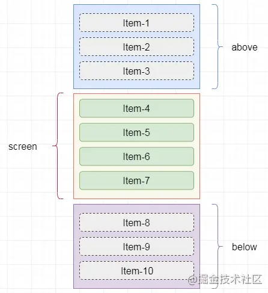

## 高性能渲染长列表

有时候我们可能需要渲染很多数据的长列表，比如商品列表，交易记录等，这些在PC端一般都会使用分页来解决，但是在移动端的话就不会这样处理，在一次渲染时太多时候的时候浏览器可能会分常卡，所以需要使用到一些方式来优化一下。

一般在一次性插入大量数据的时候一般采用的方式有两种

1. 分片插入
2. 虚拟列表

### 分片插入

分片插入，顾名思义就是将数据分割成多个片段，分段插入。这里我们使用`DocumentFragment`作为容器包裹内容，进行一次性传入，这样可以减少回流的次数，使用`requestAnimationFrame`递归调用插入方法，这个方法相比于`setTimeout`和`setInterval`可以避免出现闪屏现象

> **文档碎片**
>
> `DocumentFragment`，文档片段接口，表示一个没有父级文件的最小文档对象。它被作为一个轻量版的`Document`使用，用于存储已排好版的或尚未打理好格式的XML片段。最大的区别是因为`DocumentFragment`不是真实DOM树的一部分，它的变化不会触发DOM树的（重新渲染) ，且不会导致性能等问题。
>  可以使用`document.createDocumentFragment`方法或者构造函数来创建一个空的`DocumentFragment`
>
> **`requestAnimationFrame`**
>
> 与`setTimeout`相比，`requestAnimationFrame`最大的优势是由系统来决定回调函数的执行时机。
>
> 如果屏幕刷新率是60Hz,那么回调函数就每16.7ms被执行一次，如果刷新率是75Hz，那么这个时间间隔就变成了1000/75=13.3ms，换句话说就是，`requestAnimationFrame`的步伐跟着系统的刷新步伐走。它能保证回调函数在屏幕每一次的刷新间隔中只被执行一次，这样就不会引起丢帧现象。

```html
<ul id="container"></ul>
```

```js
let container = document.getElementById("container");//容器
let total = 100000;//总数据量
let once = 20;//一次插入的数据量
let page = total / once;//总页数
let index = 0;//每条记录的索引
//递归插入数据
function loop(curTotal,curIndex){
    if(curTotal <= 0) return;
   	let pageCount = Math.min(curTotal,once);
    window.requestAnimationFrame(function(){
        let fragment = document.createDocumentFragment();
        for(let i = 0;i < pageCount;i++){
            let li = document.createElement("li");
            li.innerText = "data:" + (curIndex + i);
            fragment.appendChild(li);//不会触发回流
        }
        container.appendChild(fragment);//会触发回流
        loop(curTotal - pageCount,curIndex + pageCount);
    })
}
loop(total,index);
```


### 虚拟列表

使用分片插入的方式虽然能提高数据插入的性能，但是你会发现浏览器可能会变得非常卡，因为页面的每次变动，浏览器都需要处理大量的节点，有些节点是并不需要显示的，但是还是要处理，这就浪费了很大一部分性能了。对于这样情况可以使用虚拟列表解决。

虚拟列表，一般是只将要显示的数据渲染到可见区域，其他的数据就不需要了，不过一遍还会渲染当前视口前后的一部分数据，这样可以获得比较好的滚动过度效果。



我们需要的html结构是这样的

```html
<div class="infinite-list-container">
    <div class="infinite-list-phantom"></div>
    <div class="infinite-list">
      <!-- item-1 -->
      <!-- item-2 -->
      <!-- ...... -->
      <!-- item-n -->
    </div>
</div>
```

> - `infinite-list-container` 为`可视区域`的容器
> - `infinite-list-phantom` 为容器内的占位，高度为总列表高度，用于形成滚动条
> - `infinite-list` 为列表项的`渲染区域`

我们使用vue2.x来实现

```vue
<template>
<div ref="list" :style="{height}" class="infinite-list-container" @scroll="scrollEvent($event)">
    <div ref="phantom" class="infinite-list-phantom"></div>
    <div ref="content" class="infinite-list">
        <div class="infinite-list-item" ref="items" :id="item._index" :key="item._index" v-for="item in visibleData">
            <slot ref="slot" :item="item.item"></slot>
    </div>
    </div>
    </div>
</template>

<script>
    export default {
        name:'VirtualList',
        props: {
            //所有列表数据
            listData:{
                type:Array,
                default:()=>[]
            },
            //列表项预估高度
            estimatedItemSize:{
                type:Number,
                required: true
            },
            //缓冲区比例
            bufferScale:{
                type:Number, 
                default:1
            },
            //容器高度 100px or 50vh
            height:{
                type:String,
                default:'100%'
            }
        },
        computed:{
            //转化后的全部数据
            _listData(){
                return this.listData.map((item,index)=>{
                    return {
                        _index:`_${index}`,
                        item
                    }
                })
            },
            //可视区域数据数量
            visibleCount(){
                return Math.ceil(this.screenHeight / this.estimatedItemSize);
            },
            //可视区域前的数据数量
            aboveCount(){
                return Math.min(this.start,this.bufferScale * this.visibleCount)
            },
            //可视区域后的数据数量
            belowCount(){
                return Math.min(this.listData.length - this.end,this.bufferScale * this.visibleCount);
            },
            //可视区域的数据
            visibleData(){
                let start = this.start - this.aboveCount;
                let end = this.end + this.belowCount;
                return this._listData.slice(start, end);
            }
        },
        created(){
            this.initPositions();
            window.vm = this;
        },
        mounted() {
            this.screenHeight = this.$el.clientHeight;
            this.start = 0;
            this.end = this.start + this.visibleCount;
        },
        updated(){
            this.$nextTick(function () {
                if(!this.$refs.items || !this.$refs.items.length){
                    return ;
                }
                //获取真实元素大小，修改对应的尺寸缓存
                this.updateItemsSize(); 
                //更新列表总高度
                let height = this.positions[this.positions.length - 1].bottom;
                this.$refs.phantom.style.height = height + 'px'
                //更新真实偏移量
                this.setStartOffset();
            })
        },
        data() {
            return {
                //可视区域高度
                screenHeight:0,
                //起始索引
                start:0,
                //结束索引
                end:0,
            };
        },
        methods: {
            initPositions(){
                this.positions = this.listData.map((d,index)=>({
                    index,
                    height:this.estimatedItemSize,
                    top:index * this.estimatedItemSize,
                    bottom:(index+1) * this.estimatedItemSize
                }));
            },
            //获取列表起始索引
            getStartIndex(scrollTop = 0){
                //二分法查找
                return this.binarySearch(this.positions,scrollTop)
            },
            binarySearch(list,value){
                let start = 0;
                let end = list.length - 1;
                let tempIndex = null;

                while(start <= end){
                    let midIndex = parseInt((start + end)/2);
                    let midValue = list[midIndex].bottom;
                    if(midValue === value){
                        return midIndex + 1;
                    }else if(midValue < value){
                        start = midIndex + 1;
                    }else if(midValue > value){
                        if(tempIndex === null || tempIndex > midIndex){
                            tempIndex = midIndex;
                        }
                        end = midIndex - 1;
                    }
                }
                return tempIndex;
            },
            //获取列表项的当前尺寸
            updateItemsSize(){
                let nodes = this.$refs.items;
                nodes.forEach((node)=>{
                    let rect = node.getBoundingClientRect();
                    let height = rect.height;
                    let index = +node.id.slice(1)
                    let oldHeight = this.positions[index].height;
                    let dValue = oldHeight - height;
                    //存在差值
                    if(dValue){
                        this.positions[index].bottom = this.positions[index].bottom - dValue;
                        this.positions[index].height = height;
                        for(let k = index + 1;k<this.positions.length; k++){
                            this.positions[k].top = this.positions[k-1].bottom;
                            this.positions[k].bottom = this.positions[k].bottom - dValue;
                        }
                    }

                })
            },
            //获取当前的偏移量
            setStartOffset(){
                let startOffset;
                if(this.start >= 1){
                    let size = this.positions[this.start].top - (this.positions[this.start - this.aboveCount] ? this.positions[this.start - this.aboveCount].top : 0);
                    startOffset = this.positions[this.start - 1].bottom - size;
                }else{
                    startOffset = 0;
                }
                this.$refs.content.style.transform = `translate3d(0,${startOffset}px,0)`
            },
            //滚动事件
            scrollEvent() {
                //当前滚动位置
                let scrollTop = this.$refs.list.scrollTop;
                // let startBottom = this.positions[this.start - ]
                //此时的开始索引
                this.start = this.getStartIndex(scrollTop);
                //此时的结束索引
                this.end = this.start + this.visibleCount;
                //此时的偏移量
                this.setStartOffset();
            }
        }
    };
</script>


<style scoped>
    .infinite-list-container {
        overflow: auto;
        position: relative;
        -webkit-overflow-scrolling: touch;
    }

    .infinite-list-phantom {
        position: absolute;
        left: 0;
        top: 0;
        right: 0;
        z-index: -1;
    }

    .infinite-list {
        left: 0;
        right: 0;
        top: 0;
        position: absolute;
    }

    .infinite-list-item {
        padding: 5px;
        color: #555;
        box-sizing: border-box;
        border-bottom: 1px solid #999;
        /* height:200px; */
    }
</style>
```


## 参考(来源)

+ [「前端进阶」高性能渲染十万条数据(时间分片)](https://juejin.cn/post/6844903938894872589)
+ [「前端进阶」高性能渲染十万条数据(虚拟列表)](https://juejin.cn/post/6844903982742110216)