## 资料

+ [裸K交易法](https://www.bilibili.com/video/BV1CE411n7xy?spm_id_from=333.1245.0.0)
+ [裸K线交易法——价格行为（Price-Action）全面详解.pdf](./裸K交易法/裸K线交易法——价格行为（Price-Action）全面详解.pdf)

## 突破信号

什么是突破？当K线突破上一个高点的时候就是突破

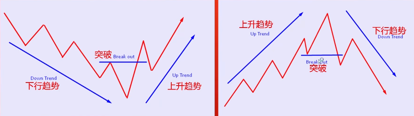

### 确定初步突破(Initial Break,IB)

在上升趋势里，当最高的蜡烛被反向突破，那这个区域就是初步突破区域。

+ IB只是提供初步价格转向的可能性
+ IB并非入场信号，除非是以Dominant Break(**DB**)的形态出现。

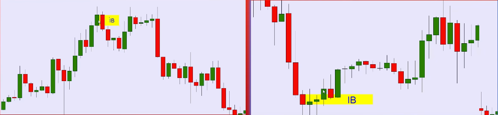

### 蜡烛突破口（CandleBreak，CB)

再出现 **IB** 之后还需要等待K线突破 **CB** 才可以，这个信号才是有效的

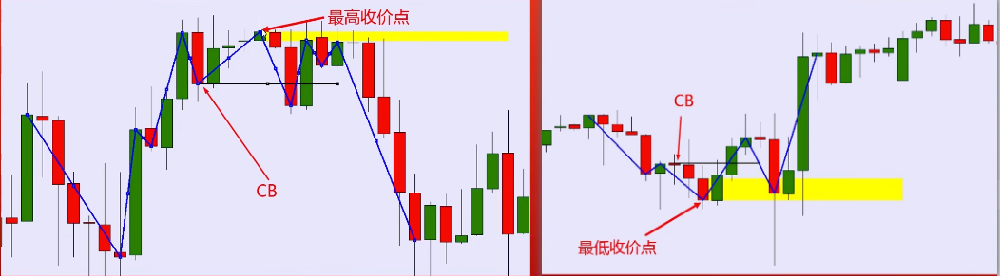

**CB不可和IB处在同一个位置**

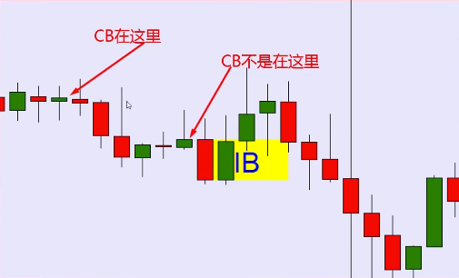

### Dominant Break ( DB)

由**3个或以上**的蜡烛形成的IB突破可以成为入场的信号

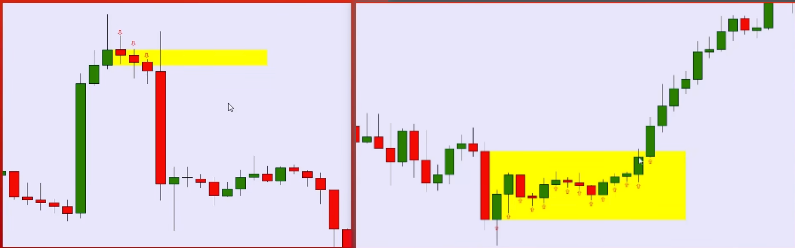

**所有IB，DB，和窗口突破，都是以蜡烛收价为标准**

### 如何察觉信号被市场否决？

当IB区域被反向突破，信号就不再成立。

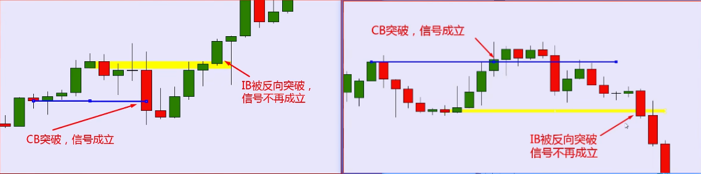

## 使用斐波那契寻找止盈点

黄金比例（GoldenRatio），是以斐波纳契（Fibonacci）数列计算出来的完美比例

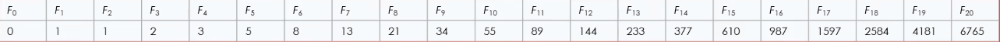

### 斐波纳契回撤的设定

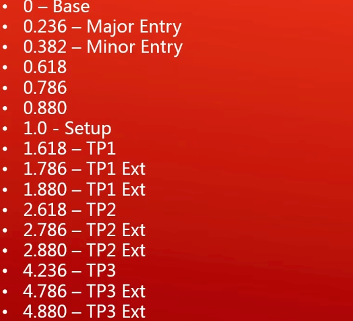

**具体步骤**

1. 寻找蜡烛突破的信号，信号包括了CB的突破，或DominantBreak（DB)。
2. 使用斐波纳契回撤工具，把1.0定位在突破CB的蜡烛收价位置。
3. 把0定位在整个信号最低价的位置。
4. 从黄金分割线呈现出的TP1（1.618),TP2(2.618),TP3（4.236）就是止盈点。

使用斐波纳契回撤拉出来的线如下，其中需要关注的是`TP1`、`TP2`、`TP3`三个是止盈点，`minor Entry`，`major Entry`是回撤点

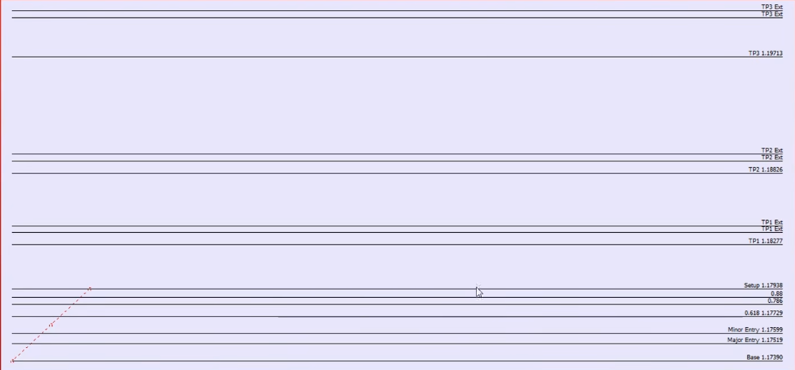

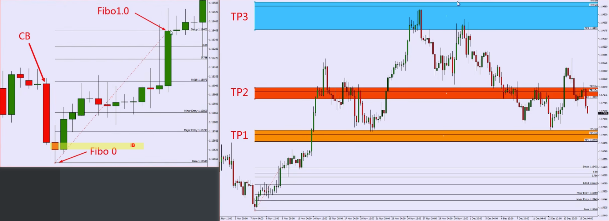

对于**DB**来说，可以直接再DB的收价位开始拉

### 注意事项

+ TP3如果破了后，我们可以把Fibo1再调整至最高/最低价，然后寻找延伸的止盈点。
+ 如果TP3再破，就必须转换更大的周期图来寻找止盈的区域，比如H1转换H4，H4转换Daily
+ 入场做反向的信号如果是发生在TP2/TP3区域，将有比较大的概率。

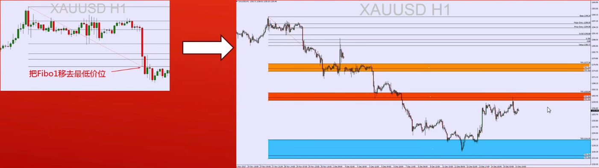

## 寻找最佳入场点

信号成立后，等价格回撤在进场开单，以取得更好的RR。通过4种策略，寻找最理想的位置挂单：

1. 从蜡烛形态寻找A-B-C波段，挂单在B位置
2. 挂单在IB区域
3. 转去小周期图寻找回撤终点
4. 利用斐波纳契(Fibonacci)回撤工具挂单

***注意：一旦IB区域被反向突破，必须止损。***

#### 从蜡烛形态寻找A-B-C波段

什么是A-B-C波段？

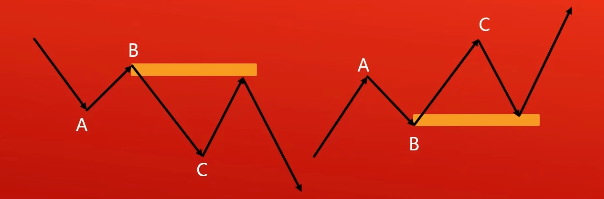

在B的位置挂单，等价格回撤入场。注意在找A-B-C的时候**C的位置一定要比A的位置低或高**，C点一般都是突破了CB的，其实认真观察会发现**每个B点都是IB**。

并且**B的顶点**一般是区域内阴线/阳线**实体**的最低/高点，在C点出现之后才可以找到B的位置

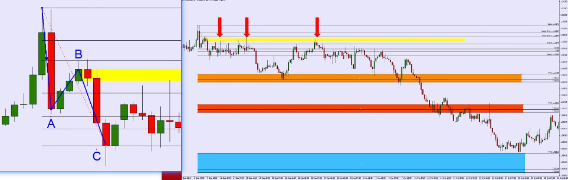

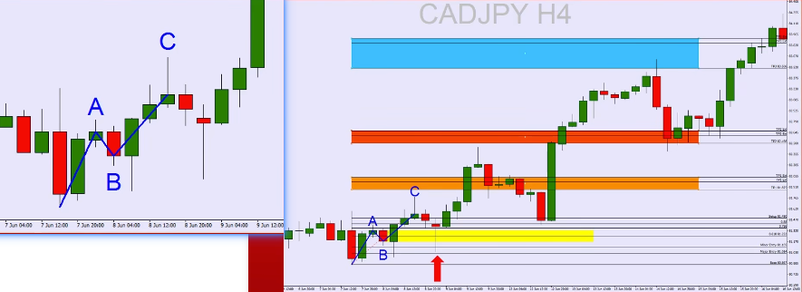

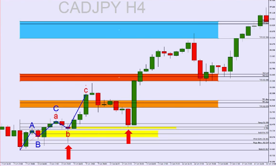

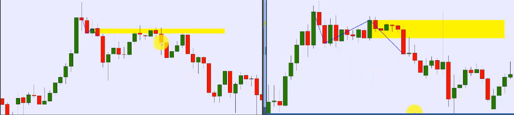

> K 线突破的主要B区域（**CBR key level**），这种B区域会比较强
>
> **形成条件**：B位置前面有3个或以上的同趋势K线（可以被一两个反趋势的k线中断）
>
> 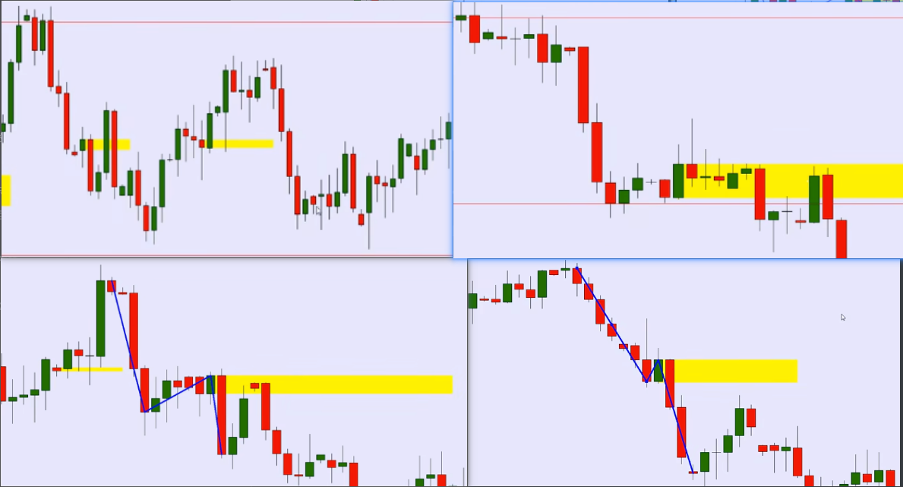

#### 挂单在IB区域

IB是信号的最后关口，最简单的入场方法，可以拿到最好的RR。但是价格不一定会回来这个区域，也需克服恐惧心理

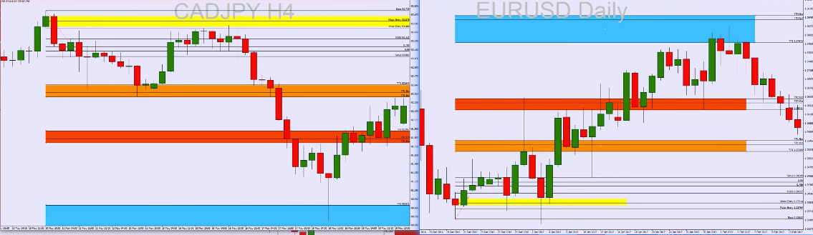

#### 转去小周期图寻找回撤终点

操作上有些难度比较适合有经验者，当有信号时，转去小周期图寻找回撤目标

+ 在H4有信号，转去H1寻找回撤
+ 在H1有信号，转去M30/M15寻找回撤

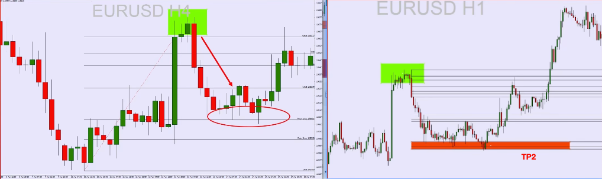

**高风险做法**：直接在TP1/2/3区域挂单；**低风险做法**：等待出现做多信号才开单

#### 利用斐波纳契(Fibonacci)回撤工具挂单

具体步骤：

1. 等待信号出现
2. 等价格回撤
3. 把黄金分割线移至波段的最高/低，但是最多可以追到原本的TP2的位置，如果TP2突破了就不要再追了
4. 在Minor/Major区域挂单

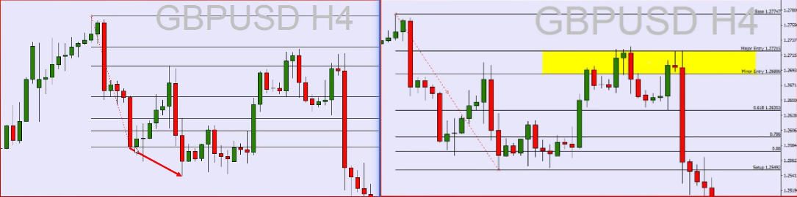

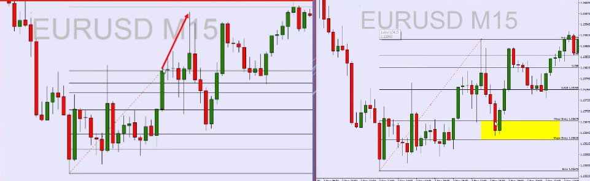

> 如果要做TP1的盈利也可以挂单再 `0.786~1` 的位置，止盈再 1.618 ，这样盈亏比可以到 1:1，如果要做TP2的盈利可以在2.618处止盈，盈亏比可以到 1:1.618
>
> 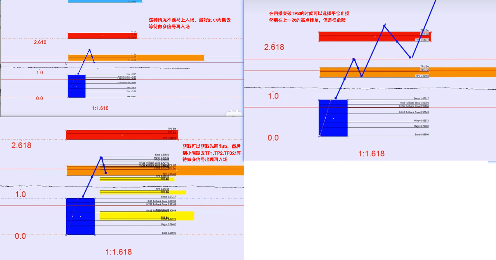

#### 在什么情况下我们要考虑不等回撤？

当一根蜡烛突破IB和CB的情况下，可以考虑现价开单。

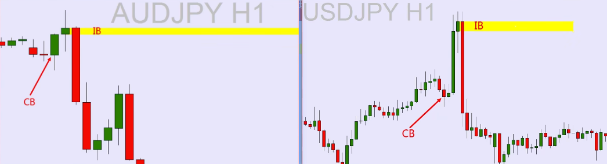

### 动量震荡指标（AO），简称AO

动量震荡指标（Awesome Oscillator），简称**AO**（就是**MACD**，只不过不看那两根线），计算方法：`AO = SMA（中间价，5）- SMA（中间价，34）`,`中间价 =（最高价+最低价）/ 2`，**用来判定市场的动量，也就是推动力**，主要是寻找有**背离**的信号，对入场的风险做出调整。

#### 什么是背离(Divergence)?

+ 当价格创新低，但AO并没有相应创新低（牛市背离），视为利好（利多）讯息，价格跌势或将完结。
+ 相反，若价格创新高，但AO并没有相应创新高（熊市背离），视为利淡（利空）讯息，价格涨势或将完结。
+ 有背离的反向信号，价格来到TP2/TP3的概率也比较高。
+ 没有背离的反向信号，通常被视为暂时性的价格调整，信号被市场否决的概率也比较高。

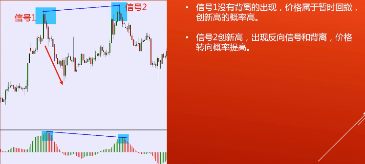

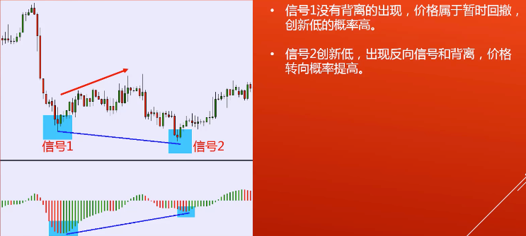

**总结**：

+ 和其他指标一样，动量震荡指标是属于滞后性指标，不一定有100%准确性。
+ 动量震荡指标主要作用只是提供价格动力的参考。
+ 其他的指标也可以用来寻找背离，比如MACD，RSI等等。
+ 有背离的信号通常会有比较大的转向概率。
+ 在TP1/2/3区域当我们期待转向信号时，如果没有背离出现，通常我会等待价格再创高/低，有信号和背离后才入场。
+ 一个没有背离的信号被市场否决的概率比较高，如果开了单，务必执行严格风险控制，比如进行锁盈或设保本损策略。

## 简单交易系统

标准作业程序（SOP）

1. 等待蜡烛突破的信号
2. 使用斐波纳契回撤(Fibonacci Retracement)寻找止盈点位
3. 等待价格回撤，在使用适当的策略挂单。
4. 参考AO指标，实行必要的风险管控。
5. 一旦IB区域被反向突破，必须止损。

## 顺势交易

### MA判断趋势

通过**移动平均线MA（Moving Average）**来做判断是否是顺势，设置分别是`50 Close`、`150 high`、`150 low`。

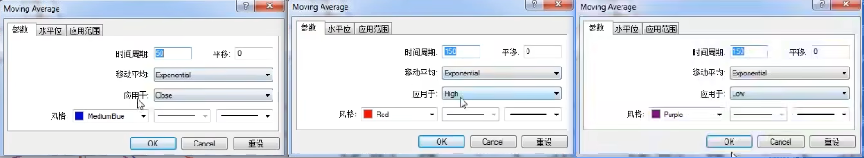

交易做法:

+ 当 **50 均线向下穿**过另外两条均线的时候，趋势为下跌，做空；当 **50 均线向上穿**过另外两条均线的时候，趋势为上升，做多。
+ 在**上升趋势**中，当 **K线** 回到 **50 均线下方**的时候可以**等待信号出现**之后开始**做多**；在**下跌趋势**中，当 **K线** 回到 **50 均线上方**的时候可以**等待信号出现**之后开始**做空**
+ 如果 **50 均线在另外两条均线中间**的时候表示趋势不明朗，暂时不要做单，继续观望。

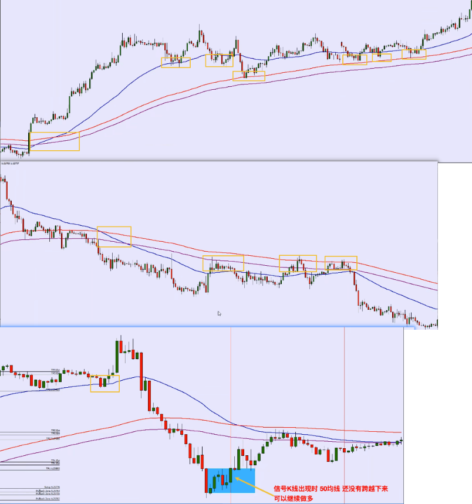

这种是相对稳健的做法，风险较低，另一种比较冒险的开单方法就是使用 **WPR** 来确定挂单点位，WPR设置为10周期和100周期。

在上升/下跌趋势k线进入到50均线下/上，10周期线进入到 `-80~-100`/`0~-20`的时候就**直接开单，无需等待信号出现**

> KDJ/RSI 和 WPR 很像但是并不一样，不过可以用来做止盈，出现超买/超卖的时候止盈
>
> 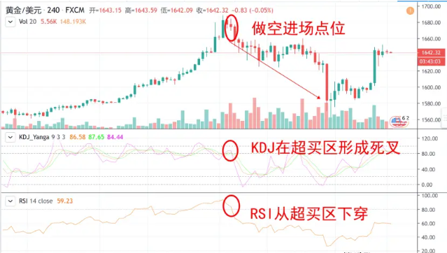

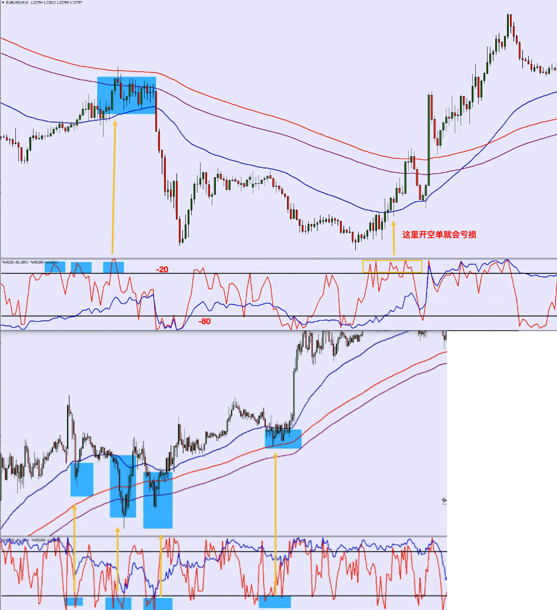

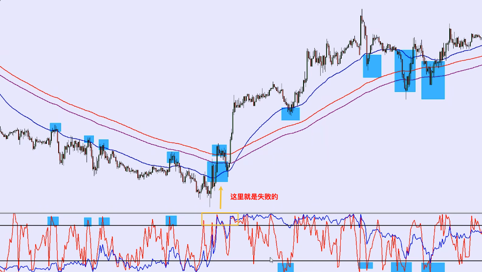

## 通道

一段趋势之后，趋势反转通常会出现一个波段的通道。

在大周期（一般1D，4H，1H）上当点位2出现的时候就可以连接点位1和2形成一个通道，之后可以转去小周期在通道线上等待信号的出现开始做单

通道线尽可能多的触碰到影线

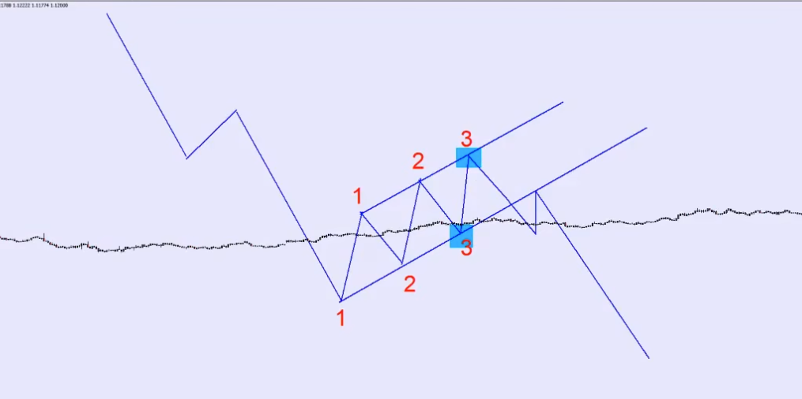

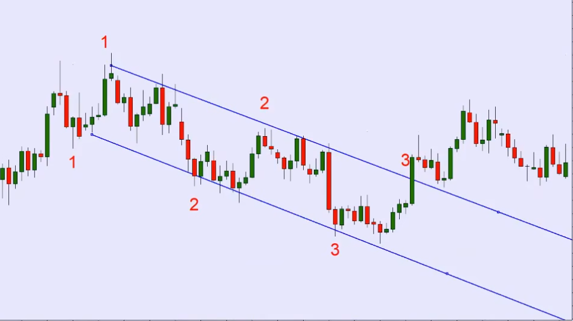

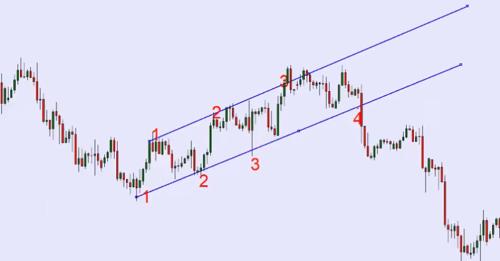

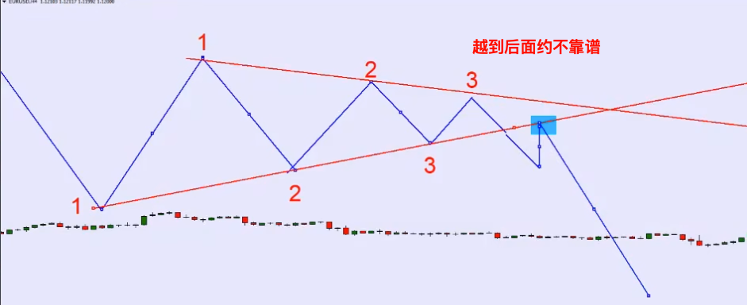

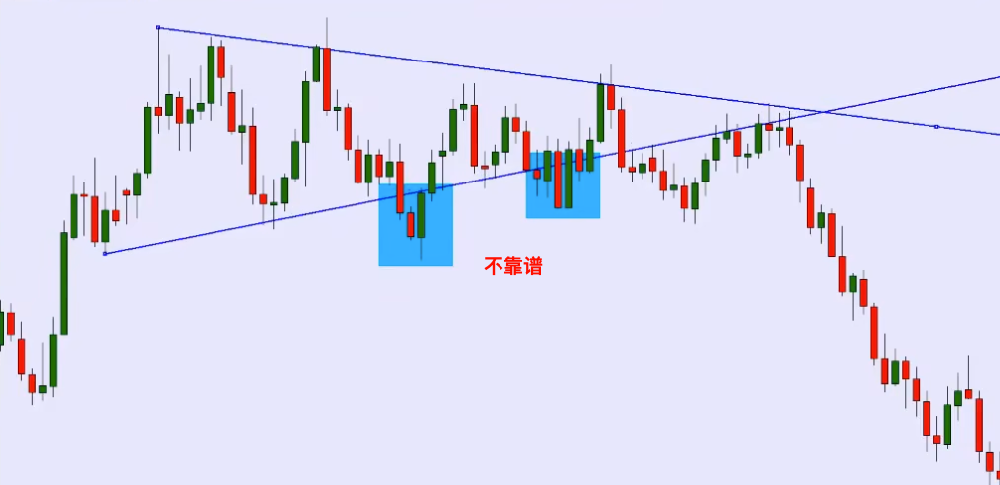

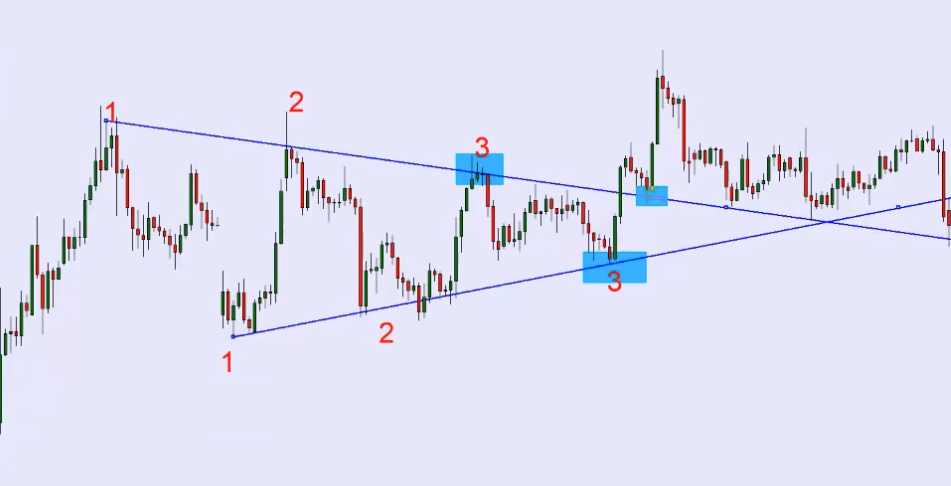

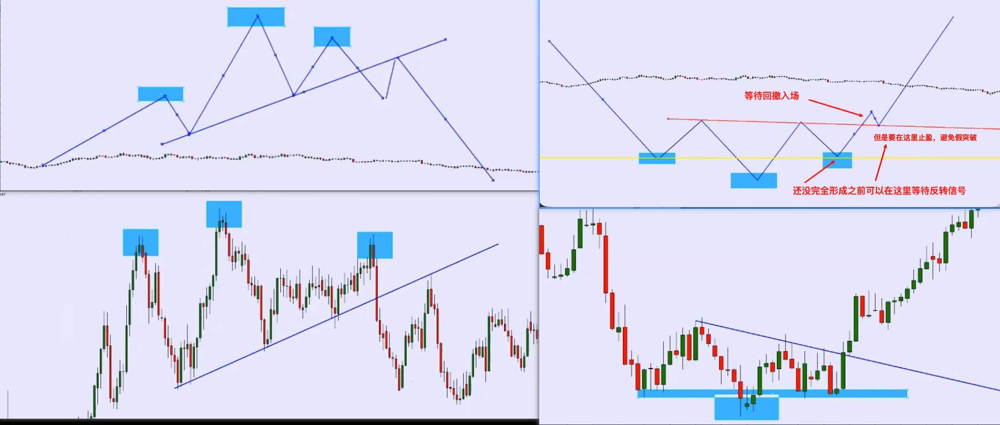

**划线要三点连一线，这样的线才是重要的支持压力线。**
