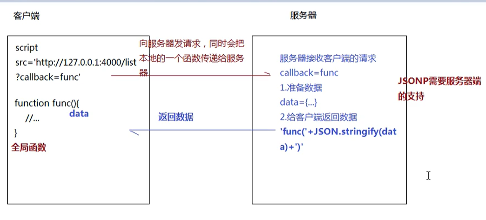
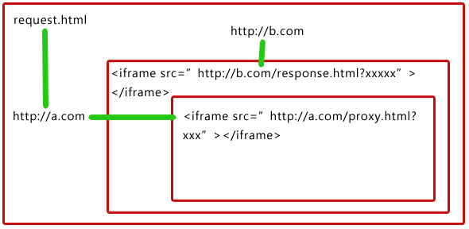
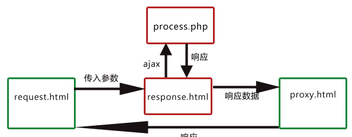

# 跨域请求

## 什么是跨域请求

**跨域请求**的也叫 **非同源策略请求** ：协议，端口号，域名只要有一个不一样就是非同源连接，比如 `http://127.0.0.1:1234/getData`和`http://127.0.0.1:4321`这两个就是非同源的。


## 跨域请求得不得数据 ？

**跨域请求**的正式名称为 **非同源策略请求** 。我们之前使用的 ajax / fetch 请求技术就是相对于同源策略请求的，**非同源策略请求的之所以不能得到数据**是因为浏览器内部的 ajax 引擎处于安全原因而将返回的结果拦截了，而不是因为服务端接收不到请求。


## 为什么以前没有跨域请求？

在以前的开发中没有出现跨域的原因是，以前没有前后端分离的开发方式，采用的是前后端混合开发的方式，这样在开发的时候是处于同一个服务器上的不存在跨域的情况。在到后面前后端开发就使用的是前端开发的时候使用 xampp 搭建本地服务器，然后配置 host 文件将本地的请求伪装成目标地址，比如 本地的开发地址是 `http://127.0.0.1:1234/index.html` ，目标地址是`http://api.test.com/getData`。这两个就出现了跨域情况了，那么在 host 文件下新增映射`127.0.0.1:1234  http://api.test.com/`将本是非同源的伪装成同源的。 


## 为什么浏览器有跨域限制？

如果你在browser这边的js代码可以任意访问第三方的数据，那么你可以让你的js代码定时轮询对这个第三方的访问，比如每秒访问一次。那么，任何正在浏览你的网页的用户，都会以每秒一个请求的频率对这个第三方的网站做访问。假设有十万人在浏览你的网页，那么这个第三方的网站就不得不承受每秒10万次的无效访问。这谁受得了。。。当然，这里说的是你去作恶他人。但如果放开了同源策略，就是人人平等的，别人也可以用同样的方式来作恶你的网站。如此这般，整个web生态将充斥着这样海量的无效请求，以至于大家都没办法正常地访问web页面了，因为带宽都被无效请求吃掉了。

[为什么浏览器要限制跨域访问?](https://www.zhihu.com/question/26379635/answer/558606359)


## 解决跨域的基本思想

跨域的产生的原因有两个：1.非同源策略，2.跨域限制，根本的原因还是**浏览器的跨域限制**。而这个限制是由于浏览器内部的 ajax 引擎产生的，非同源策略请求也是被它拦截得的。所以解决跨域的方法有三种：1.将非同源策略请求伪装成同源策略请求。2.跳开浏览器的 ajax引擎 的拦截，使用自己的 server 进行请求得的转发和数据接收，再将数据转发给浏览器。3.使用不受跨域限制的资源进行代码注入


## 1. JSONP解决跨域

在浏览器中有些请求资源的标签是不受跨域限制的 如 `script img link iframe....`等。而其中能进行代码注入的就是 `<script>` 标签。



当浏览器解析到 script 时，如果这个script 是请求远程脚本的标签就会立即发送请求获取数据。并且如果接受到的数据是一个可执行的函数，浏览器会自动执行掉。

**简单实现 jsonp**

```js
//client 端
let script = document.createElement("script");
document.body.appendChild(script);
function sendJsonp(url){
  script.src = url;
}
function func(res){
  console.log(res)
}
sendJsonp("http://localhost:5001/list?callback=func");
```

```js
//server 端
let express = require("express");
let app = express();
app.listen(5001, _ => {
  console.log("server is run on: http://localhost:5001");
})
app.get("/list",(req,res) => {
  let {callback} = req.query;
  let data = {
    id:1
    name:"jack",
    age:18
  }
  res.send(`${callback}(${JSON.stringify(data)})`);
})
```

> **jsonp缺点**
>
> - 容易被拦截，不安全，甚至有可能会被接受到木马。
> - 只能发 GET 请求。url 会显示发送信息


## 2. CORS解决跨域

**CORS(跨域资源传输)**

这样方式可以解决跨域请求，但是主控权在服务端，应因为这种方式是需要服务端设置响应头来限制哪些地址是可以被运行跨域的。

```js
app.use((req,res,next)=>{
  // 第二个参数填写允许跨域的域名，不建议直接写 "*"（不允许携带cookie）
  res.header("Access-Control-Allow-Origin", "http://localhost:5001");  	// 允许的请求头
  res.header("Access-Control-Allow-Headers", "Content-Type,Content-Length,Accept,Authorization,X-Requested-With");
	// 运行的请求方式
  res.header("Access-Control-Allow-Methods", "PUT,POST,GET,DELETE,OPTIONS");
	// 接收跨域的cookie
	res.header("Access-Control-Allow-Credentials", "true");
  //浏览器每次发送请求之前都会先发送一个 OPTIONS 的请求，测试服务端是否可以接收请求。
  if(req.method === "OPTIONS"){res.send("ok");return}
  next();
})
```

> **缺点**：允许跨域的域名只能写一个或者全部，全部的话就不能设置携带cookie（但是可以将cookie作为请求数据传递，这样也可以实现允许全部但是可以接收到cookie）。


## 3. http proxy解决跨域

http代理模式，就是在本地搭建自己服务器用于转发请求，在接收到服务端的数据之后再将数据转发到本地的，这样接收到的数据就不是非同源的了，ajax 引擎就不会拦截响应。

开发中常用的 http代理模式是， 使用 webpack + webpack-dev-server 实现，在webpack项目中配置 `webpack.config.js`

```js
module.exports = {
 	....,
  devServer:{
    port:5000,
    contentBase:"./dist",
    proxy:{
      "/api":{
        target:"http://127.0.0.1:5001",
        changeOrigin:true,
        pathRewrite:{'/api':''}
      }
    }
  }
}
```

webpack-dev-server 中使用的就是 node 创建的 http 服务器，这个服务器中没有 ajax 引擎，所以不会拦截非同源请求的响应。

> **缺点：**这种方法只能使用在开发环境中，因为项目最终还是需要打包出来才能上线使用的，webpack-dev-server 只能应用于开发环境中。一般项目开发打包出来后都是需要配置在同源服务器上运行的，所以也不用担心会不能上线。


## 4. nginx反向代理解决跨域

nginx反向代理实际上和 webpack-dev-server 的代理原理一样，都是开一个自己的服务器用于转发请求和响应，不同的是这个不仅可以应用于开发环境还可应用于生成环境。


## 5. window.postMessage解决跨域

`window.postMessage(data,url)`在MDN上的解释是

```
window.postMessage() 方法可以安全地实现跨源通信。通常，对于两个不同页面的脚本，只有当执行它们的页面位于具有相同的协议（通常为https），端口号（443为https的默认值），以及主机  (两个页面的模数 Document.domain设置为相同的值) 时，这两个脚本才能相互通信。window.postMessage() 方法提供了一种受控机制来规避此限制，只要正确的使用，这种方法就很安全。

从广义上讲，一个窗口可以获得对另一个窗口的引用（比如 targetWindow = window.opener），然后在窗口上调用 targetWindow.postMessage() 方法分发一个  MessageEvent 消息。接收消息的窗口可以根据需要自由处理此事件。传递给 window.postMessage() 的参数（比如 message ）将通过消息事件对象暴露给接收消息的窗口。
```

如客户端为 A.html ,服务端上有 ./public/B.html

B 服务端为

```js
//server 端
let express = require("express");
let app = express();
app.use('/public/',express.static('./public/'))
app.listen(5002, _ => {
  console.log("server is run on: http://localhost:5002");
})
```

B.html

```html
<body>
  <script>
  	window.onmessage = fucntion(event){
      event.source.postMessage(event.data+" world",event.origin);
    }
  </script>
</body>
```

A.html 加入是运行在 `http://localhost:5001`

```html
<body>
  <iframe id="iframe" src="http://localhost:5002/public/B.html" frameborder="0" style="display:none;"></iframe>
  <script>
  	iframe.onload = function(){
      iframe.contentWindow.postMessage("hello","http://localhost:5002/public/B.html");
    }
    window.onmessage = function(event){
      console.log(event.data);
    }
  </script>
</body>
```


## 6. socket.io解决跨域

socket.io.js 是 websocket 的封装包，可以更加高效地使用 websocket 。websocket 使用的协议不是 http / https 而是 ws / wss 协议，所以不会受 ajax 引擎的跨域限制。

在客户端

```html
<body>
  <script src="./socket.io.js"></script>
  <script>
  	let socket = io("http://127.0.0.1:5001");
    //监听连接成功
    socket.on("connect",()=>{
      socket.on('message',function(msg){
        console.log("server data :",msg);
      })
      socket.on('disconnect',function(msg){
        console.log("server lose");
      })
    })
    socket.send("hello");
  </script>
</body>
```

服务端

```js
let socket = require("socket.io");
const express=require('express');
const app=express();
const server=require('http').createServer(app);
socket.listen(server).on('connection',function(client){
  client.on("message",function(){
    client.send(msg+" world");
  })
  client.on('disconnect',function(msg){
      console.log("client lose");
  })
})
app.listen(5001, _ => {
  console.log("server is run on: http://localhost:5001");
})
```


## 7. iframe跨域通信

### 同源页面通信

对于同源的两个页面 a.html，b.html ，通过 iframe 其实是可以互相之间访问和操作他们之间的方法的，如在b.html中有函数

```js
function show(){
    console.log("this is b page")
}
```

然后 在 a.html 通过 iframe 引入 b.html

```html
<iframe id="iframeB" src="http://test.com/b.html" frameborder="0" style="display:none;"></iframe>
<script>
  	var iframe = document.getElementById('iframeB');
    iframe.onload = function(){
        var pageBWin = document.getElementById('iframeA').contentWindow;
        pageBWin.show();
    }
</script>
```

### 不同子域的跨域通信

同主域下面，不同子域之间的跨域；可以通过document.domain 来设置相同的主域来解决。

假如现在我有个域 abc.example.com 下有个页面叫abc.html, 页面上嵌套了一个iframe 如下：`<iframe src="http://def.example.com/demo/def.html"  id="iframe2" style="display:none;"></iframe>`，我想在abc域下的页面abc.html 访问 def域下的def.html  我们都知道由于安全性 游览器的同源策略的限制，js不能操作页面不同域下 不同协议下 不同端口的页面，所以就要解决跨域访问了，假如父页面abc.html 页面有个js函数：`function test(){console.log(1);};` 我想在子页面调用这个函数 还是按照上面的同域方式调用 `parent.test();`

abc.html代码如下：

```html
<iframe src="http://def.example.com/demo/def.html"  id="iframe2" style="display:none;"></iframe>
<script>
    // 跨域 子页调用父页的 函数 （假设是下面test函数）
    document.domain = 'example.com';
    function test(){console.log(1);};
</script>
```

def.html代码如下

```js
//子页调用父页的方法
document.domain = 'example.com';
//window.top.test();
window.parent.test();
```

跨域情况下的 abc.html 调用 def.html 方法就和同源时候一样了。

### 不同主域跨域

域a.com的页面request.html（即http://a.com/demo/ajax/ajaxproxy/request.html）里面嵌套了一个iframe指向域b.com（http://b.com/demo/ajax/ajaxproxy/response.html）的response.html，而response.html里又嵌套了域a.com的proxy.html。



思路：要实现a.com域下的request.html页面请求域b.com下的process.php,可以将请求参数通过url传给response.html,由response.html向process.php发起真正的ajax请求（response.html与process.php都属于域b.com），然后将返回的结果通过url传给proxy.html，最后由于proxy.html和request.html是在同个域下，所以可以在proxy.html利用window.top 将结果返回在request.html完成真正的跨域。



```shell
a.com
-- request.html
-- proxy.html
b.com 
-- response.html
-- process.php
```

request.html

```html
<p id="result">这里将会填上响应的结果</p>
<a id="sendBtn" href="javascript:void(0)">点击，发送跨域请求</a>
<iframe id="serverIf" style="display:none"></iframe>
 
<script>
    document.getElementById('sendBtn').onclick = function() {
        var url = 'http://b.com/demo/ajax/ajaxproxy/reponse.html',
            fn = 'GetPerson',          //这是定义在response.html的方法
            reqdata = '{"id" : 24}',   //这是请求的参数
            callback = "CallBack";     //这是请求全过程完成后执行的回调函数，执行最后的动作

        CrossRequest(url, fn, reqdata, callback);  //发送请求
    }

    function CrossRequest(url,fn,reqdata,callback) {
        var server = document.getElementById('serverIf');
        server.src = url + '?fn=' +encodeURIComponent(fn) + "&data=" +encodeURIComponent(reqdata) + "&callback="+encodeURIComponent(callback);
    }
    //回调函数
    function CallBack(data) {
        var str = "My name is " + data.name + ". I am a " + data.sex + ". I am " + data.age + " years old.";
        document.getElementById("result").innerHTML = str;
    }
</script>
```

这个页面其实就是要告诉response.html：我要让你执行你定义好的方法GetPerson，并且要用我给你的参数`'{"id" : 24}'`。response.html纯粹是负责将CallBack这个方法名传递给下一位仁兄proxy.html，而proxy.html拿到了CallBack这个方法名就可以执行了，因为proxy.html和request.html是同域的。

response.html代码如下：

```html
<iframe id="proxy"></iframe>
<script>
    // 通用方法 ajax请求
    function _request (reqdata,url,callback) {
        var xmlhttp;
        if(window.XMLHttpRequest) {
            xmlhttp = new XMLHttpRequest();
        }else {
            xmlhttp = new ActiveXObject("Microsoft.XMLHTTP");
        }

        xmlhttp.onreadystatechange = function(){
            if(xmlhttp.readyState == 4 && xmlhttp.status == 200) {
                var data = xmlhttp.responseText;
                callback(data);
            }
        }
        xmlhttp.open('POST',url);
        xmlhttp.setRequestHeader("Content-Type", "application/json; charset=utf-8");
        xmlhttp.send(reqdata);
    }

    // 通用方法 获取url参数
    function _getQuery(key) {
        var query = location.href.split('?')[1],
            value = decodeURIComponent(query.split(key + "=")[1].split("&")[0]);
        return value;
    }

    //向process.php发送ajax请求
    function GetPerson(reqdata,callback) {
        var url = 'http://b.com/demo/ajax/ajaxproxy/process.php';
        var fn = function(data) {
            var proxy = document.getElementById('proxy');
            proxy.src = "http://a.com/demo/ajax/ajaxproxy/Proxy.html?data=" + encodeURIComponent(data) + "&callback=" + encodeURIComponent(callback);
        };
        _request(reqdata, url, fn);
    }

    (function(){
        var fn = _getQuery('fn'),
            reqdata = _getQuery("data"),
            callback = _getQuery("callback");
        eval(fn + "('" + reqdata +"', '" + callback + "')");
    })();
</script>
```

process.php

```php
<?php 
    $data = json_decode(file_get_contents("php://input"));
    header("Content-Type: application/json; charset=utf-8");
    echo ('{"id" : ' . $data->id . ', "age" : 24, "sex" : "boy", "name" : "huangxueming"}');
?>
```

proxy.html代码：

```html
<script>
    function _getUrl(key) {//通用方法，获取URL参数
        var query = location.href.split("?")[1],
            value = decodeURIComponent(query.split(key + "=")[1].split("&")[0]);
        return value;
    }
    (function() {
        var callback = _getUrl("callback"),
            data = _getUrl("data");
        eval("window.top." + decodeURIComponent(callback) + "(" + decodeURIComponent(data) + ")");
    })();
</script>
```

*转载自*：[iframe之间通信问题及iframe自适应高度问题](https://www.cnblogs.com/tugenhua0707/p/3346522.html)


## 8. window.name + iframe

 window.name这个属性不是一个简单的全局属性 --- 只要在一个window下，无论url怎么变化，只要设置好了window.name，那么后续就一直都不会改变，同理，在iframe中，即使url在变化，iframe中的window.name也是一个固定的值，利用这个，我们就可以实现跨域了

a.com 下的 test1.html

```html
<h2>test1页面</h2>
<iframe src="http://b.com/test2.html" frameborder="1"></iframe>
<script>
    var ifr = document.querySelector('iframe')
    ifr.style.display = 'none'
    var flag = 0;
    ifr.onload = function () {
        console.log('跨域获取数据', ifr.contentWindow.name);
        ifr.contentWindow.close();
    }
</script>
```

b.com 下的 test2.html

```html
<h2>test2页面</h2>
<script>
    var person = {
        name: 'hello world,
        age: 22,
        school: 'xjtu'
    }
    window.name = JSON.stringify(person)
</script>
```


## 9. location.hash + iframe

原理是利用 location.hash 来进行传值。在`url： http://a.com#helloword`中的`#helloworld`就是 location.hash，改变hash并不会导致页面刷新，所以可以利用hash值来进行数据传递，当然数据容量是有限的。假设域名a.com下的文件cs1.html 要和 b.com 域名下的 cs2.html 传递信息，cs1.html首先创建自动创建一个隐藏的iframe，iframe的src指向b.com域名下的cs2.html页面，这时的hash值可以做参数传递用。cs2.html响应请求后再将通过修改cs1.html的hash值来传递数据（由于两个页面不在同一个域下IE、Chrome不允许修改parent.location.hash的值，所以要借助于a.com域名下的一个代理iframe；Firefox可以修改）。同时在cs1.html上加一个定时器，隔一段时间来判断location.hash的值有没有变化，一点有变化则获取获取hash值。代码如下：

结构

```shell
a.com
-- cs1.html
-- cs3.html
b.com
-- cs2.html
```

a.com下的文件cs1.html文件

```js
function startRequest(){
    var ifr = document.createElement('iframe');
    ifr.style.display = 'none';
    ifr.src = 'http://b.com/lab/cscript/cs2.html#paramdo';
    document.body.appendChild(ifr);
}
function checkHash() {
    try {
        var data = location.hash ? location.hash.substring(1) : '';
        if (console.log) {
            console.log('Now the data is '+data);
        }
    } catch(e) {};
}
setInterval(checkHash, 2000);
```

b.com域名下的cs2.html

```js
//模拟一个简单的参数处理操作
switch(location.hash){
    case '#paramdo':
        callBack();
        break;
    case '#paramset':
        //do something……
        break;
}

function callBack(){
    try {
        parent.location.hash = 'somedata';
    } catch (e) {
        // ie、chrome的安全机制无法修改parent.location.hash，
        // 所以要利用一个中间的cnblogs域下的代理iframe
        var ifrproxy = document.createElement('iframe');
        ifrproxy.style.display = 'none';
        ifrproxy.src = 'http://a.com/test/cscript/cs3.html#somedata';    // 注意该文件在"a.com"域下
        document.body.appendChild(ifrproxy);
    }
}
```

a.com下的域名cs3.html

```js
//因为parent.parent和自身属于同一个域，所以可以改变其location.hash的值
parent.parent.location.hash = self.location.hash.substring(1);
```

*转载自*：[利用iframe和location.hash实现跨域](https://blog.csdn.net/u012102306/article/details/19076209)


> 7,8,9这两种方式太过于麻烦。开发中也不会用到。他们的核心就是 使用一个中间代理文件将本来是关于的 iframe 变成是同源的，比如 a 和 c 是同源的，a 和 b 是非同源的，那个在a 中引入 b就会引发跨域，这时在 a 中将 iframe 的 src 指向同源的 c 就可以了。然后获取数据的方式和 7 相同。
>
> 5,7,8,9 和 1 一样有个缺点，就是只能使用get请求，这就限制了只能传输少量的数据并且是不安全的，并且对数据的类型也是有要求的。