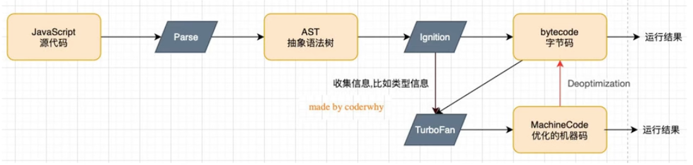
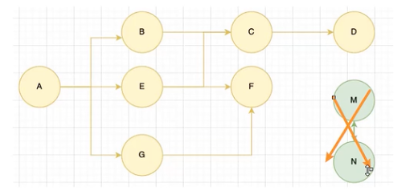
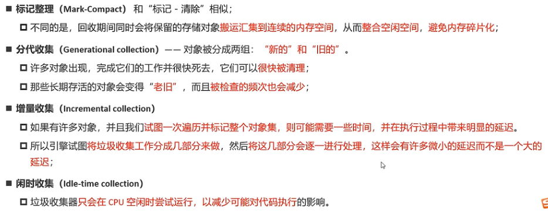
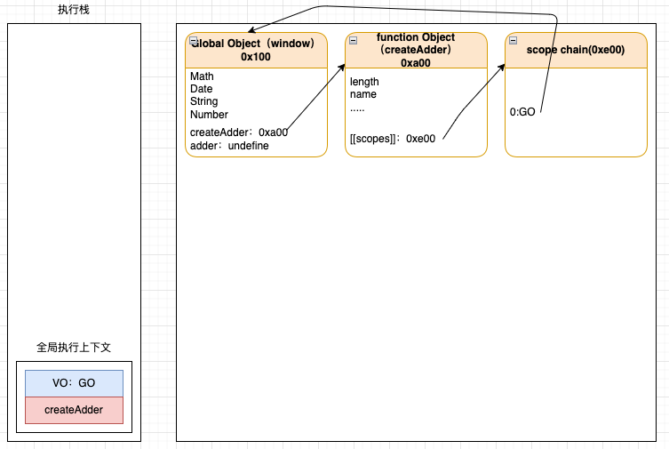
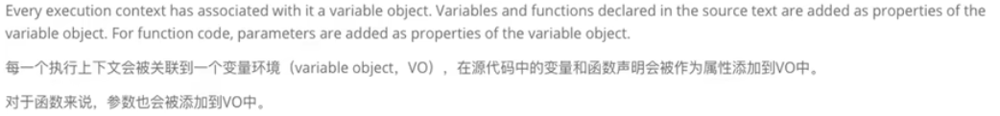
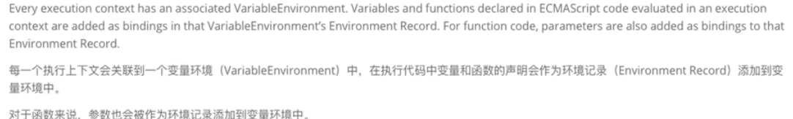
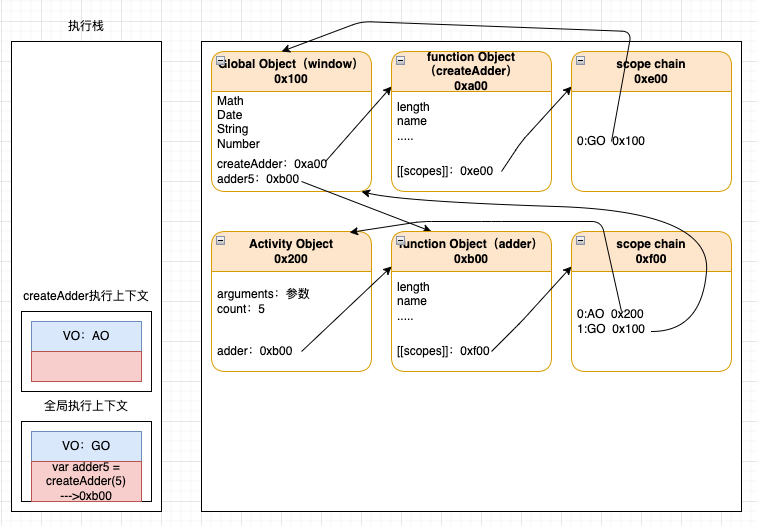
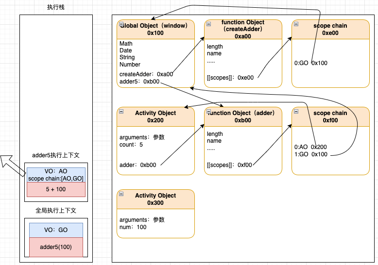
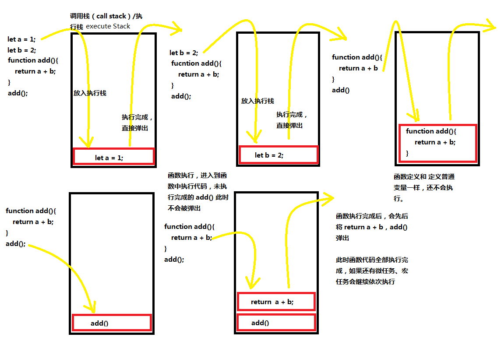
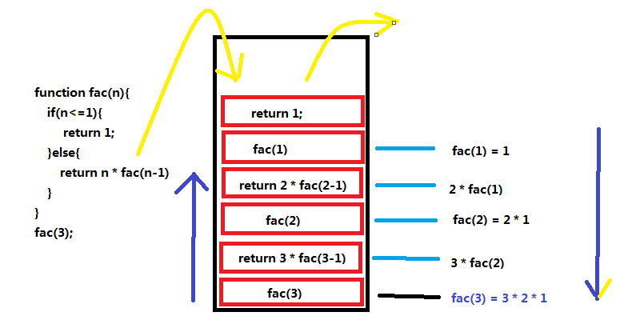

## V8引擎工作流程

V8引擎其实是一个用来处理和执行javascript代码的引擎

### V8引擎中如何执行javascript代码



javascript是一种高级的编程语言，如果要执行就要先转换成cpu指令才能执行，V8引擎就会将javascript代码转化成cpu指令的。

V8引擎会先将 javascript 代码通过 Parse 进行词法分析，语法分析之后转化成 AST 抽象语法树，然后通过 Ignition 将 AST 在转化成果 bytecode字节码（此时的字节码还需要根据不同平台和cpu架构来转化成不同的机器码才能被cpu执行）。在 Ignition 处理AST时会进行分析将一些重复的地方进行优化，比如说函数`function sum(a,b){return a + b}`，每次执行都会将函数执行的代码进行字节码转化，这样就有点重复了而无意义了，所以TurboFan通过分析会将一些会重复使用到的字节码做缓存从而进行优化生成优化后的机器码，下次直接使用。但是有个问题就是之前通过 TurboFan 是分析`sum(10,20);sum(1,1)`来生成优化的机器码的，但是突然`sum("a","b")`这样子传递进来，之前生成优化机器码就无法处理了，所以需要重新对其进行机器码转化，这个过程叫做负优化（deoptimization）。

### V8引擎中的垃圾回收机制

+ **引用计数**：当一个对象有一个引用指向它时，那么这个对象的引用就 +1，当引用为 0时这个对象就会被销毁，但是这个算法会产生**循环引用**的问题
+ **标记清除**
  + 标记清除的核心思路是可达性(Reachability)
  + 这个算法是设置一个根对象(root object，可以是 global object，window),垃圾回收器会定期从这个根开始，找所有从根开始有引用到的对象，对于哪些没有引用到的对象，就认为是不可用的对象
  + 这个算法可以很好的解决循环引用的问题



**内存管理方案**




## 原型、原型链

在 js 中每一个函数（类也是一个函数）都会有一个 prototype（原型） 对象，其中的 constructor 指向函数自身；而每一个对象或者实例都有一个 `__proto__`（原型链/链接点）属性指向原型 prototype 。

需要**注意**的是 prototype 也是一个对象，它也是会有 `__proto__`属性的，一般指向顶层的 Object 的 prototype 。但是 `Object.prototype.__proto__` 指向的是终点 null。

```js
function Test(){}
const test = new Test();
console.log(Test.prototype);//{constructor:f Test}
console.log(test.__proto__ == Test.prototype);//true;
console.log(Test.prototype.__proto__);//{constructor:f Object}
console.log(Test.prototype.__proto__ == Object.prototype);//true
console.log(Object.prototype.__proto__);//null
```

**注意 Function 和 Object 的特殊性**：他们既是函数也是对象，所以既有 `prototype` 也有 `__proto__`属性

```js
//let Test = new Function();
console.log(Test.__proto__ === Function.prototype);//true
console.log(Function.__proto__ === Function.prototype);//true

console.log(typeof Object);//function;
console.log(Object.__proto__ === Function.prototype);//true
console.log(Object.__proto__ === Function.__proto__);//true
```


## 闭包

### 闭包的定义：

在计算机科学中对闭包的定义（维基百科）

+ 闭包（closure）是在支持 头等函数 的编程语言中，实现词法绑定的一种技术
+ 闭包在实现上**是一个结构体**，它存储一个**函数和一个关联的环境**（相当于一个符号查找表）
+ 闭包跟函数最大的区别在于，当捕捉闭包的时候，它的 自由变量 会在捕捉时被确定，这样即使脱离了捕捉时的上下问它也能照常运行

MDN中对闭包的定义

+ 一个函数和其周围状态（词法环境）的引用捆绑在一起（或者说函数被引用包围），这样的组合就是闭包，
+ 也就是说，闭包让你可以在一个内层函数中访问到外层函数的作用域
+ 在javascript中，每当创建一个函数，闭包就会在函数创建的同时被创建出来

总结：

+ 一个普通的函数 function，如果它可以访问外层作用域的自由变量，那么这个函数和周围环境就是一个闭包
+ 从广义的角度来说：javascript中的函数都是闭包
+ 从狭义的角度来说：javascript 中一个函数，如果访问了外层作用域的变量，那么它就是一个闭包

### 闭包为什么会导致内存泄漏？

```js
function createAdder(count){
 	return function adder(num){
    return count + num;
  }
}

var adder5 = createAdder(5);
adder5(100);
```

上述代码中，在执行到 createAdder 函数的定义时



> + VO：变量对象，每个执行上下文都会有一个 VO
> + GO：全局执行上下文
> + AO：当前执行上下文（一般是函数的执行上下文）
> + `[[scopes]]/scope chain` 作用域链
>
> V8引擎在解析 javascript代码生成 AST 的时候也会创建一个全局对象 （Global Object，GO），这个对象是用来存储在全局环境下定义的所用通过 var 定义的变量（代码还没有运行之前这些变量的值是undefined）和函数，还有一些全局对象，如window = this = GO、Date、Math等。（通过 let、const 定义的变量并不会在GO中而是在一个新的对象 Script 中）。
>
> 执行栈也叫函数执行栈，是用来执行函数的，在执行函数的时候，会创建一个变量对象（VO）来保存在函数内部定义的所有变量，同时创建出作用域链，并且确定this指向。在执行全局代码的时候会为全局的代码创建一个全局的执行上下文，里面也有VO，此时的VO指向的就是 GO。

> **let const 定义的变量保存在哪？**
>
> 我们知道，在全局通过var来声明一个变量，事实上会在window上添加一个属性：
>
> + 但是let、const是不会给window上添加任何属性的。
> + 那么我们可能会想这个变量是保存在哪里呢？
>
> 我们先回顾一下最新的ECMA标准中对执行上下文的描述
>
> 
>
> 
>
> 也就是说我们声明的**变量**和**环境记录**是被添加到**变量环境**中的：
>
> + 但是标准有没有规定这个对象是window对象或者其他对象呢？
> + 其实并没有，那么JS引擎在解析的时候，其实会有自己的实现；
> + 比如v8中其实是通过VariableMap的一个hashmap来实现它们的存储的。
> + 那么window对象呢？而window对象是早期的GO对象，在最新的实现中其实是浏览器添加的全局对象，并且一直保持了window和var之间值的相等性；

在执行 `var adder5 = createAdder(5)`时



在执行 `adder5(100)`时



由上图可以知道，根据V8引擎的垃圾回收机制采用的是标记清除（可达性检查），所以上面的六个还有引用的内存是不会被回收的。而且在每次调用`createAdder`函数创建`adder`的时候会申请内存生成一个全新的函数，以及相关的作用域链的引用，导致内存无法被释放，所以在多次使用`createAdder`函数创建 `adder`而不释放就容易出现内存泄漏

### 如何释放内存？

将引用切断，使可达性检查达到不了，那么那部分内存就会被回收释放。比如要释放掉`adder5`，那么`adder5 = null`即可

**闭包的作用**：保护变量不被污染和随意访问，并将变量保存起来，但是因为私有上下文不能被主动释放会消耗更多的内存和资源。

**手动释放私有上下文，消除闭包**：将引用私用上下文内容的变量销毁或者重新执行其他的内容即可。

[闭包原理理解](https://www.bilibili.com/video/BV1xf4y1R7AH)

[我从来不理解JavaScript闭包，直到有人这样向我解释它](https://juejin.cn/post/6844903858636849159)

[用大白话🙌带你掌握闭包](https://juejin.cn/post/7051604174357676062)

[深入JavaScriptS闭包](https://www.bilibili.com/video/BV1M44y1R76m?p=1&vd_source=41ed998ac767425fb616fd9071ce9682)


## 递归

因为 JavaScript 是一种单线程的语言，在执行代码的时候采用了执行栈的结构，所以在处理代码的时候，每当解析执行一句代码的时候都会放入执行栈中执行，当执行完成之后就会将这个代码进行弹出操作，那么代码还没有完全执行完成的时候就不会讲代码进行弹出操作。

```js
let a = 1;
let b = 2;
function add(){
    return a + b;
}
add();
```



**递归**，其实就是在函数中调用自己本身，从而造成函数中重复调用函数，导致调用栈中的入口函数还没有执行完成就又有函数被加入到调用栈中。递归操作如果没有设置合适的结束条件就容易**引起死循环，导致调用栈溢出，导致程序崩溃**。

```js
function fac(n){
    if(n <= 1){
        return 1;
    }else{
        return n * fac(n-1);
    }
}
fac(3);
```




## 执行上下文和作用域

[js执行上下文与作用域](https://www.bilibili.com/video/BV1wD4y1D7Pp?from=search&seid=2212534765957722610)