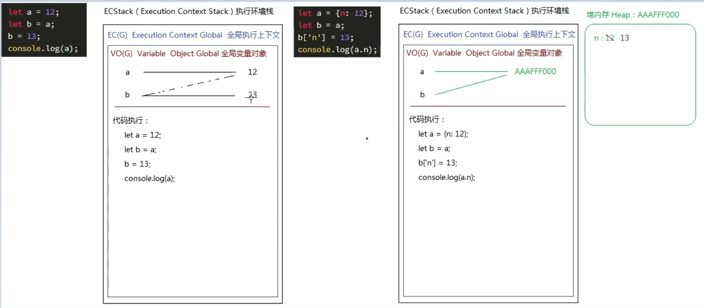
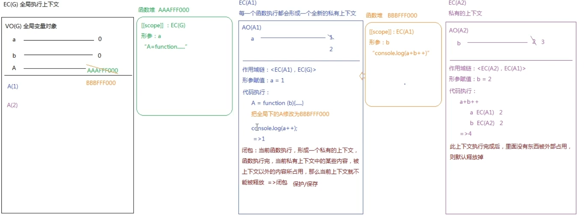

javascript 是一种单线程的语言，在同一时间内只能做一件事情，有多个事情的话就会将要执行的代码放入执行站中，然后在执行完成之后会将这个部分内容释放。继续执行下一段代码。

## 原型、原型链

在 js 中每一个函数（类也是一个函数）都会有一个 prototype（原型） 对象，其中的 constructor 指向函数自身；而每一个对象或者实例都有一个 `__proto__`（原型链/链接点）属性指向原型 prototype 。

需要**注意**的是 prototype 也是一个对象，它也是会有 `__proto__`属性的，一般指向顶层的 Object 的 prototype 。但是 `Object.prototype.__proto__` 指向的是终点 null。

```js
function Test(){}
const test = new Test();
console.log(Test.prototype);//{constructor:f Test}
console.log(test.__proto__ == Test.prototype);//true;
console.log(Test.prototype.__proto__);//{constructor:f Object}
console.log(Test.prototype.__proto__ == Object.prototype);//true
console.log(Object.prototype.__proto__);//null
```

**注意 Function 和 Object 的特殊性**：他们既是函数也是对象，所以既有 `prototype` 也有 `__proto__`属性

```js
//let Test = new Function();
console.log(Test.__proto__ === Function.prototype);//true
console.log(Function.__proto__ === Function.prototype);//true

console.log(typeof Object);//function;
console.log(Object.__proto__ === Function.prototype);//true
console.log(Object.__proto__ === Function.__proto__);//true
```


## 闭包



```js
let a = 12;
let b = a;
b = 13;
console.log(a);//12;
```

执行上面的代码的时候先创建**全局执行环境栈（ECS）**再创建**全局执行上下文（EC(G)）**，因为现在的是主代码块所以创建的是**全局变量对象（VO(G)）**用于存储全局变量（私有变量对象是 AO(X)），在赋值的时候是先创建 12 这个数值，然后再 定义变量 a ，之后会将这两个关联起来；然后给 b 赋值的时候，发现 a 已经定义好了，那么 b 将直接赋值为 a 的值，之后 创建值 13 发现 b 已经创建好，就会直接将 b 与 13 进行关联。

```js
let a = {n:12};
let b = a;
b["n"] = 13;
console.log(a.n);//13;
```

执行上面代码的时候，前面创建环境的时候步骤是一样的，但是创建变量的时候是不一样的，因为 `let a = {n:12}`创建的值是一个对象，在 js 中对象的 存储结构是已栈堆的方式存储的，因此会先创建一个堆空间用于存储对象的内容，然后返回一个内存地址 用于和变量 a 进行关联。



```js
let a = 0, b = 0;
function A(a){
    A = function(b){
        console.log(a + b++);
    }
    console.log(a++);
}
A(1);
A(2);
```

主代码执行步骤与上面相同，但是在执行 `A(1)` 时，也是会先创建一个执行上下，这个执行上下文是私有的 EC(A1)，然后继续创建一个 私有的对象 AO(A1) 用于存储 A1 中的私有变量；然后创建作用域链`<EC(A1),EC(G)>`，紧接执行 `A = function(){....}` 此时在当前的 EC(A1) 中找不到 变量 A，然后到 EC(G) 中找，找到会将 A 赋值一个新的函数，因为这个函数的作用域是 EC(A1) ，但是却被 EC(G) 中的变量应用，这时候就产生了闭包。产生闭包后 EC(A1) 将不会被主动释放。

**闭包的作用**：保护变量不被污染和随意访问，并将变量保存起来，但是因为私有上下文不能被主动释放会消耗更多的内存和资源。

**手动释放私有上下文，消除闭包**：将引用私用上下文内容的变量销毁或者重新执行其他的内容即可。

[闭包原理理解](https://www.bilibili.com/video/BV1xf4y1R7AH)


## 递归

因为 JavaScript 是一种单线程的语言，在执行代码的时候采用了执行栈的结构，所以在处理代码的时候，每当解析执行一句代码的时候都会放入执行栈中执行，当执行完成之后就会将这个代码进行弹出操作，那么代码还没有完全执行完成的时候就不会讲代码进行弹出操作。

```js
let a = 1;
let b = 2;
function add(){
    return a + b;
}
add();
```


**递归**，其实就是在函数中调用自己本身，从而造成函数中重复调用函数，导致调用栈中的入口函数还没有执行完成就又有函数被加入到调用栈中。递归操作如果没有设置合适的结束条件就容易**引起死循环，导致调用栈溢出，导致程序崩溃**。

```js
function fac(n){
    if(n <= 1){
        return 1;
    }else{
        return n * fac(n-1);
    }
}
fac(3);
```

